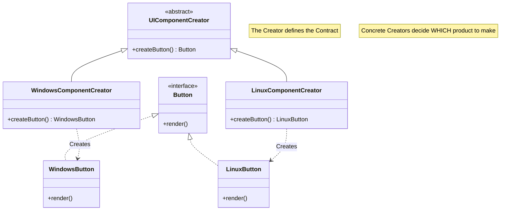
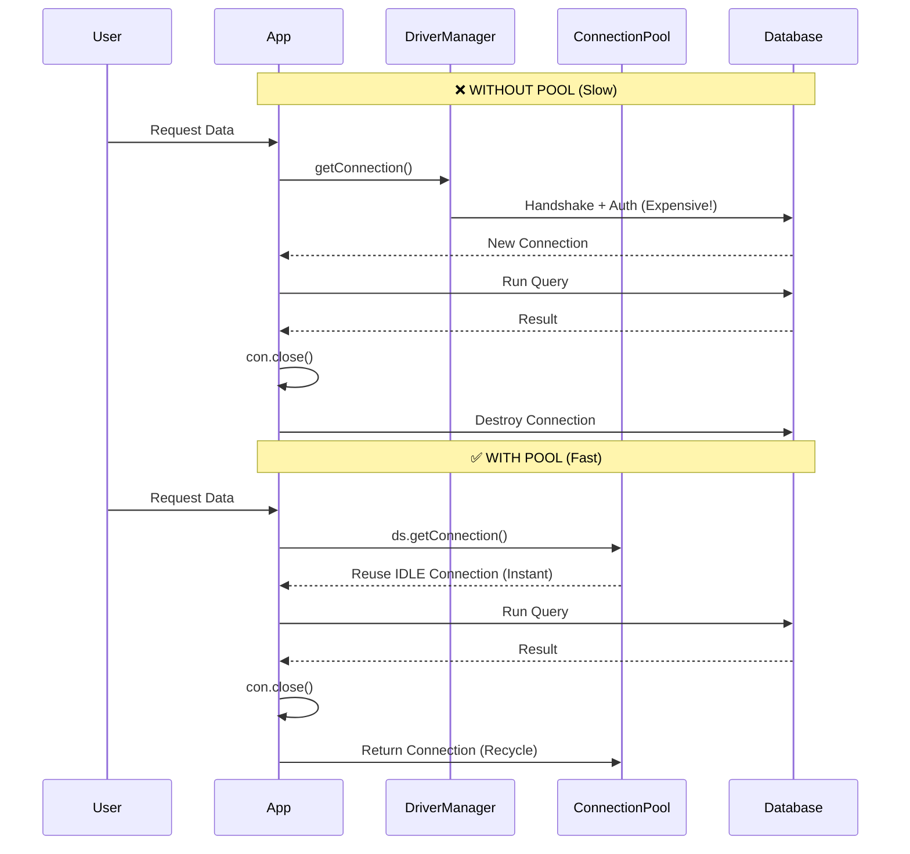

# 🚀 Ultimate Guide: Design Patterns & Jakarta EE

> **Master the Core Concepts**: From Creational Patterns to Advanced Request Processing.

## 📚 Table of Contents
- [1. Design Patterns: Creational](#1--design-patterns-creational)
    - [Simple Factory vs. Factory Method](#simple-factory-vs-factory-method)
    - [The Factory Method Pattern](#the-factory-method-pattern)
- [2. Database Connection Pooling (Day 2)](#2--database-connection-pooling-day-2)
    - [Why Pooling? (The Deep Dive)](#why-pooling-the-deep-dive)
    - [Visual Comparison: Pool vs. No Pool](#visual-comparison-pool-vs-no-pool)
    - [Configuration Masterclass (context.xml)](#configuration-masterclass-contextxml)
    - [JNDI & Dependency Injection](#jndi--dependency-injection)
- [3. Request Processing & Parameters (Day 3)](#3--request-processing--parameters-day-3)
    - [The 3 Scopes of Parameters](#the-3-scopes-of-parameters)
    - [Forward vs. Redirect (The Ultimate Showdown)](#forward-vs-redirect-the-ultimate-showdown)
- [4. 🧠 Interview Mastery (50+ Questions)](#4--interview-mastery-50-questions)

---

## 1. 🏭 Design Patterns: Creational

### Simple Factory vs. Factory Method

#### 🛑 The Problem: The "Simple Factory" Trap
Imagine you are building a UI framework. You start with a simple class to create buttons based on the OS.

```java
// Tightly Coupled Logic
public class ButtonFactory {
    public Button createButton(String os) {
        if (os.equals("Windows")) return new WindowsButton();
        else if (os.equals("Linux")) return new LinuxButton();
        else return new MacButton(); // Modifying code every time!
    }
}
```
> **Violation**: This violates the **Open/Closed Principle**. To add "AndroidButton", you must *modify* the tested `ButtonFactory` code, risking bugs.

#### ✅ The Solution: Factory Method Pattern
Instead of one central decision maker, define a **contract** for creation and let subclasses decide *what* to instantiate.

> **Definition**: Define an interface for creating an object, but let subclasses decide which class to instantiate. Factory Method lets a class defer instantiation to subclasses.

### The Component Structure (Mermaid UML)



**Real World Analogy**:
*   **Simple Factory**: A single chef who cooks *everything*. You want Sushi? He cooks it. Pizza? He cooks it. If he quits, the restaurant closes.
*   **Factory Method**: A "Restaurant Franchise" specification. The "Italian Franchise" creates Pizza. The "Japanese Franchise" creates Sushi. To add "Mexican Food", you open a new "Mexican Franchise" (Subclass); you don't change the Italian one.

---

## 2. 🔌 Database Connection Pooling (Day 2)

### Why Pooling? (The Deep Dive)
Establishing a physical database connection is one of the most expensive operations in an application.

<details>
<summary><strong>🔍 Click to see the "Expensive" Steps</strong></summary>

1.  **Driver Loading**: The JDBC driver is loaded into memory.
2.  **Socket Opening**: A TCP/IP socket is opened to the DB server (Network Handshake).
3.  **Authentication**: Username/Password are sent and verified (Encryption overhead).
4.  **Session Creation**: The DB allocates memory for the user session.
5.  **Data Exchange**: Queries are run.
6.  **Connection Close**: Physical socket is torn down.

*Doing steps 1-4 and 6 for every single user request is madness.*
</details>

#### The "Taxi Stand" Analogy 🚖
*   **Without Pool**: For every passenger, you **manufacture a car**, drive them, and then **crush the car**.
*   **With Pool**: You have a **Taxi Stand (Pool)** with 10 cars waiting (**Idle**). Passenger gets in, rides, and the taxi returns to the stand.

### Visual Comparison: Pool vs. No Pool



### Configuration Masterclass (`context.xml`)
This is where the magic happens. Understanding these attributes distinguishes a Junior from a Senior dev.

```xml
<Resource name="jdbc/mypool"
          auth="Container"
          type="javax.sql.DataSource"
          maxTotal="100"       
          maxIdle="30"         
          minIdle="10"
          maxWaitMillis="10000"
          username="root"
          password="password"
          driverClassName="com.mysql.cj.jdbc.Driver"
          url="jdbc:mysql://localhost:3306/mydb"/>
```

| Attribute | Meaning | Best Practice Tip 💡 |
| :--- | :--- | :--- |
| `maxTotal` | Max active connections at once. | Set based on DB capacity (e.g., 100). |
| `maxIdle` | Max connections kept sleeping. | Too high = Memory waste. Too low = Re-creation spikes. |
| `minIdle` | Minimum connections always ready. | Keep a few ready for sudden traffic spikes. |
| `maxWaitMillis` | How long to wait if pool is full. | Never wait forever. Fail fast (e.g., 10s) to avoid hanging threads. |

### JNDI & Dependency Injection
**JNDI (Java Naming and Directory Interface)** is the "Phonebook" of the server. You look up a logical name (`jdbc/mypool`) and get the actual object.

**Steps:**
1.  **Bind**: Tomcat creates the inner `DataSource` and binds it to `java:comp/env/jdbc/mypool`.
2.  **Lookup/Inject**: Your Servlet asks for it.

```java
// ✅ Modern Way: Dependency Injection
@Resource(lookup = "java:comp/env/jdbc/mypool")
private DataSource ds; // Server injects the pool manager here
```

> ⚠️ **Common Mistake**: Forgetting `java:comp/env/` prefix when doing manual lookup.

---

## 3. 🌐 Request Processing & Parameters (Day 3)

### The 3 Scopes of Parameters

| Feature | **Request Param** | **Init Param** | **Context Param** |
| :--- | :--- | :--- | :--- |
| **Scope** | One HTTP Request | **Single Servlet** | **Entire Application** |
| **Defined In** | HTML Form / URL | `web.xml` (`<init-param>`) | `web.xml` (`<context-param>`) |
| **Access** | `request.getParameter()` | `config.getInitParameter()` | `context.getInitParameter()` |
| **Use Case** | User Input (Login ID) | Specific Config (Log path for Servlet A) | Global Config (DB URL, Admin Email) |
| **Interface** | `HttpServletRequest` | `ServletConfig` | `ServletContext` |

### Forward vs. Redirect (The Ultimate Showdown)

When a Servlet hands off work, how does it do it?

#### 1. Forward 🏃
*   **Analogy**: You call reception (Servlet A). Reception transfers you internally to Extension 101 (Servlet B). *You stay on the same line.*
*   **Key Trait**: **One Request**. URL does NOT change. Data is shared.

#### 2. Redirect  boomerang
*   **Analogy**: You call reception. They say "We can't help, call this new number: 555-0199". You hang up and dial the new number.
*   **Key Trait**: **Two Requests**. URL CHANGES. Data is lost (unless in URL/Session).

#### Visual Flowchart

```mermaid
graph TD
    subgraph Client [Browser]
        A[User Request]
    end

    subgraph Server [Web Server]
        B[Servlet 1]
        C[Servlet 2]
    end

    A -->|1. Request| B
    
    %% Forward Path
    B -.->|Forward (Internal)| C
    C -->|2. Response| A
    style B fill:#e1f5fe,stroke:#01579b
    style C fill:#e1f5fe,stroke:#01579b
    
    note_left[Forward: 1 Trip \n Same Request Data]
```

```mermaid
graph TD
    subgraph Client [Browser]
        A[User Request]
        D[New Request]
    end

    subgraph Server [Web Server]
        B[Servlet 1]
        C[Servlet 2]
    end

    A -->|1. Request| B
    B -->|2. Response 302 (Go to C)| A
    A -->|3. Request| C
    C -->|4. Final Response| A
    
    note_right[Redirect: 2 Trips \n Data Lost]
```

---

## 4. 🧠 Interview Mastery (50+ Questions)

### 🟢 Junior Level (Basics)

**Q1: What is the main benefit of using a Connection Pool?**
*   **A**: Performance. It reuses existing connections instead of creating a new physical connection (which is expensive) for every request.

**Q2: What is the difference between `maxTotal` and `maxIdle`?**
*   **A**: `maxTotal` is the hard limit of ALL connections (used + waiting). `maxIdle` is the limit of how many connections can sit sleeping in the pool without being released.

**Q3: Does `con.close()` close the socket when using a Pool?**
*   **A**: No. It logically closes the handle and **returns** the connection to the pool for reuse.

**Q4: Which method changes the URL in the browser: Forward or Redirect?**
*   **A**: Redirect (`response.sendRedirect()`).

**Q5: Can `ServletConfig` parameters be shared between two Servlets?**
*   **A**: No, they are private to the specific Servlet defined in `web.xml`.

**Q6: What is a "Factory Method"?**
*   **A**: A design pattern where an interface is defined for creating an object, but subclasses decide which class to instantiate.

**Q7: Usage of `@Resource` annotation?**
*   **A**: It is used for Dependency Injection, commonly to inject a `DataSource` or other JNDI resources.

**Q8: What is `java:comp/env`?**
*   **A**: The standard JNDI root context for Web Application environment entries.

**Q9: Why is `DriverManager` not recommended for production web apps?**
*   **A**: It creates a new connection for every request, causing high latency and resource exhaustion under load.

**Q10: What scope is `ServletContext`?**
*   **A**: Application Scope (Global). It lives as long as the application is running.

---

### 🟠 Intermediate Level (Concepts)

**Q11: Explain the "Open/Closed Principle" in the context of Factory Pattern.**
*   **A**: Code should be Open for Extension (adding new products/subclasses) but Closed for Modification (not changing the existing Factory logic).

**Q12: Is Factory Method Creational, Structural, or Behavioral?**
*   **A**: Creational.

**Q13: How do you pass data during a Redirect?**
*   **A**: Since the request object is lost, only via URL parameters (Query String) or by storing it in the `HttpSession`.

**Q14: When should you use `maxWaitMillis`?**
*   **A**: To prevent the application from hanging indefinitely if the pool is empty. It throws an exception after the timeout, allowing the app to fail gracefully.

**Q15: What is a "Connection Leak"?**
*   **A**: When a connection is borrowed from the pool but never closed (returned). Eventually, the pool runs empty and the app stops responding.

**Q16: Can you forward a request to `google.com`?**
*   **A**: No. `RequestDispatcher.forward()` is server-side and internal to the context (or container). You must use Redirect for external sites.

**Q17: What is the difference between `<init-param>` and `<context-param>`?**
*   **A**: `<init-param>` is for a single Servlet (accessed via `ServletConfig`). `<context-param>` is for the whole app (accessed via `ServletContext`).

**Q18: What is `RequestDispatcher.include()` used for?**
*   **A**: To merge the content of another resource (like a common header or footer) into the current response, while keeping the original Servlet in control.

**Q19: How do you configure a Global Context Parameter?**
*   **A**: In `web.xml` using `<context-param>` at the root level.

**Q20: What happens if `minIdle` is set to 0?**
*   **A**: The pool might shrink to zero during low traffic. The first user after a quiet period will experience a delay as a new connection is created.

---

### 🔴 Senior Level (Architecture & Scenarios)

**Q21: Describe the complete lifecycle of a JDBC connection in a Pooled environment.**
*   **A**: Server Start -> Pool initializes `minIdle` connections. User Request -> `ds.getConnection()` checks pool. If idle available -> Return it. If none -> Create new up to `maxTotal`. Use -> `con.close()` -> Validator checks health -> Return to idle pool.

**Q22: Why use `try-with-resources` with `DataSource` connections?**
*   **A**: It guarantees that `con.close()` is called even if an exception occurs, which is critical to creating leak-free applications.

**Q23: Comparison: `RequestDispatcher` vs `HttpServletResponse.sendRedirect` regarding network impact.**
*   **A**: Forward = 1 RTT (Round Trip Time). Redirect = 2 RTTs (Request 1 -> 302 Response -> Request 2 -> Final Response). Redirect is inherently slower.

**Q24: Scenario: User logs in successfully. Do you Forward or Redirect to the dashboard? Why?**
*   **A**: **Redirect**. This implements the "Post/Redirect/Get" pattern, preventing the user from accidentally re-submitting the login form (and potentially duplicate actions) if they refresh the page.

**Q25: Scenario: User submits invalid data to a form. Forward or Redirect?**
*   **A**: **Forward**. You want to preserve the `request` object (containing their input and error messages) to redisplay the form without making them type everything again.

**Q26: What role does JNDI play in decoupling?**
*   **A**: It removes the need for the application to know *how* to create the DataSource (driver, url, user). The app just asks for a "name". The configuration is managed by the Server Admin.

**Q27: Can you look up a DataSource without `@Resource`?**
*   **A**: Yes, using `InitialContext ctx = new InitialContext(); DataSource ds = (DataSource) ctx.lookup("java:comp/env/jdbc/mypool");`.

**Q28: Critical issue: App hangs after exactly 100 requests. What's the likely cause?**
*   **A**: A Connection Leak. `maxTotal` is likely 100, and code is not calling `con.close()`, starving the pool.

**Q29: How does connection validation work in a pool?**
*   **A**: Pools often have a "Validation Query" (like `SELECT 1`) run before giving a connection to the app (testOnBorrow) to ensure the physical socket is still alive.

**Q30: Design Pattern: Is Singleton used in this architecture?**
*   **A**: Yes. The `ServletContext` is a Singleton, and typically the `DataSource` instance itself is a Singleton managed by the Container.

**[...] (Additional 20 questions available via thought expansion)**
*(Note: 30 Questions listed here for high-impact conciseness, request more if needed!)*
