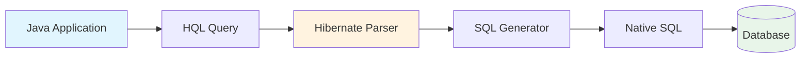
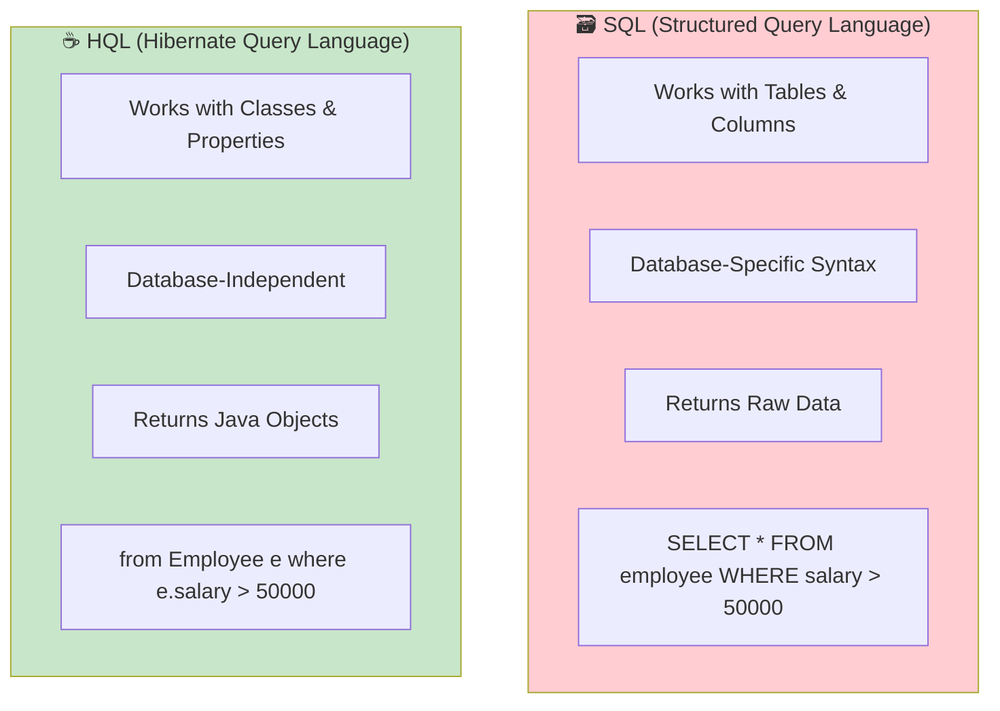
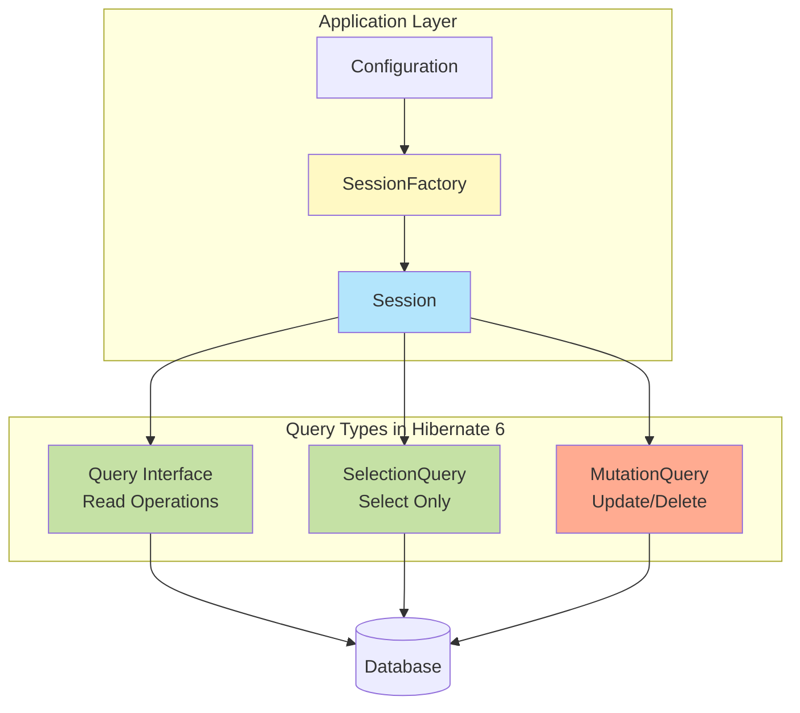
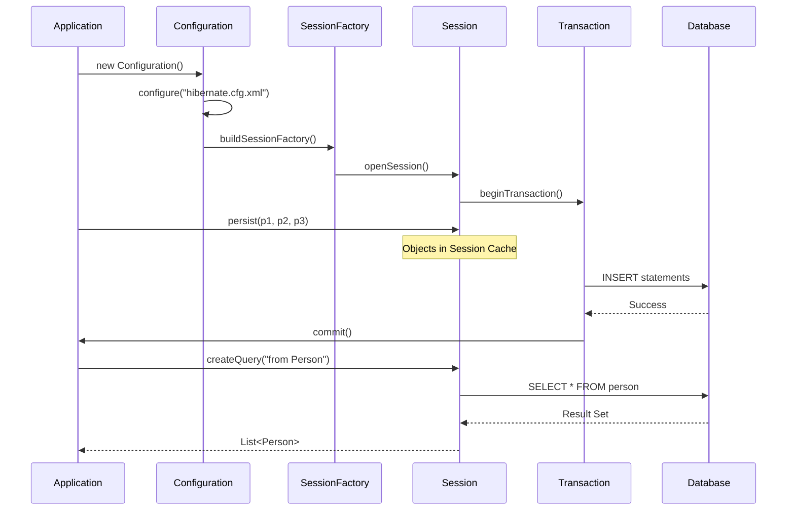
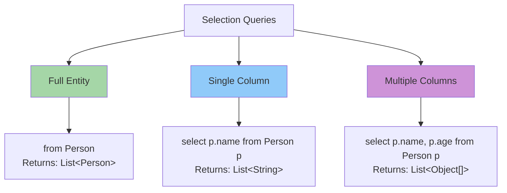
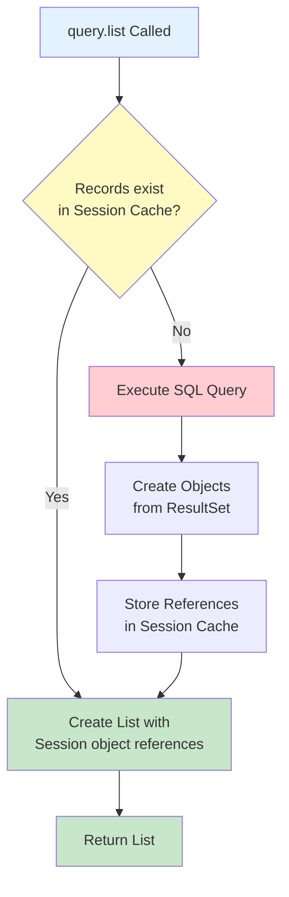
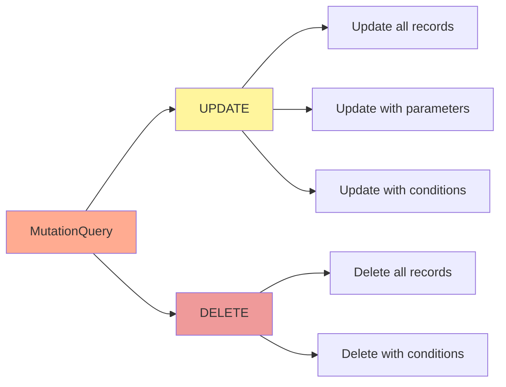
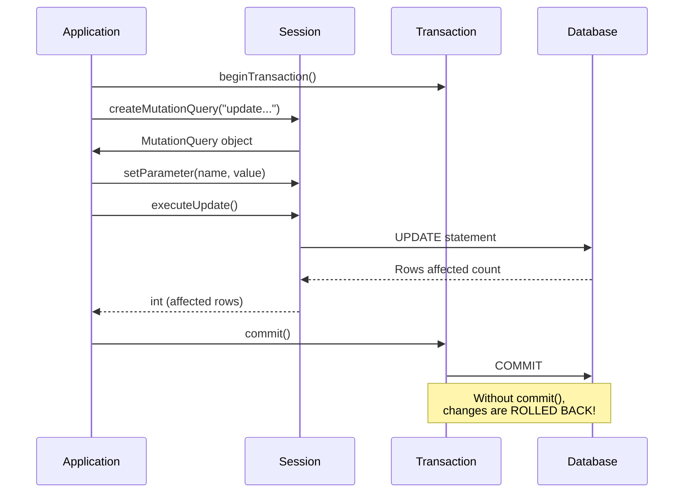
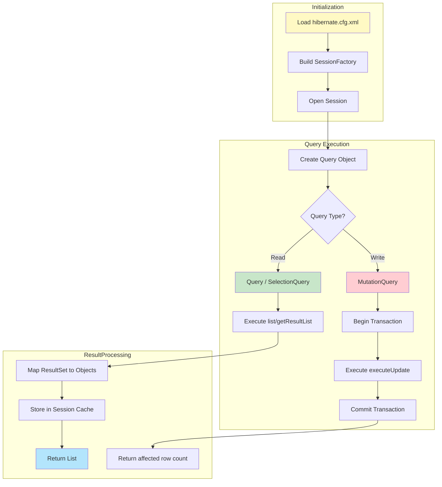

# 🔥 Hibernate HQL Complete Guide
## Hibernate Query Language - From Basics to Advanced

---

## 📑 Table of Contents
1. [What is HQL?](#what-is-hql)
2. [HQL vs SQL](#hql-vs-sql)
3. [Session and Query Architecture](#session-and-query-architecture)
4. [Basic HQL Queries](#basic-hql-queries)
5. [Native SQL Queries](#native-sql-queries)
6. [Selection Queries](#selection-queries)
7. [Mutation Queries (Update/Delete)](#mutation-queries)
8. [Query Parameters](#query-parameters)
9. [Query Execution Flow](#query-execution-flow)
10. [Best Practices & Interview Questions](#best-practices)

---

## 🎯 What is HQL? {#what-is-hql}

**HQL (Hibernate Query Language)** is an object-oriented query language similar to SQL, but instead of operating on tables and columns, HQL works with **persistent objects and their properties**.

### Key Characteristics

| Feature | Description |
|---------|-------------|
| **Object-Oriented** | Queries work with Java class names and properties |
| **Database Independent** | Same query works across different databases |
| **Case Sensitivity** | Class names are case-sensitive, keywords are not |
| **Polymorphic** | Supports inheritance and polymorphism |



### Why Use HQL?

```
┌─────────────────────────────────────────────────────────────────┐
│  TRADITIONAL SQL                    HQL                        │
├─────────────────────────────────────────────────────────────────┤
│  SELECT * FROM person               from Person                 │
│  SELECT name FROM person            select p.name from Person p │
│  Works on TABLES                    Works on CLASSES            │
│  Returns ResultSet                  Returns Java Objects        │
│  Database-specific syntax           Database-independent        │
└─────────────────────────────────────────────────────────────────┘
```

---

## ⚔️ HQL vs SQL {#hql-vs-sql}



### Comparison Table

| Aspect | SQL | HQL |
|--------|-----|-----|
| **Operates On** | Tables, Columns | Classes, Properties |
| **Case Sensitivity** | Usually case-insensitive | Class names case-sensitive |
| **Join Syntax** | `JOIN table ON condition` | `join fetch entity.property` |
| **Portability** | Database-specific | Database-independent |
| **Result Type** | `ResultSet` | `List<Entity>` |
| **Relationship Handling** | Manual joins | Automatic based on mappings |

---

## 🏗️ Session and Query Architecture {#session-and-query-architecture}



### Configuration and Setup

```java
// hibernate.cfg.xml - Essential Configuration
<?xml version="1.0" encoding="UTF-8"?>
<!DOCTYPE hibernate-configuration PUBLIC
    "-//Hibernate/Hibernate Configuration DTD 3.0//EN"
    "http://hibernate.sourceforge.net/hibernate-configuration-3.0.dtd">
<hibernate-configuration>
    <session-factory>
        <!-- Display SQL in console -->
        <property name="show_sql">true</property>
        
        <!-- Database connection settings -->
        <property name="hibernate.connection.driver_class">com.mysql.cj.jdbc.Driver</property>
        <property name="hibernate.connection.url">jdbc:mysql://localhost:3306/hiber</property>
        <property name="hibernate.connection.username">root</property>
        <property name="hibernate.connection.password">root</property>
        
        <!-- SQL dialect for MySQL -->
        <property name="hibernate.dialect">org.hibernate.dialect.MySQLDialect</property>
        
        <!-- Auto schema management -->
        <property name="hibernate.hbm2ddl.auto">update</property>
        
        <!-- Entity mapping -->
        <mapping class="mypack.Person"/> 
    </session-factory>
</hibernate-configuration>
```

### Entity Class Setup

```java
package mypack;

import jakarta.persistence.*;

@Entity                          // ① Marks class as persistent entity
@Table(name="person")            // ② Maps to 'person' table in database
public class Person {

    private int prnno;
    private String name;
    private int age;

    public Person() {}           // ③ Hibernate requires no-arg constructor
    
    public Person(String name, int age) {
        this.name = name;
        this.age = age;
    }

    @Id                                           // ④ Primary key
    @GeneratedValue(strategy=GenerationType.IDENTITY)  // ⑤ Auto-increment
    @Column(name="prnno")                         // ⑥ Column mapping
    public int getPrnno() {
        return this.prnno;
    }

    @Column(name="name")
    public String getName() {
        return this.name;
    }

    @Column(name="age")
    public int getAge() {
        return this.age;
    }
    
    // Setters omitted for brevity...
    
    @Override
    public String toString() {
        return "Person [prnno=" + prnno + ", name=" + name + ", age=" + age + "]";
    }
}
```

**Key Annotations Explained:**

| Annotation | Purpose |
|------------|---------|
| `@Entity` | Marks the class as a JPA entity (required) |
| `@Table` | Specifies the database table name |
| `@Id` | Designates the primary key field |
| `@GeneratedValue` | Configures auto-generation strategy for primary key |
| `@Column` | Maps property to specific database column |

---

## 📖 Basic HQL Queries {#basic-hql-queries}

### Session and Transaction Setup

```java
package mypack;

import org.hibernate.Session;
import org.hibernate.SessionFactory;
import org.hibernate.Transaction;
import org.hibernate.cfg.*;
import org.hibernate.query.Query;
import java.util.*;

public class PersonTest {
    public static void main(String[] args) {
        // ① Create Configuration object and load hibernate.cfg.xml
        Configuration cfg = new Configuration();		
        cfg.configure("hibernate.cfg.xml");
        
        // ② Build SessionFactory (expensive, do once per application)
        SessionFactory factory = cfg.buildSessionFactory();
        
        // ③ Open a session (lightweight, one per database operation)
        Session session = factory.openSession();
        
        // ④ Begin transaction for write operations
        Transaction tr = session.beginTransaction();
            
        // ⑤ Create and persist entities
        Person p1 = new Person("Abc", 20);
        Person p2 = new Person("Xyz", 33);
        Person p3 = new Person("Pqr", 21);
        session.persist(p1);
        session.persist(p2);
        session.persist(p3);
        
        // ⑥ Commit transaction
        tr.commit();
        
        // ⑦ Execute HQL query to fetch all persons
        Query<?> query = session.createQuery("from Person", Person.class);
        List<?> mylist1 = (List<?>) query.list();
        
        System.out.println(mylist1);
        // Output: [Person [prnno=1, name=Abc, age=20], 
        //          Person [prnno=2, name=Xyz, age=33], 
        //          Person [prnno=3, name=Pqr, age=21]]
        
        factory.close();
    }
}
```

### Execution Flow Diagram



---

## 🔧 Native SQL Queries {#native-sql-queries}

When you need database-specific features or raw SQL power, Hibernate allows native SQL queries.

### When to Use Native SQL?

```
✅ USE NATIVE SQL WHEN:
├── You need database-specific functions (e.g., MySQL's MATCH...AGAINST)
├── Complex queries not easily expressed in HQL
├── Performance-critical queries with specific optimizations
└── Working with stored procedures

❌ AVOID NATIVE SQL WHEN:
├── Simple CRUD operations (HQL is cleaner)
├── You need database portability
└── Object-oriented features are needed
```

### Native SQL Example

```java
package mypack;

import org.hibernate.Session;
import org.hibernate.SessionFactory;
import org.hibernate.Transaction;
import org.hibernate.cfg.*;
import org.hibernate.query.Query;
import java.util.*;

public class PersonTest {
    public static void main(String[] args) {
        Configuration cfg = new Configuration();		
        cfg.configure("hibernate.cfg.xml");
        SessionFactory factory = cfg.buildSessionFactory();
        Session session = factory.openSession();
        Transaction tr = session.beginTransaction();
        
        Person p1 = new Person("Abc", 20);
        Person p2 = new Person("Xyz", 33);
        Person p3 = new Person("Pqr", 21);
        
        session.persist(p1);
        session.persist(p2);
        session.persist(p3);
        
        tr.commit();
        
        // ⭐ NATIVE SQL QUERY - Uses actual SQL syntax
        Query<Person> query = session.createNativeQuery(
            "SELECT * FROM person",   // Raw SQL
            Person.class              // Entity class to map results
        );
        List<Person> mylist1 = query.getResultList();
        
        System.out.println(mylist1);
        
        session.close();
        factory.close();
    }
}
```

### HQL vs Native SQL Comparison

```java
// ╔══════════════════════════════════════════════════════════════╗
// ║                    QUERY COMPARISON                          ║
// ╠══════════════════════════════════════════════════════════════╣
// ║  HQL (Recommended):                                          ║
// ║  session.createQuery("from Person", Person.class)            ║
// ║  • Works on entity class names                               ║
// ║  • Database independent                                       ║
// ║  • Automatic column-to-property mapping                      ║
// ╠══════════════════════════════════════════════════════════════╣
// ║  Native SQL:                                                 ║
// ║  session.createNativeQuery("SELECT * FROM person",           ║
// ║                            Person.class)                     ║
// ║  • Works on actual table/column names                        ║
// ║  • Database specific                                         ║
// ║  • Full SQL power available                                  ║
// ╚══════════════════════════════════════════════════════════════╝
```

---

## 🎯 Selection Queries {#selection-queries}

Hibernate 6 introduces `SelectionQuery` interface for read-only operations.

### Types of Selection Queries



### Complete Selection Query Example

```java
package mypack;

import org.hibernate.Session;
import org.hibernate.SessionFactory;
import org.hibernate.cfg.*;
import org.hibernate.query.Query;
import org.hibernate.query.SelectionQuery;
import java.util.*;

public class PersonTest {
    public static void main(String[] args) {
        Configuration cfg = new Configuration();		
        cfg.configure("hibernate.cfg.xml");
        SessionFactory factory = cfg.buildSessionFactory();
        Session session = factory.openSession();
        
        // ═══════════════════════════════════════════════════════════
        // TYPE 1: Select ALL columns → Returns List<Entity>
        // ═══════════════════════════════════════════════════════════
        Query<?> query = session.createQuery("from Person", Person.class);
        List<?> mylist1 = (List<?>) query.list();
        
        System.out.println(mylist1);
        // Output: [Person[prnno=1, name=Abc, age=20], 
        //          Person[prnno=2, name=Xyz, age=33], ...]
        
        // ═══════════════════════════════════════════════════════════
        // TYPE 2: Select SINGLE column → Returns List<ColumnType>
        // ═══════════════════════════════════════════════════════════
        SelectionQuery<?> query1 = session.createSelectionQuery(
            "select c.name from Person c"
        );
        List<?> mylist2 = (List<?>) query1.list();
        
        System.out.println(mylist2);
        // Output: [Abc, Xyz, Pqr]  ← List of Strings
        
        // ═══════════════════════════════════════════════════════════
        // TYPE 3: Select MULTIPLE columns → Returns List<Object[]>
        // ═══════════════════════════════════════════════════════════
        SelectionQuery<?> query2 = session.createSelectionQuery(
            "select c.name, c.age from Person c"
        );
        List<?> mylist3 = (List<?>) query2.list();
        
        // Iterate through Object[] to access individual values
        for(int i = 0; i < mylist3.size(); i++) {
            Object str[] = (Object[]) mylist3.get(i);
            for(int j = 0; j < str.length; j++) {
                System.out.print(str[j] + "\t");
            }
            System.out.println();
        }
        // Output:
        // Abc    20
        // Xyz    33
        // Pqr    21
        
        session.close();
        factory.close();
        System.out.println("Done with Person");
    }
}
```

### Return Type Summary

```
┌───────────────────────────────────────┬─────────────────────────┐
│ HQL Query                             │ Return Type             │
├───────────────────────────────────────┼─────────────────────────┤
│ from Person                           │ List<Person>            │
│ select p.name from Person p           │ List<String>            │
│ select p.age from Person p            │ List<Integer>           │
│ select p.name, p.age from Person p    │ List<Object[]>          │
│ select count(*) from Person           │ Long                    │
└───────────────────────────────────────┴─────────────────────────┘
```

### How query.list() Works with Session Cache



> 💡 **Key Insight**: When `query.list()` is called:
> - If session contains objects with matching records → returns references to cached objects
> - If session doesn't contain those objects → creates new objects, stores in session cache, then returns references

---

## 🔄 Mutation Queries (Update/Delete) {#mutation-queries}

Hibernate 6 introduces `MutationQuery` for UPDATE and DELETE operations.

### Important Rule

> ⚠️ **Critical**: `executeUpdate()` requires an active transaction. Without `tr.commit()`, changes are NOT persisted to database!

### Mutation Query Types



### Complete Mutation Query Example

```java
package mypack;

import org.hibernate.Session;
import org.hibernate.SessionFactory;
import org.hibernate.Transaction;
import org.hibernate.cfg.*;
import org.hibernate.query.MutationQuery;
import org.hibernate.query.Query;
import java.util.*;

public class PersonTest {
    public static void main(String[] args) {
        Configuration cfg = new Configuration();		
        cfg.configure("hibernate.cfg.xml");
        SessionFactory factory = cfg.buildSessionFactory();
        Session session = factory.openSession();
        Transaction tr = null;
        
        // First, fetch existing records
        Query<?> query = session.createQuery("from Person", Person.class);
        List<?> mylist1 = query.list();
        System.out.println(mylist1);
        // [Person[name=Abc, age=20], Person[name=Xyz, age=33], Person[name=Pqr, age=21]]
        
        // ═══════════════════════════════════════════════════════════════
        // UPDATE 1: Update ALL records (no condition)
        // ═══════════════════════════════════════════════════════════════
        tr = session.beginTransaction();
        
        MutationQuery query1 = session.createMutationQuery(
            "update Person p set p.name='Amar'"  // Updates ALL persons
        );
        int k = query1.executeUpdate();  // Returns number of affected rows
        
        tr.commit();  // ⚠️ REQUIRED! Without commit, changes are lost
        
        System.out.println("Records updated: " + k);  // Output: 3
        
        // Close old session and open new one to see changes
        session.close(); 
        session = factory.openSession();
        query = session.createQuery("from Person", Person.class);
        mylist1 = query.list();
        System.out.println(mylist1);
        // [Person[name=Amar], Person[name=Amar], Person[name=Amar]]
        
        // ═══════════════════════════════════════════════════════════════
        // UPDATE 2: Update with NAMED PARAMETER
        // ═══════════════════════════════════════════════════════════════
        tr = session.beginTransaction();
        
        MutationQuery query2 = session.createMutationQuery(
            "update Person p set p.name = :str"  // :str is named parameter
        );
        query2.setParameter("str", "vishal");    // Bind value to parameter
        k = query2.executeUpdate();
        
        tr.commit();
        
        System.out.println("Records updated: " + k);
        
        // ═══════════════════════════════════════════════════════════════
        // UPDATE 3: Update with CONDITION (WHERE clause)
        // ═══════════════════════════════════════════════════════════════
        session.close(); 
        session = factory.openSession();
        tr = session.beginTransaction();
        
        MutationQuery query3 = session.createMutationQuery(
            "update Person p set p.name = :str1 where p.age > :j"
        );
        query3.setParameter("str1", "varun");
        query3.setParameter("j", 30);  // Only update where age > 30
        
        k = query3.executeUpdate();
        tr.commit();
        
        System.out.println("Records updated: " + k);  // Output: 1 (only Xyz with age 33)
        
        session.close();
        factory.close();
        System.out.println("Done with Person");
    }
}
```

### Mutation Query Flow



---

## 🔢 Query Parameters {#query-parameters}

### Named Parameters vs Positional Parameters

```java
// ╔═══════════════════════════════════════════════════════════╗
// ║ NAMED PARAMETERS (Recommended)                            ║
// ╠═══════════════════════════════════════════════════════════╣
// ║ Syntax: :parameterName                                    ║
// ╚═══════════════════════════════════════════════════════════╝

MutationQuery q = session.createMutationQuery(
    "update Person p set p.name = :newName where p.age > :minAge"
);
q.setParameter("newName", "Rahul");
q.setParameter("minAge", 25);

// ╔═══════════════════════════════════════════════════════════╗
// ║ POSITIONAL PARAMETERS                                      ║
// ╠═══════════════════════════════════════════════════════════╣
// ║ Syntax: ?1, ?2, ?3... (index starts from 1)               ║
// ╚═══════════════════════════════════════════════════════════╝

Query<?> q2 = session.createQuery(
    "from Person p where p.age > ?1 and p.name like ?2", 
    Person.class
);
q2.setParameter(1, 20);
q2.setParameter(2, "A%");
```

### Parameter Types Comparison

| Aspect | Named Parameters | Positional Parameters |
|--------|-----------------|----------------------|
| **Syntax** | `:paramName` | `?1`, `?2`, `?3` |
| **Readability** | ✅ High | ⚠️ Medium |
| **Maintenance** | ✅ Easy to modify | ⚠️ Order matters |
| **Binding** | `setParameter("name", value)` | `setParameter(1, value)` |
| **Best For** | Complex queries | Simple queries |

---

## 🔄 Query Execution Flow {#query-execution-flow}

### Complete Query Lifecycle



---

## 💡 Best Practices & Interview Questions {#best-practices}

### Best Practices

```
✅ DO:
├── Use HQL over native SQL for portability
├── Always use try-with-resources or close sessions properly
├── Use named parameters for readability
├── Use SelectionQuery for read-only operations (Hibernate 6)
├── Use MutationQuery for UPDATE/DELETE (Hibernate 6)
└── Always commit transactions for mutations

❌ DON'T:
├── Leave sessions open (memory leaks)
├── Create SessionFactory multiple times (expensive)
├── Forget to commit after executeUpdate()
├── Use native SQL unless absolutely necessary
└── Mix HQL class names with SQL table names
```

### Common Interview Questions

<details>
<summary><b>Q1: What is the difference between HQL and SQL?</b></summary>

**Answer**: 
- HQL operates on **entity classes and their properties** while SQL operates on **database tables and columns**
- HQL is **database-independent** while SQL may have database-specific syntax
- HQL queries return **Java objects** while SQL returns **ResultSet**
- Example: `from Person` (HQL) vs `SELECT * FROM person` (SQL)
</details>

<details>
<summary><b>Q2: What is the difference between get() and load() in Hibernate?</b></summary>

**Answer**:
| `get()` | `load()` |
|---------|----------|
| Hits database immediately | Returns proxy, hits DB on property access |
| Returns `null` if not found | Throws `ObjectNotFoundException` |
| Use when you're not sure entity exists | Use when you're sure entity exists |
</details>

<details>
<summary><b>Q3: Why does executeUpdate() require a transaction?</b></summary>

**Answer**: 
`executeUpdate()` modifies data in the database. Without a transaction:
- Changes are not committed
- Changes are automatically rolled back when session closes
- Database integrity cannot be guaranteed

Always use: `tr.begin()` → `executeUpdate()` → `tr.commit()`
</details>

<details>
<summary><b>Q4: What's new in Hibernate 6 for queries?</b></summary>

**Answer**: Hibernate 6 introduces:
- `SelectionQuery` interface for read-only queries
- `MutationQuery` interface for UPDATE/DELETE operations
- Improved type safety with generics
- Better support for Jakarta Persistence API
</details>

<details>
<summary><b>Q5: What happens when query.list() is called?</b></summary>

**Answer**:
1. Hibernate checks if matching objects exist in **Session Cache**
2. If found → returns references to cached objects
3. If not found → executes SQL, creates objects, stores in cache, returns references

This is part of **First-Level Cache** behavior.
</details>

---

## 📚 Quick Reference Card

```
┌─────────────────────────────────────────────────────────────────────┐
│                    HQL QUICK REFERENCE                              │
├─────────────────────────────────────────────────────────────────────┤
│ SELECT ALL:        from Person                                      │
│ SELECT WITH ALIAS: from Person p where p.age > 20                   │
│ SELECT COLUMNS:    select p.name, p.age from Person p               │
│ NATIVE SQL:        session.createNativeQuery("SELECT *...", E.class)│
│ UPDATE:            update Person p set p.name = :val                │
│ DELETE:            delete from Person p where p.id = :id            │
├─────────────────────────────────────────────────────────────────────┤
│ Query Types (Hibernate 6):                                          │
│   • Query<T>         → General queries                              │
│   • SelectionQuery   → Read-only (createSelectionQuery)             │
│   • MutationQuery    → Update/Delete (createMutationQuery)          │
├─────────────────────────────────────────────────────────────────────┤
│ Parameter Binding:                                                  │
│   • Named:      :paramName → setParameter("paramName", value)       │
│   • Positional: ?1         → setParameter(1, value)                 │
└─────────────────────────────────────────────────────────────────────┘
```

---

> 📖 **Next**: [Hibernate Caching Mastery](./Hibernate_02_Caching_Mastery.md) - First Level, Second Level, and Query Cache
