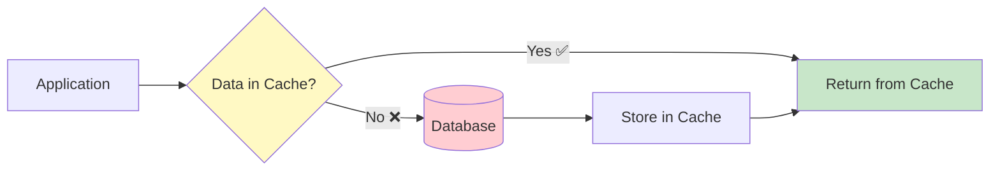
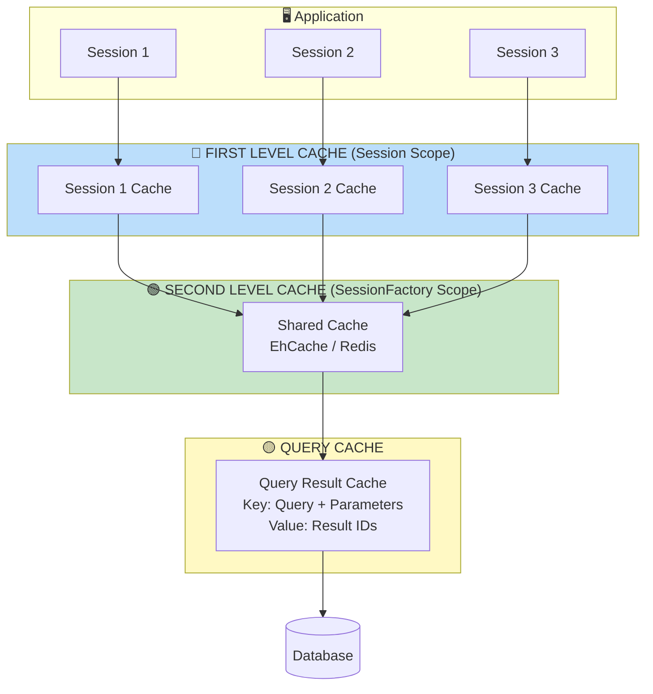
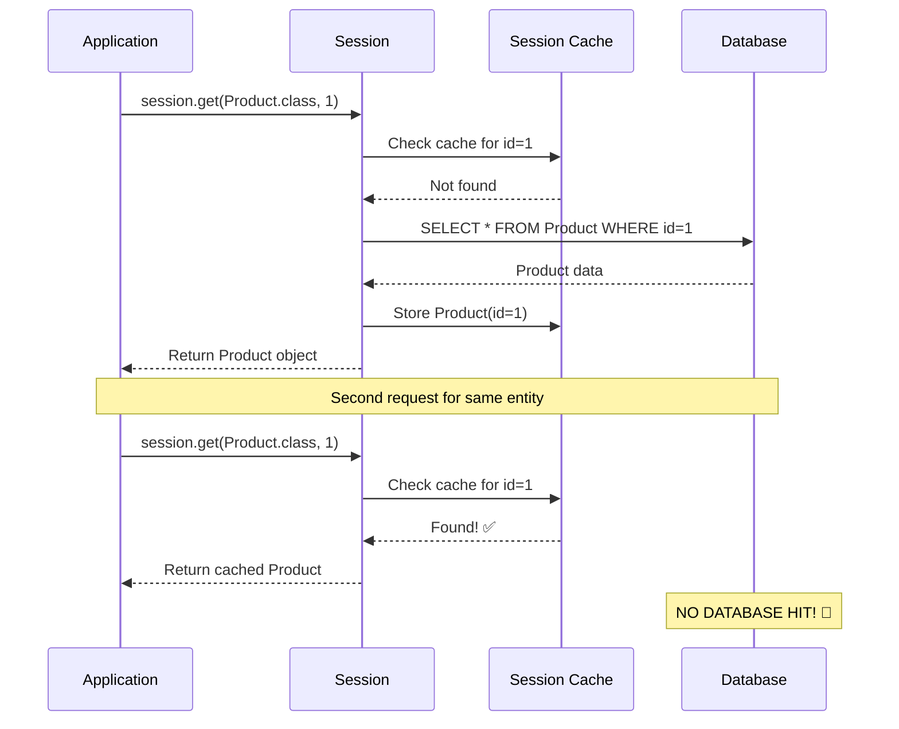
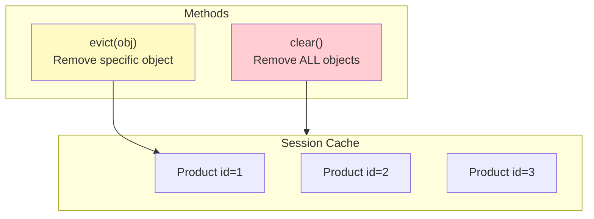
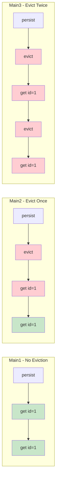
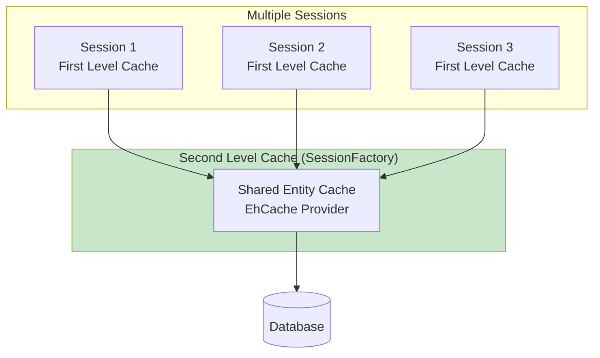
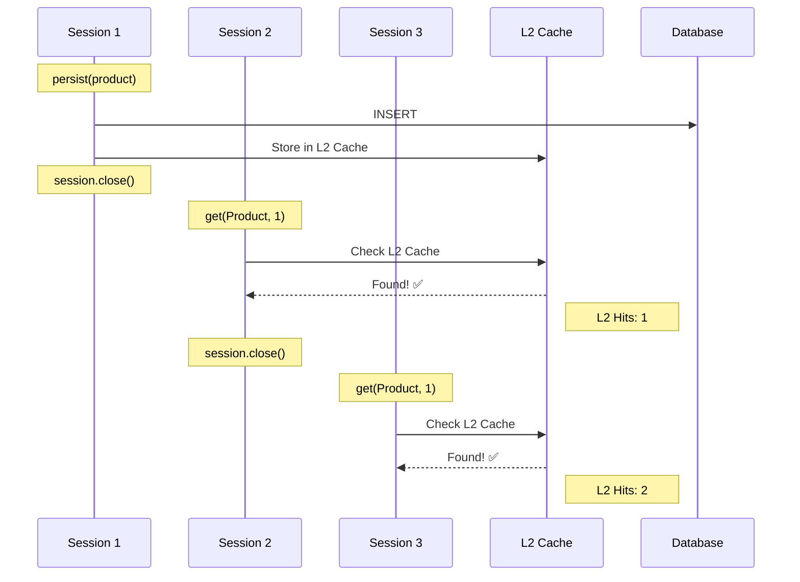
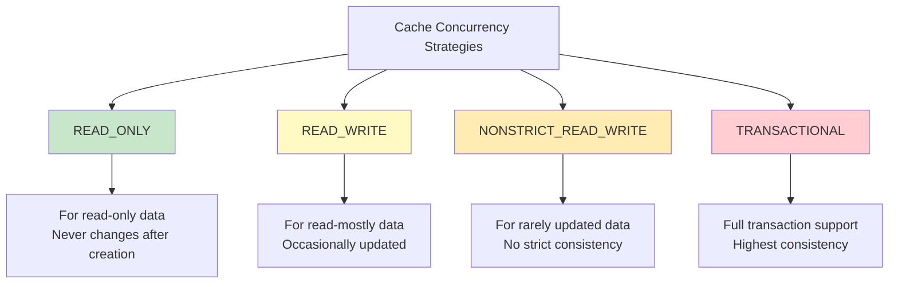
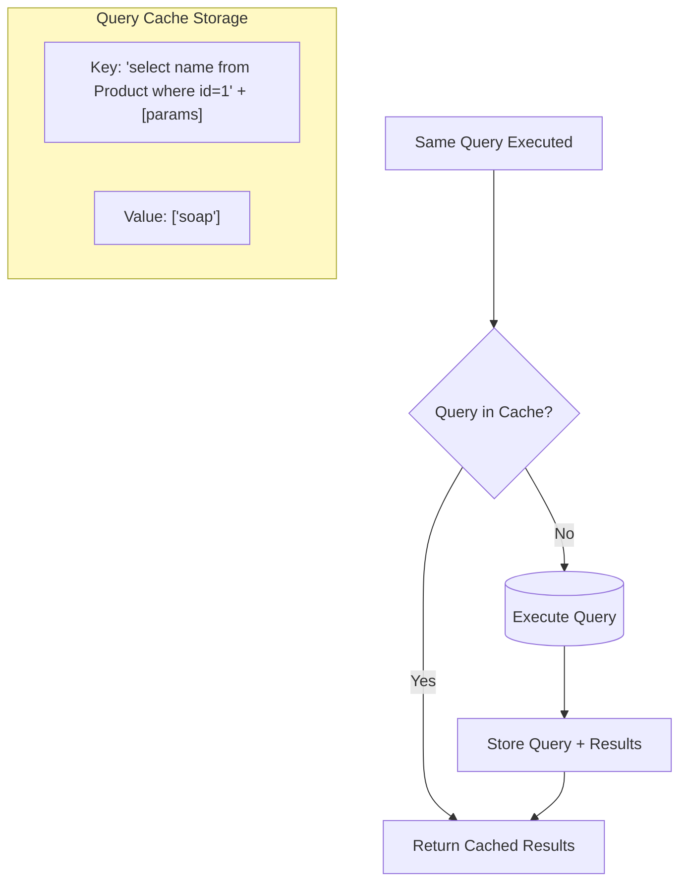

# 🚀 Hibernate Caching Mastery
## First Level, Second Level, and Query Cache - Complete Guide

---

## 📑 Table of Contents
1. [What is Caching?](#what-is-caching)
2. [Hibernate Caching Architecture](#caching-architecture)
3. [First Level Cache (Session Cache)](#first-level-cache)
4. [Eviction and Cache Management](#eviction)
5. [Second Level Cache](#second-level-cache)
6. [Cache Concurrency Strategies](#concurrency-strategies)
7. [Query Cache](#query-cache)
8. [When NOT to Use Caching](#when-not-to-cache)
9. [Best Practices & Interview Questions](#best-practices)

---

## 🎯 What is Caching? {#what-is-caching}

**Caching** is a mechanism to store frequently accessed data in memory to reduce database round-trips and improve application performance.



### Why Caching Matters

```
┌────────────────────────────────────────────────────────────────┐
│                    PERFORMANCE COMPARISON                      │
├────────────────────────────────────────────────────────────────┤
│  WITHOUT CACHE                 │  WITH CACHE                   │
│  ─────────────────────────────│──────────────────────────────│
│  100 requests = 100 DB trips   │  100 requests = 1 DB trip     │
│  High latency                  │  Low latency                  │
│  Database overload             │  Database relieved            │
│  Slow response                 │  Fast response                │
└────────────────────────────────────────────────────────────────┘
```

---

## 🏗️ Hibernate Caching Architecture {#caching-architecture}

Hibernate provides a **multi-level caching strategy** with three distinct cache layers:



### Cache Levels Comparison

| Aspect | First Level | Second Level | Query Cache |
|--------|-------------|--------------|-------------|
| **Scope** | Session | SessionFactory | SessionFactory |
| **Enabled By** | Always ON | Configuration | Configuration |
| **Stores** | Entity Objects | Entity Objects | Query + Result IDs |
| **Lifetime** | Session lifecycle | Application lifecycle | Application lifecycle |
| **Shared** | No (per session) | Yes (all sessions) | Yes (all sessions) |

---

## 🔵 First Level Cache (Session Cache) {#first-level-cache}

The **First Level Cache** is associated with the Session object and is **enabled by default**. You cannot disable it.

### How It Works



### First Level Cache Example

```java
package mypack;

import org.hibernate.Session;
import org.hibernate.SessionFactory;
import org.hibernate.Transaction;
import org.hibernate.cfg.*;
import java.util.*;

public class Main1 {
    public static void main(String[] args) {
        Configuration cfg = new Configuration();		
        cfg.configure("hibernate.cfg.xml");
        SessionFactory factory = cfg.buildSessionFactory();
        Session session = factory.openSession();
        Transaction tr = session.beginTransaction();
        
        // Create and persist a product
        Product p = new Product();
        p.setName("soap");
        p.setQty(75);
        p.setPrice(90);
        
        session.persist(p);  // ① Object 'p' is now in Session Cache
        tr.commit();
 
        System.out.println("done with product");
        
        // ═══════════════════════════════════════════════════════════
        // FIRST get() CALL - Object already in cache from persist()
        // ═══════════════════════════════════════════════════════════
        Product ref2 = (Product) session.get(Product.class, 1);   
        System.out.println(ref2);
        // Console: Hibernate does NOT fire SELECT query! 
        // Why? Product with id=1 is already in session cache
        
        // ═══════════════════════════════════════════════════════════
        // SECOND get() CALL - Still uses cache
        // ═══════════════════════════════════════════════════════════
        Product ref3 = (Product) session.get(Product.class, 1);  
        System.out.println(ref3);
        // Console: Still NO SELECT query! Cache hit again!
        
        // PROOF: ref2 == ref3 (same object reference from cache)
        System.out.println(ref2 == ref3);  // Output: true
    }
}
```

### Console Output Analysis

```
Hibernate: insert into Product (name, price, qty) values (?, ?, ?)
done with product
Product [id=1, name=soap, qty=75, price=90.0]  ← From cache, NO SELECT
Product [id=1, name=soap, qty=75, price=90.0]  ← From cache, NO SELECT
```

> 💡 **Key Insight**: Notice there's only one INSERT statement and **zero SELECT statements**. The `get()` calls return objects directly from the Session Cache.

---

## 🔄 Eviction and Cache Management {#eviction}

Sometimes you need to remove objects from the cache. Hibernate provides methods to manage the first-level cache:

### evict() vs clear()



### Example: Without evict() - Cache Hit

```java
// Main1.java - Multiple get() calls WITHOUT evict()
public class Main1 {
    public static void main(String[] args) {
        // ... setup code ...
        
        session.persist(p);
        tr.commit();
        
        // session.evict(p);  ← COMMENTED OUT
        
        Product ref2 = (Product) session.get(Product.class, 1);   
        System.out.println(ref2);
        // ✅ NO SQL - Object found in cache
        
        // session.evict(ref2);  ← COMMENTED OUT
        
        Product ref3 = (Product) session.get(Product.class, 1);  
        System.out.println(ref3);
        // ✅ NO SQL - Object still in cache
    }
}
```

**Output**: Only INSERT, no SELECT queries.

### Example: With evict() - Forces Database Query

```java
// Main2.java - Using evict() after persist
public class Main2 {
    public static void main(String[] args) {
        // ... setup code ...
        
        session.persist(p);
        tr.commit();
        
        session.evict(p);  // ⚠️ Remove 'p' from session cache
        
        Product ref2 = (Product) session.get(Product.class, 1);   
        System.out.println(ref2);
        // 🔍 FIRES SELECT! Object was evicted, must fetch from DB
        
        // session.evict(ref2);  ← COMMENTED OUT
        
        Product ref3 = (Product) session.get(Product.class, 1);  
        System.out.println(ref3);
        // ✅ NO SQL - ref2 is now in cache
    }
}
```

**Output**:
```
Hibernate: insert into Product (name, price, qty) values (?, ?, ?)
done with product
now loading
Hibernate: select p1_0.id,p1_0.name,p1_0.price,p1_0.qty from Product p1_0 where p1_0.id=?
Product [id=1, name=soap, qty=75, price=90.0]
Product [id=1, name=soap, qty=75, price=90.0]  ← From cache after first get()
```

### Example: Evicting Twice - Two Database Queries

```java
// Main3.java - Using evict() after both persist and get
public class Main3 {
    public static void main(String[] args) {
        // ... setup code ...
        
        session.persist(p);
        tr.commit();
        
        session.evict(p);  // ⚠️ Remove persisted object
        
        Product ref2 = (Product) session.get(Product.class, 1);   
        System.out.println(ref2);
        // 🔍 FIRES SELECT! Must fetch from DB
        
        session.evict(ref2);  // ⚠️ Remove fetched object too!
        
        Product ref3 = (Product) session.get(Product.class, 1);  
        System.out.println(ref3);
        // 🔍 FIRES SELECT AGAIN! Must fetch from DB again
    }
}
```

**Output**:
```
Hibernate: insert into Product (name, price, qty) values (?, ?, ?)
done with product
now loading
Hibernate: select p1_0.id,p1_0.name,p1_0.price,p1_0.qty from Product p1_0 where p1_0.id=?
Product [id=1, name=soap, qty=75, price=90.0]
Hibernate: select p1_0.id,p1_0.name,p1_0.price,p1_0.qty from Product p1_0 where p1_0.id=?
Product [id=1, name=soap, qty=75, price=90.0]
```

### Visual Flow Comparison



**Legend**: 🟢 Green = Cache Hit | 🔴 Red = Database Query

---

## 🟢 Second Level Cache {#second-level-cache}

The **Second Level Cache** is associated with the **SessionFactory** and is **shared across all sessions**. Unlike First Level Cache, it must be explicitly enabled.

### Architecture



### When Second Level Cache is Used

```
Session 1: session.get(Product, 1)
  → First Level Cache: MISS
  → Second Level Cache: MISS
  → Database: FETCH
  → Store in L1 and L2 Cache

Session 1 CLOSED

Session 2: session.get(Product, 1)
  → First Level Cache: MISS (new session)
  → Second Level Cache: HIT ✅
  → NO DATABASE QUERY!
```

### Configuration (hibernate.cfg.xml)

```xml
<?xml version="1.0" encoding="UTF-8"?>
<!DOCTYPE hibernate-configuration PUBLIC
    "-//Hibernate/Hibernate Configuration DTD 3.0//EN"
    "http://hibernate.sourceforge.net/hibernate-configuration-3.0.dtd">
<hibernate-configuration>
    <session-factory>
        <!-- ═══════════════════════════════════════════════════════ -->
        <!-- SECOND LEVEL CACHE CONFIGURATION                        -->
        <!-- ═══════════════════════════════════════════════════════ -->
        
        <!-- Enable second-level cache -->
        <property name="hibernate.cache.use_second_level_cache">true</property>
        
        <!-- Specify cache region factory (JCache) -->
        <property name="hibernate.cache.region.factory_class">jcache</property>
        
        <!-- Specify cache provider (EhCache) -->
        <property name="hibernate.javax.cache.provider">
            org.ehcache.jsr107.EhcacheCachingProvider
        </property>
        
        <!-- Enable statistics for monitoring cache hits -->
        <property name="hibernate.generate_statistics">true</property>
        
        <!-- Standard Hibernate properties -->
        <property name="show_sql">true</property>
        <property name="hibernate.connection.driver_class">com.mysql.cj.jdbc.Driver</property>
        <property name="hibernate.connection.url">jdbc:mysql://localhost:3306/hiber</property>
        <property name="hibernate.connection.username">root</property>
        <property name="hibernate.connection.password">root</property>
        <property name="hibernate.dialect">org.hibernate.dialect.MySQLDialect</property>
        <property name="hibernate.hbm2ddl.auto">update</property>
        
        <mapping class="mypack.Product"/> 
    </session-factory>
</hibernate-configuration>
```

### Entity Configuration for Caching

```java
package mypack;

import org.hibernate.annotations.Cache;
import org.hibernate.annotations.CacheConcurrencyStrategy;
import jakarta.persistence.*;

@Entity
@Cacheable                                        // ① Enable caching for this entity
@Cache(usage = CacheConcurrencyStrategy.READ_ONLY) // ② Specify cache strategy
@Table(name = "Product")
public class Product {

    @Id
    @GeneratedValue(strategy = GenerationType.IDENTITY)
    @Column(name = "id", nullable = false)
    private int id;
    
    @Column(name = "name")
    private String name;
    
    @Column(name = "qty")
    private int qty;
    
    @Column(name = "price")
    private double price;
    
    // Constructors, getters, setters...
    
    @Override
    public String toString() {
        return "Product [id=" + id + ", name=" + name + 
               ", qty=" + qty + ", price=" + price + "]";
    }
}
```

### Second Level Cache Example

```java
package mypack;

import org.hibernate.*;
import org.hibernate.cfg.*;

public class Main_2 {
    public static void main(String[] args) {
        Configuration cfg = new Configuration();		
        cfg.configure("hibernate.cfg.xml");
        SessionFactory factory = cfg.buildSessionFactory();
        
        // ═══════════════════════════════════════════════════════════
        // SESSION 1: Persist and fetch product
        // ═══════════════════════════════════════════════════════════
        Session session = factory.openSession();
        Transaction tr = session.beginTransaction();
        Product p = new Product();
        p.setName("soap");
        p.setPrice(100);
        p.setQty(30);
        session.persist(p);
        tr.commit();
        session.close();  // ⚠️ Session 1 CLOSED, First Level Cache cleared
        
        // ═══════════════════════════════════════════════════════════
        // SESSION 2: Fetch same product
        // ═══════════════════════════════════════════════════════════
        Session session1 = factory.openSession();  
        Product emp2 = (Product) session1.get(Product.class, 1);  
        System.out.println(emp2);
        session1.close();  // Session 2 CLOSED
        
        // Check second level cache hit count
        System.out.println("L2 Cache Hits: " + 
            factory.getStatistics().getSecondLevelCacheHitCount()); 
        // Output: 0 (first fetch was from DB)
        
        // ═══════════════════════════════════════════════════════════
        // SESSION 3: Fetch same product AGAIN
        // ═══════════════════════════════════════════════════════════
        Session session2 = factory.openSession();  
        Product emp3 = (Product) session2.get(Product.class, 1);  
        System.out.println(emp3);
        session2.close();
        
        System.out.println("L2 Cache Hits: " + 
            factory.getStatistics().getSecondLevelCacheHitCount()); 
        // Output: 1 ✅ (fetched from second level cache!)
        
        // ═══════════════════════════════════════════════════════════
        // SESSION 4: Fetch same product AGAIN
        // ═══════════════════════════════════════════════════════════
        Session session3 = factory.openSession();  
        Product emp4 = (Product) session3.get(Product.class, 1);  
        System.out.println(emp4);
        session3.close();
        
        System.out.println("L2 Cache Hits: " + 
            factory.getStatistics().getSecondLevelCacheHitCount()); 
        // Output: 2 ✅ (second level cache hit again!)
    }
}
```

### Visual Flow



---

## ⚙️ Cache Concurrency Strategies {#concurrency-strategies}

Hibernate provides different strategies for handling concurrent access to cached data:



### READ_ONLY Strategy

```java
@Entity
@Cacheable
@Cache(usage = CacheConcurrencyStrategy.READ_ONLY)  // ← READ ONLY
@Table(name = "Product")
public class Product {
    // ...
}
```

**Behavior**:
```java
Session session1 = factory.openSession();   
Product emp2 = (Product) session1.load(Product.class, 1);  
System.out.println(emp2);

Transaction trans = session1.beginTransaction();
emp2.setName("dddd");  // ⚠️ Trying to update
trans.commit();        // ❌ EXCEPTION!

// Exception: java.lang.UnsupportedOperationException: 
//            Can't update readonly object
```

> ⚠️ **Warning**: READ_ONLY strategy throws exception if you try to update a cached entity!

### READ_WRITE Strategy

```java
@Entity
@Cacheable
@Cache(usage = CacheConcurrencyStrategy.READ_WRITE)  // ← READ WRITE
@Table(name = "Product")
public class Product {
    // ...
}
```

**Behavior**:
```java
Session session1 = factory.openSession();   
Product emp2 = (Product) session1.load(Product.class, 1);  
System.out.println(emp2);

Transaction trans = session1.beginTransaction();
emp2.setName("dddd");  // ✅ Update allowed
trans.commit();        // ✅ Updates cache AND database
```

> ✅ **Allowed**: READ_WRITE strategy updates both cache and database on commit.

### Strategy Comparison Table

| Strategy | Read | Write | Use Case |
|----------|------|-------|----------|
| `READ_ONLY` | ✅ Fast | ❌ Throws Error | Reference data (countries, states) |
| `READ_WRITE` | ✅ Good | ✅ Allowed | General purpose, most applications |
| `NONSTRICT_READ_WRITE` | ✅ Good | ✅ Allowed | Rarely updated data, eventual consistency OK |
| `TRANSACTIONAL` | ✅ Slower | ✅ Full TX | Banking, financial applications |

---

## 🟡 Query Cache {#query-cache}

The **Query Cache** stores the results of HQL/JPQL queries. Unlike entity cache which stores objects by ID, query cache stores query strings and their result sets.

### How Query Cache Works



### Query Cache Key-Value Structure

```
┌──────────────────────────────────────────────────────────────────────────┐
│ QUERY CACHE DATA STRUCTURE                                               │
├──────────────────────────────────────────────────────────────────────────┤
│ KEY                                              VALUE                   │
├──────────────────────────────────────────────────────────────────────────┤
│ ["from Person where address=? and name=?",       [id1, id2, id3...]     │
│  ["goa", "Joey"]]                                (matching record IDs)   │
├──────────────────────────────────────────────────────────────────────────┤
│ ["select name from Product where id=1", []]      ["soap"]                │
└──────────────────────────────────────────────────────────────────────────┘
```

### Configuration for Query Cache

```xml
<hibernate-configuration>
    <session-factory>
        <!-- Enable Second Level Cache (required for Query Cache) -->
        <property name="hibernate.cache.use_second_level_cache">true</property>
        
        <!-- Enable Query Cache -->
        <property name="hibernate.cache.use_query_cache">true</property>
        
        <property name="hibernate.cache.region.factory_class">jcache</property>
        <property name="hibernate.javax.cache.provider">
            org.ehcache.jsr107.EhcacheCachingProvider
        </property>
        <property name="hibernate.generate_statistics">true</property>
        
        <!-- ... other properties ... -->
    </session-factory>
</hibernate-configuration>
```

### Query Cache Example

```java
package mypack;

import org.hibernate.*;
import org.hibernate.cfg.*;
import org.hibernate.query.Query;
import java.util.*;

public class Main_1 {
    public static void main(String[] args) {
        Configuration cfg = new Configuration();		
        cfg.configure("hibernate.cfg.xml");
        SessionFactory factory = cfg.buildSessionFactory();
        
        // ═══════════════════════════════════════════════════════════
        // SESSION 1: Persist and then run query
        // ═══════════════════════════════════════════════════════════
        Session session = factory.openSession();
        Transaction tr = session.beginTransaction();
        Product p = new Product();
        p.setName("soap");
        p.setPrice(100);
        p.setQty(30);
        session.persist(p);
        tr.commit();
        session.close();
        
        Session session1 = factory.openSession();   
        Product emp2 = (Product) session1.get(Product.class, 1);  
        System.out.println(emp2);
        
        // ⭐ Create cacheable query
        Query<?> q1 = session1.createQuery(
            "select c.name from Product c where c.id=1", 
            String.class
        );
        q1.setCacheable(true);  // ← ENABLE QUERY CACHING
        List<?> mylist = q1.list();
        System.out.println(mylist);
        session1.close();
        
        // Check cache statistics
        System.out.println("L2 Cache Hits: " + 
            factory.getStatistics().getSecondLevelCacheHitCount()); 
        System.out.println("Query Cache Hits: " + 
            factory.getStatistics().getQueryCacheHitCount()); 
        // Both: 0 (first execution)
        
        // ═══════════════════════════════════════════════════════════
        // SESSION 3: Run SAME query again
        // ═══════════════════════════════════════════════════════════
        Session session2 = factory.openSession();  
        Product emp3 = (Product) session2.get(Product.class, 1);  
        System.out.println(emp3);
        session2.close();
        
        Session session3 = factory.openSession();
        
        // ⭐ Same query - will hit query cache
        Query<?> q2 = session3.createQuery(
            "select c.name from Product c where c.id=1", 
            String.class
        );
        q2.setCacheable(true);  // ← MUST enable caching again
        mylist = q2.list();
        System.out.println(mylist);
        session3.close();
        
        // Check cache statistics
        System.out.println("L2 Cache Hits: " + 
            factory.getStatistics().getSecondLevelCacheHitCount()); 
        System.out.println("Query Cache Hits: " + 
            factory.getStatistics().getQueryCacheHitCount()); 
        // L2: 1, Query Cache: 1 ✅
    }
}
```

### Important: setCacheable(true)

```java
// ⚠️ You MUST set cacheable for EACH query execution
Query<?> q1 = session.createQuery("from Product", Product.class);
q1.setCacheable(true);  // ← Required to use/populate query cache
List<?> results = q1.list();
```

> 💡 **Note**: Even if query cache is enabled in configuration, each individual query must call `setCacheable(true)` to participate in caching.

---

## 🚫 When NOT to Use Caching {#when-not-to-cache}

```
❌ DON'T USE CACHING WHEN:
├── Data changes frequently
│   └── Cache becomes stale quickly, invalidation overhead
│
├── Data is large and accessed rarely
│   └── Wastes memory, low hit ratio
│
├── Data must always be real-time
│   └── Banking balances, stock prices
│
├── Application has heavy write operations
│   └── Cache invalidation overhead > performance gain
│
└── Concurrent updates are common
    └── Complex synchronization issues
```

### EhCache Default Settings

```xml
<defaultCache>
    <!-- Maximum objects in memory before spooling to disk -->
    maxEntriesLocalHeap="1000"
    
    <!-- If eternal=true, objects never expire -->
    eternal="false"
    
    <!-- Seconds an object can be idle before expiration -->
    timeToIdleSeconds="120"
    
    <!-- Maximum seconds an object can live regardless of access -->
    timeToLiveSeconds="120"
    
    <!-- Overflow to disk when heap is full -->
    overflowToDisk="true"
/>
```

---

## 💡 Best Practices & Interview Questions {#best-practices}

### Best Practices

```
✅ CACHING BEST PRACTICES:

┌─ First Level Cache ─────────────────────────────────────────────┐
│  • Always enabled - use it wisely                               │
│  • Use evict() to remove specific objects                       │
│  • Use clear() to remove all objects                            │
│  • Close sessions properly to release memory                    │
└─────────────────────────────────────────────────────────────────┘

┌─ Second Level Cache ────────────────────────────────────────────┐
│  • Use for read-heavy, write-light data                         │
│  • Choose appropriate concurrency strategy                      │
│  • Set proper time-to-live values                               │
│  • Monitor cache hit ratios                                      │
└─────────────────────────────────────────────────────────────────┘

┌─ Query Cache ───────────────────────────────────────────────────┐
│  • Use for queries that don't change often                      │
│  • Always use with Second Level Cache                           │
│  • Remember to setCacheable(true) on each query                 │
│  • Query cache is invalidated when related entity changes       │
└─────────────────────────────────────────────────────────────────┘
```

### Common Interview Questions

<details>
<summary><b>Q1: What is the difference between First Level and Second Level Cache?</b></summary>

| First Level Cache | Second Level Cache |
|-------------------|-------------------|
| Session scope | SessionFactory scope |
| Always enabled | Must be configured |
| Private to session | Shared across sessions |
| Cleared when session closes | Lives until factory closes |
| Cannot be disabled | Optional |
</details>

<details>
<summary><b>Q2: How do you enable Second Level Cache in Hibernate?</b></summary>

Three steps:
1. **hibernate.cfg.xml**: Set `hibernate.cache.use_second_level_cache=true`
2. **Add cache provider**: Configure EhCache/Redis as provider
3. **Entity annotation**: Add `@Cacheable` and `@Cache(usage=...)` to entity
</details>

<details>
<summary><b>Q3: What is the difference between evict() and clear()?</b></summary>

- `evict(object)`: Removes **specific object** from session cache
- `clear()`: Removes **ALL objects** from session cache

```java
session.evict(product);  // Only removes 'product'
session.clear();         // Removes everything
```
</details>

<details>
<summary><b>Q4: Can you disable First Level Cache?</b></summary>

**No**, First Level Cache cannot be disabled. It's an integral part of Hibernate's Session. You can only:
- `evict()` specific objects
- `clear()` all objects
- Not prevent objects from being cached initially
</details>

<details>
<summary><b>Q5: What happens when you update an entity with READ_ONLY cache strategy?</b></summary>

You get an exception:
```
java.lang.UnsupportedOperationException: Can't update readonly object
```

Use `READ_WRITE` strategy if updates are needed.
</details>

<details>
<summary><b>Q6: Why do you need Second Level Cache enabled for Query Cache to work?</b></summary>

Query Cache only stores **query results** (entity IDs). When results are needed, it looks up actual entities from:
1. First Level Cache (if available)
2. **Second Level Cache** (if available)
3. Database (last resort)

Without Second Level Cache, query cache would need to hit DB for every entity, defeating its purpose.
</details>

---

## 📚 Quick Reference Card

```
┌─────────────────────────────────────────────────────────────────────┐
│                    CACHING QUICK REFERENCE                          │
├─────────────────────────────────────────────────────────────────────┤
│ FIRST LEVEL CACHE:                                                  │
│   • Always ON, session scope                                        │
│   • session.evict(obj) - remove one                                 │
│   • session.clear() - remove all                                    │
├─────────────────────────────────────────────────────────────────────┤
│ SECOND LEVEL CACHE:                                                 │
│   • hibernate.cache.use_second_level_cache=true                     │
│   • @Cacheable + @Cache(usage=CacheConcurrencyStrategy.XXX)         │
│   • factory.getStatistics().getSecondLevelCacheHitCount()           │
├─────────────────────────────────────────────────────────────────────┤
│ QUERY CACHE:                                                        │
│   • hibernate.cache.use_query_cache=true                            │
│   • query.setCacheable(true) - for each query                       │
│   • factory.getStatistics().getQueryCacheHitCount()                 │
├─────────────────────────────────────────────────────────────────────┤
│ CONCURRENCY STRATEGIES:                                             │
│   • READ_ONLY     - No updates allowed                              │
│   • READ_WRITE    - Updates OK (most common)                        │
│   • NONSTRICT_READ_WRITE - Eventual consistency                     │
│   • TRANSACTIONAL - Full transaction support                        │
└─────────────────────────────────────────────────────────────────────┘
```

---

> 📖 **Next**: [Association Mappings Guide](./Hibernate_03_Association_Mappings.md) - One-to-One, One-to-Many, Many-to-Many
