# 🔗 Hibernate Association Mappings Guide
## One-to-One, One-to-Many, Many-to-One, Many-to-Many - Complete Guide

---

## 📑 Table of Contents
1. [What are Associations?](#what-are-associations)
2. [Types of Associations](#types-of-associations)
3. [Unidirectional vs Bidirectional](#uni-vs-bi)
4. [One-to-One Mapping](#one-to-one)
5. [One-to-Many Mapping](#one-to-many)
6. [@JoinColumn Annotation](#join-column)
7. [Bidirectional One-to-Many/Many-to-One](#bidirectional)
8. [The mappedBy Attribute](#mapped-by)
9. [CascadeType Operations](#cascade-type)
10. [Many-to-Many Mapping](#many-to-many)
11. [Best Practices & Interview Questions](#best-practices)

---

## 🎯 What are Associations? {#what-are-associations}

**Associations** in Hibernate represent relationships between entities, similar to foreign key relationships in relational databases but modeled as object references.


### Why Associations Matter

```
┌────────────────────────────────────────────────────────────────┐
│  WITHOUT HIBERNATE                WITH HIBERNATE               │
├────────────────────────────────────────────────────────────────┤
│  Manual SQL JOINs               Object references              │
│  ResultSet processing           Automatic object mapping       │
│  Foreign key management         Transparent navigation         │
│  Complex code                   Clean, readable code           │
└────────────────────────────────────────────────────────────────┘
```

---

## 📊 Types of Associations {#types-of-associations}


### Relationship Cardinality Table

| Relationship | Annotation | Example | FK Location |
|--------------|------------|---------|-------------|
| **One-to-One** | `@OneToOne` | Company → Account | Owner side |
| **One-to-Many** | `@OneToMany` | Student → Phones | "Many" side |
| **Many-to-One** | `@ManyToOne` | Answer → Question | "Many" side |
| **Many-to-Many** | `@ManyToMany` | Employee ↔ Project | Join table |

---

## ↔️ Unidirectional vs Bidirectional {#uni-vs-bi}


### Comparison

| Aspect | Unidirectional | Bidirectional |
|--------|----------------|---------------|
| **Navigation** | One direction only | Both directions |
| **Annotation** | On one entity | On both entities |
| **Uses** | Simple parent-child | Full relationship navigation |
| **Complexity** | Lower | Higher |
| **Example** | Company → Account | Question ↔ Answer |

---

## 1️⃣ One-to-One Mapping {#one-to-one}

**One-to-One** represents a relationship where one entity is associated with exactly one instance of another entity.

### Architecture


### Entity Classes

**Account.java** (Child Entity - No reference to parent)

```java
package mypack;

import jakarta.persistence.*;

@Entity
@Table(name="account")
public class Account {
    private int id;
    private double balance;
    
    @Id
    @GeneratedValue(strategy=GenerationType.IDENTITY)
    @Column(name="accid")
    public int getId() {
        return id;
    }
    
    public void setId(int id) {
        this.id = id;
    }
    
    @Column(name="balance")
    public double getBalance() {
        return balance;
    }
    
    public void setBalance(double balance) {
        this.balance = balance;
    }
}
```

**Company.java** (Parent Entity - Has reference to Account)

```java
package mypack;

import jakarta.persistence.*;

@Entity
@Table(name="company")
public class Company {
    private int id;
    private Account acc;       // ← Reference to associated Account
    private String name;
    private String location;
    
    @Id
    @GeneratedValue(strategy=GenerationType.IDENTITY)
    @Column(name="cid")
    public int getId() {
        return id;
    }
    
    public void setId(int id) {
        this.id = id;
    }
    
    // ⭐ ONE-TO-ONE MAPPING
    @OneToOne(cascade = CascadeType.ALL)  // ① Cascade all operations
    public Account getAcc() {
        return acc;
    }
    
    public void setAcc(Account acc) {
        this.acc = acc;
    }
    
    @Column(name="name")
    public String getName() {
        return name;
    }
    
    public void setName(String name) {
        this.name = name;
    }
    
    @Column(name="location")
    public String getLocation() {
        return location;
    }
    
    public void setLocation(String location) {
        this.location = location;
    }
}
```

### Main.java - Using One-to-One

```java
package mypack;

import org.hibernate.*;
import org.hibernate.cfg.*;

public class Main {
    public static void main(String[] args) {
        Configuration cfg = new Configuration();		
        cfg.configure("hibernate.cfg.xml");
        SessionFactory factory = cfg.buildSessionFactory();
        Session session = factory.openSession();
        Transaction transaction = session.beginTransaction(); 
        
        // ═══════════════════════════════════════════════════════════
        // CREATE COMPANY 1 WITH ACCOUNT 1
        // ═══════════════════════════════════════════════════════════
        Company c1 = new Company();
        Account a1 = new Account();
        a1.setBalance(20000);          // Account balance
        c1.setName("capgemini");       // Company name
        c1.setLocation("mumbai");      // Company location
        c1.setAcc(a1);                 // ⭐ Link account to company
        
        // ═══════════════════════════════════════════════════════════
        // CREATE COMPANY 2 WITH ACCOUNT 2
        // ═══════════════════════════════════════════════════════════
        Company c2 = new Company();
        Account a2 = new Account();
        a2.setBalance(40000);
        c2.setName("smartstream");
        c2.setLocation("banglore");
        c2.setAcc(a2);
        
        // ═══════════════════════════════════════════════════════════
        // PERSIST - CascadeType.ALL saves both Company AND Account
        // ═══════════════════════════════════════════════════════════
        session.persist(c1);  // Saves c1 AND a1 automatically!
        session.persist(c2);  // Saves c2 AND a2 automatically!
        
        transaction.commit(); 
        System.out.println("done with company");  
    }
}
```

### Generated Tables

```
mysql> select * from company;
+-----+---------------+-----------+-----------+
| cid | location      | name      | acc_accid |
+-----+---------------+-----------+-----------+
|   1 | mumbai        | capgemini |         1 |
|   2 | banglore      | smartstream|        2 |
+-----+---------------+-----------+-----------+

mysql> select * from account;
+-------+---------+
| accid | balance |
+-------+---------+
|     1 |   20000 |
|     2 |   40000 |
+-------+---------+
```

### Execution Flow

```mermaid
sequenceDiagram
    participant App as Application
    participant Sess as Session
    participant DB as Database
    
    App->>App: Create Company & Account
    App->>App: company.setAcc(account)
    App->>Sess: session.persist(company)
    
    Note over Sess: CascadeType.ALL active
    
    Sess->>DB: INSERT into account (balance)
    DB-->>Sess: accid = 1
    Sess->>DB: INSERT into company (name, location, acc_accid)
    
    Note over DB: Foreign key links company → account
```



---

## 1️⃣➡️🔢 One-to-Many Mapping {#one-to-many}

**One-to-Many** represents a relationship where one entity is associated with multiple instances of another entity.

### Architecture


### Entity Classes

**Phone.java** (Child Entity)

```java
package mypack;

import jakarta.persistence.*;

@Entity
@Table(name = "PHONE")
public class Phone {
    private long phoneId;
    private String phoneType;
    private String phoneNumber;
    
    public Phone() {}
    
    public Phone(String phoneType, String phoneNumber) {
        this.phoneType = phoneType;
        this.phoneNumber = phoneNumber;
    }
    
    @Id
    @GeneratedValue(strategy=GenerationType.IDENTITY)
    @Column(name = "PHONE_ID")
    public long getPhoneId() {
        return this.phoneId;
    }
    
    public void setPhoneId(long phoneId) {
        this.phoneId = phoneId;
    }
    
    @Column(name = "PHONE_TYPE", nullable = false, length=10)
    public String getPhoneType() {
        return this.phoneType;
    }
    
    public void setPhoneType(String phoneType) {
        this.phoneType = phoneType;
    }
    
    @Column(name = "PHONE_NUMBER", nullable = false, length=15)
    public String getPhoneNumber() {
        return this.phoneNumber;
    }
    
    public void setPhoneNumber(String phoneNumber) {
        this.phoneNumber = phoneNumber;
    }
}
```

**Student.java** (Parent Entity with Collection)

```java
package mypack;

import java.util.*;
import jakarta.persistence.*;

@Entity
@Table(name = "STUDENT")
public class Student {
    private long studentId;
    private String studentName;
    private Set<Phone> studentPhoneNumbers;  // ← Collection of phones
    
    public Student() {}
    
    public Student(String studentName, Set<Phone> studentPhoneNumbers) {
        this.studentName = studentName;
        this.studentPhoneNumbers = studentPhoneNumbers;
    }
    
    @Id
    @GeneratedValue(strategy=GenerationType.IDENTITY)
    @Column(name = "STUDENT_ID")
    public long getStudentId() {
        return this.studentId;
    }
    
    public void setStudentId(long studentId) {
        this.studentId = studentId;
    }
    
    @Column(name = "STUDENT_NAME", nullable = false, length = 100)
    public String getStudentName() {
        return this.studentName;
    }
    
    public void setStudentName(String studentName) {
        this.studentName = studentName;
    }
    
    // ⭐ ONE-TO-MANY MAPPING WITH @JoinColumn
    @OneToMany(cascade = CascadeType.ALL)
    @JoinColumn(name = "sid", referencedColumnName="STUDENT_ID")
    public Set<Phone> getStudentPhoneNumbers() {
        return this.studentPhoneNumbers;
    }
    
    public void setStudentPhoneNumbers(Set<Phone> studentPhoneNumbers) {
        this.studentPhoneNumbers = studentPhoneNumbers;
    }
}
```

### Main.java - Using One-to-Many

```java
package mypack;

import org.hibernate.*;
import org.hibernate.cfg.*;
import java.util.*;

public class Main {
    public static void main(String[] args) {
        Configuration cfg = new Configuration();		
        cfg.configure("hibernate.cfg.xml");
        SessionFactory factory = cfg.buildSessionFactory();
        Session session = factory.openSession();
        Transaction transaction = session.beginTransaction(); 
        
        // Create student
        Student s1 = new Student();
        
        // Create phones
        Phone p1 = new Phone();
        p1.setPhoneNumber("923456789");
        p1.setPhoneType("mobile");
        
        Phone p2 = new Phone();
        p2.setPhoneNumber("2654321");
        p2.setPhoneType("resd");
        
        // Add phones to set
        Set<Phone> h = new HashSet<Phone>();
        h.add(p1);
        h.add(p2);
        
        // Link phones to student
        s1.setStudentName("abc");
        s1.setStudentPhoneNumbers(h);
        
        // Persist student (cascades to phones)
        session.persist(s1);
        
        transaction.commit(); 
        System.out.println("done with student");  
    }
}
```

### Generated Tables

```
mysql> select * from student;
+------------+--------------+
| STUDENT_ID | STUDENT_NAME |
+------------+--------------+
|          1 | abc          |
+------------+--------------+

mysql> select * from phone;
+----------+------------+--------------+------+
| PHONE_ID | PHONE_TYPE | PHONE_NUMBER |  sid |
+----------+------------+--------------+------+
|        1 | mobile     | 923456789    |    1 |
|        2 | resd       | 2654321      |    1 |
+----------+------------+--------------+------+
```

> 💡 Notice the `sid` column in PHONE table. This is created by `@JoinColumn(name = "sid")` and stores the foreign key.

---

## 🔗 @JoinColumn Annotation {#join-column}

The `@JoinColumn` annotation specifies how the foreign key column is created.

### Syntax Explained

```java
@JoinColumn(
    name = "sid",                         // Column name in child table
    referencedColumnName = "STUDENT_ID"   // Primary key in parent table
)
```

### Visual Representation


### With vs Without @JoinColumn

```
┌─────────────────────────────────────────────────────────────────────────┐
│ WITH @JoinColumn                                                        │
├─────────────────────────────────────────────────────────────────────────┤
│ @OneToMany(cascade = CascadeType.ALL)                                   │
│ @JoinColumn(name = "sid", referencedColumnName="STUDENT_ID")            │
│                                                                         │
│ Result: FK column "sid" created in PHONE table                          │
│ Tables: STUDENT, PHONE (2 tables)                                       │
└─────────────────────────────────────────────────────────────────────────┘

┌─────────────────────────────────────────────────────────────────────────┐
│ WITHOUT @JoinColumn                                                     │
├─────────────────────────────────────────────────────────────────────────┤
│ @OneToMany(cascade = CascadeType.ALL)                                   │
│ // No @JoinColumn                                                       │
│                                                                         │
│ Result: Association table "student_phone" created automatically!        │
│ Tables: STUDENT, PHONE, STUDENT_PHONE (3 tables)                        │
└─────────────────────────────────────────────────────────────────────────┘
```

---

## ↔️ Bidirectional One-to-Many / Many-to-One {#bidirectional}

A **bidirectional** relationship allows navigation from both sides - parent to children AND child to parent.

### Architecture


### Entity Classes

**Question.java** (Parent - One-to-Many side with mappedBy)

```java
package mypack;

import java.util.List;
import jakarta.persistence.*;

@Entity
public class Question {
    @Id
    @GeneratedValue(strategy=GenerationType.IDENTITY)
    private int qid;
    private String quest;
    
    // ⭐ ONE-TO-MANY with mappedBy (non-owning side)
    @OneToMany(cascade=CascadeType.ALL, mappedBy="question")
    private List<Answer> ans;
    
    // Getters, setters, toString...
    
    public int getQid() { return qid; }
    public void setQid(int qid) { this.qid = qid; }
    
    public String getQuest() { return quest; }
    public void setQuest(String quest) { this.quest = quest; }
    
    public List<Answer> getAns() { return ans; }
    public void setAns(List<Answer> ans) { this.ans = ans; }
    
    @Override
    public String toString() {
        return "Question [qid=" + qid + ", quest=" + quest + ", ans=" + ans + "]";
    }
}
```

**Answer.java** (Child - Many-to-One side - OWNS the relationship)

```java
package mypack;

import jakarta.persistence.*;

@Entity
public class Answer {
    @Id
    @GeneratedValue(strategy=GenerationType.IDENTITY)
    private int ansid;
    private String reply;
    
    // ⭐ MANY-TO-ONE (owning side - has the FK)
    @ManyToOne
    private Question question;  // Reference back to Question
    
    // Getters and setters
    public int getAnsid() { return ansid; }
    public void setAnsid(int ansid) { this.ansid = ansid; }
    
    public String getReply() { return reply; }
    public void setReply(String reply) { this.reply = reply; }
    
    public Question getQuestion() { return question; }
    public void setQuestion(Question question) { this.question = question; }
}
```

### Main.java - Bidirectional Navigation

```java
package mypack;

import org.hibernate.*;
import org.hibernate.cfg.*;
import java.util.*;

public class Main {
    public static void main(String[] args) {
        Configuration cfg = new Configuration();
        cfg.configure("hibernate.cfg.xml");
        SessionFactory factory = cfg.buildSessionFactory();
        Session session = factory.openSession();
        Transaction tr = session.beginTransaction();
        
        // Create question
        Question q1 = new Question();
        q1.setQuest("What is Cricket");
        
        // Create answers
        Answer a1 = new Answer();
        a1.setReply("Cricket is one of the sports types");
        a1.setQuestion(q1);  // ⭐ Link answer to question (IMPORTANT!)
        
        Answer a2 = new Answer();
        a2.setReply("Cricket is very interesting");
        a2.setQuestion(q1);  // ⭐ Link answer to question
        
        Answer a3 = new Answer();
        a3.setReply("Cricket is a religion in India");
        a3.setQuestion(q1);  // ⭐ Link answer to question
        
        // Link question to answers
        List<Answer> anslist = new ArrayList<>();
        anslist.add(a1);
        anslist.add(a2);
        anslist.add(a3);
        q1.setAns(anslist);
        
        session.persist(q1);  // Cascades to all answers
        tr.commit();
        System.out.println("Done with question");
        
        // ═══════════════════════════════════════════════════════════
        // NAVIGATION: Question → Answers (One-to-Many)
        // ═══════════════════════════════════════════════════════════
        System.out.println("Let's retrieve the answers from a question");
        Question ref1 = session.get(Question.class, 1);
        System.out.println("Question is\t" + ref1.getQuest());
        System.out.println("Answers are:");
        for(Answer k : ref1.getAns()) {
            System.out.println(k.getReply());
        }
        
        // ═══════════════════════════════════════════════════════════
        // NAVIGATION: Answer → Question (Many-to-One)
        // ═══════════════════════════════════════════════════════════
        System.out.println("\nLet's retrieve the question from the answers");
        Answer ans1 = session.get(Answer.class, 1);
        System.out.println("Answer\t" + ans1.getReply() + 
                           "\t\tQuestion\t" + ans1.getQuestion().getQuest());
        
        Answer ans2 = session.get(Answer.class, 2);
        System.out.println("Answer\t" + ans2.getReply() + 
                           "\t\tQuestion\t" + ans2.getQuestion().getQuest());
        
        Answer ans3 = session.get(Answer.class, 3);
        System.out.println("Answer\t" + ans3.getReply() + 
                           "\t\tQuestion\t" + ans3.getQuestion().getQuest());
    }
}
```

### Generated Tables

```
mysql> select * from question;
+-----+-----------------+
| qid | quest           |
+-----+-----------------+
|   1 | What is Cricket |
+-----+-----------------+

mysql> select * from answer;
+-------+------------------------------------+--------------+
| ansid | reply                              | question_qid |
+-------+------------------------------------+--------------+
|     1 | Cricket is one of the sports types |            1 |
|     2 | Cricket is very interesting        |            1 |
|     3 | Cricket is a religion in India     |            1 |
+-------+------------------------------------+--------------+
```

> 💡 The foreign key `question_qid` is in the **Answer table** because Answer is the **owning side**.

---

## 📍 The mappedBy Attribute {#mapped-by}

The `mappedBy` attribute is crucial for understanding relationship ownership.

### What mappedBy Means

```java
@OneToMany(cascade=CascadeType.ALL, mappedBy="question")
private List<Answer> ans;
```

> 🔑 `mappedBy="question"` tells Hibernate: "The foreign key for this relationship is on the **Answer** side, in the property named `question`."

### Visual Explanation

```mermaid
flowchart TB
    subgraph Question["Question Entity"]
        Q_ID[qid - PK]
        Q_QUEST[quest]
        Q_ANS["List&lt;Answer&gt; ans<br/>@OneToMany(mappedBy='question')"]
    end
    
    subgraph Answer["Answer Entity"]
        A_ID[ansid - PK]
        A_REPLY[reply]
        A_QUESTION["Question question<br/>@ManyToOne<br/>⭐ OWNS the relationship"]
    end
    
    Q_ANS -.->|"mappedBy points to"| A_QUESTION
    A_QUESTION -->|"Creates FK"| FK["question_qid (FK)"]
    
    style A_QUESTION fill:#c8e6c9
    style FK fill:#fff9c4
```



### Ownership Rules

```
┌─────────────────────────────────────────────────────────────────────────┐
│ RELATIONSHIP OWNERSHIP RULES                                            │
├─────────────────────────────────────────────────────────────────────────┤
│ 1. The side WITHOUT mappedBy is the OWNER                               │
│ 2. The owner has the foreign key column in its table                    │
│ 3. Only the owner can update the relationship                           │
│ 4. mappedBy specifies the property name on the owner side               │
├─────────────────────────────────────────────────────────────────────────┤
│ In Question-Answer example:                                              │
│   • Question has mappedBy → NOT the owner                               │
│   • Answer has @ManyToOne → IS the owner                                │
│   • FK column (question_qid) is in Answer table                         │
└─────────────────────────────────────────────────────────────────────────┘
```

---

## ⚡ CascadeType Operations {#cascade-type}

`CascadeType` defines what happens to child entities when parent entity is persisted, updated, or deleted.

### Available Cascade Types


### CascadeType Comparison Table

| CascadeType | Effect | Use Case |
|-------------|--------|----------|
| `ALL` | Applies all cascade operations | Strong ownership (Order → OrderItems) |
| `PERSIST` | Only cascade persist() | Save related entities together |
| `MERGE` | Only cascade merge() | Update related entities together |
| `REMOVE` | Only cascade remove() | Delete children with parent |
| `REFRESH` | Only cascade refresh() | Reload from DB together |
| `DETACH` | Only cascade detach() | Detach from session together |

### Example Usage

```java
// CascadeType.ALL - Most common
@OneToOne(cascade = CascadeType.ALL)
public Account getAcc() { return acc; }

// Multiple cascade types
@OneToMany(cascade = {CascadeType.PERSIST, CascadeType.REMOVE})
public Set<Phone> getPhones() { return phones; }

// With orphan removal
@OneToMany(cascade = CascadeType.ALL, orphanRemoval = true)
public List<Answer> getAnswers() { return answers; }
```

---

## 🔄 Many-to-Many Mapping {#many-to-many}

**Many-to-Many** represents a relationship where multiple entities on one side can be associated with multiple entities on the other side.

### Architecture


### Entity Classes

**Employee.java** (Owning side - no mappedBy)

```java
package mypack;

import java.util.List;
import java.util.ArrayList;
import jakarta.persistence.*;

@Entity
public class Employee {
    @Id
    @GeneratedValue(strategy=GenerationType.IDENTITY)
    private int eid;
    private String ename;
    
    // ⭐ MANY-TO-MANY (Owning side - creates join table)
    @ManyToMany
    private List<Project> projects = new ArrayList<Project>();
    
    @Override
    public String toString() {
        return "Employee [ename=" + ename + "]";
    }
    
    // Getters and setters
    public int getEid() { return eid; }
    public void setEid(int eid) { this.eid = eid; }
    
    public String getEname() { return ename; }
    public void setEname(String ename) { this.ename = ename; }
    
    public List<Project> getProjects() { return projects; }
    public void setProjects(List<Project> projects) { this.projects = projects; }
    
    public Employee() {}
    
    public Employee(int eid, String ename, List<Project> projects) {
        this.eid = eid;
        this.ename = ename;
        this.projects = projects;
    }
}
```

**Project.java** (Inverse side - has mappedBy)

```java
package mypack;

import java.util.List;
import java.util.ArrayList;
import jakarta.persistence.*;

@Entity
public class Project {
    @Override
    public String toString() {
        return "Project [pname=" + pname + "]";
    }

    @Id
    @GeneratedValue(strategy=GenerationType.IDENTITY)
    private int pid;
    private String pname;
    
    // ⭐ MANY-TO-MANY (Inverse side - points to owner)
    @ManyToMany(mappedBy="projects")
    private List<Employee> employees = new ArrayList<Employee>();
    
    // Getters and setters
    public int getPid() { return pid; }
    public void setPid(int pid) { this.pid = pid; }
    
    public String getPname() { return pname; }
    public void setPname(String pname) { this.pname = pname; }
    
    public List<Employee> getEmployees() { return employees; }
    public void setEmployees(List<Employee> employees) { this.employees = employees; }
    
    public Project() {}
    
    public Project(int pid, String pname, List<Employee> employees) {
        this.pid = pid;
        this.pname = pname;
        this.employees = employees;
    }
}
```

### Main.java - Using Many-to-Many

```java
package mypack;

import org.hibernate.*;
import org.hibernate.cfg.*;

public class Main {
    public static void main(String[] args) {
        Configuration cfg = new Configuration();
        cfg.configure("hibernate.cfg.xml");
        SessionFactory factory = cfg.buildSessionFactory();
        Session session = factory.openSession();
        Transaction tr = session.beginTransaction();
        
        // Create employees
        Employee e1 = new Employee();
        Employee e2 = new Employee();
        e1.setEname("Harry");
        e2.setEname("Javed");
        
        // Create projects
        Project p1 = new Project();
        Project p2 = new Project();
        p1.setPname("Emart");
        p2.setPname("Etour");
        
        // ═══════════════════════════════════════════════════════════
        // SETUP RELATIONSHIPS (from both sides)
        // ═══════════════════════════════════════════════════════════
        
        // Harry works on both projects
        e1.getProjects().add(p1);
        e1.getProjects().add(p2);
        
        // Javed works on second project only
        e2.getProjects().add(p2); 
        
        // Project 1 is done by only Harry
        p1.getEmployees().add(e1);
        
        // Project 2 is done by Harry and Javed
        p2.getEmployees().add(e1);
        p2.getEmployees().add(e2);  
        
        // Persist all entities
        session.persist(e1);
        session.persist(e2);
        session.persist(p1);
        session.persist(p2);
        tr.commit();
        
        // ═══════════════════════════════════════════════════════════
        // NAVIGATE: Employee → Projects
        // ═══════════════════════════════════════════════════════════
        System.out.println("Let's retrieve projects from employees");
        
        Employee ref1 = (Employee) session.get(Employee.class, 1);
        System.out.println(ref1.getEname() + " is working on Projects\t" + 
                           ref1.getProjects());
        // Output: Harry is working on Projects  [Project[pname=Emart], Project[pname=Etour]]
        
        Employee ref2 = (Employee) session.get(Employee.class, 2);
        System.out.println(ref2.getEname() + " is working on Projects\t" + 
                           ref2.getProjects());
        // Output: Javed is working on Projects  [Project[pname=Etour]]
        
        // ═══════════════════════════════════════════════════════════
        // NAVIGATE: Project → Employees
        // ═══════════════════════════════════════════════════════════
        System.out.println("\nLet's retrieve employees from projects");
        
        Project ref3 = (Project) session.get(Project.class, 1);
        System.out.println(ref3.getPname() + " is done by\t" + 
                           ref3.getEmployees());
        // Output: Emart is done by  [Employee[ename=Harry]]
        
        Project ref4 = (Project) session.get(Project.class, 2);
        System.out.println(ref4.getPname() + " is done by\t" + 
                           ref4.getEmployees());
        // Output: Etour is done by  [Employee[ename=Harry], Employee[ename=Javed]]
        
        factory.close();
        System.out.println("Done with Many to Many");
    }
}
```

### Generated Tables

```
mysql> select * from employee;
+-----+-------+
| eid | ename |
+-----+-------+
|   1 | Harry |
|   2 | Javed |
+-----+-------+

mysql> select * from project;
+-----+-------+
| pid | pname |
+-----+-------+
|   1 | Emart |
|   2 | Etour |
+-----+-------+

mysql> select * from employee_projects;  -- JOIN TABLE (auto-created)
+---------------+--------------+
| employees_eid | projects_pid |
+---------------+--------------+
|             1 |            1 |
|             1 |            2 |
|             2 |            2 |
+---------------+--------------+
```

### Join Table Visualization


---

## 💡 Best Practices & Interview Questions {#best-practices}

### Best Practices

```
✅ ASSOCIATION MAPPING BEST PRACTICES:

┌─ General ───────────────────────────────────────────────────────┐
│  • Always use the appropriate relationship type                 │
│  • Prefer bidirectional for complex navigation needs            │
│  • Use @JoinColumn to avoid extra tables in One-to-Many         │
│  • Set both sides of bidirectional relationships                │
└─────────────────────────────────────────────────────────────────┘

┌─ Cascade ───────────────────────────────────────────────────────┐
│  • Use CascadeType.ALL for true parent-child relationships      │
│  • Be careful with CascadeType.REMOVE in Many-to-Many           │
│  • Consider orphanRemoval=true for child entities               │
└─────────────────────────────────────────────────────────────────┘

┌─ Performance ───────────────────────────────────────────────────┐
│  • Use LAZY fetch type by default                               │
│  • Avoid circular toString() in bidirectional relationships     │
│  • Use Set instead of List to avoid duplicates                  │
└─────────────────────────────────────────────────────────────────┘
```

### Common Interview Questions

<details>
<summary><b>Q1: What is the difference between @OneToMany and @ManyToOne?</b></summary>

| @OneToMany | @ManyToOne |
|------------|------------|
| Parent side ("One" has Many) | Child side (Many belong to "One") |
| Usually has mappedBy | Owns the foreign key |
| Collection type (List, Set) | Single entity reference |
| Example: Question → Answers | Example: Answer → Question |
</details>

<details>
<summary><b>Q2: What does mappedBy do?</b></summary>

`mappedBy` specifies:
- This side does NOT own the relationship
- The foreign key is on the OTHER side
- Points to the property name on the owning side

```java
@OneToMany(mappedBy="question")  // "question" is the field in Answer
private List<Answer> ans;
```
</details>

<details>
<summary><b>Q3: Why do we need to set both sides of a bidirectional relationship?</b></summary>

```java
// WRONG - Only sets one side
answer.setQuestion(question);

// CORRECT - Sets both sides
answer.setQuestion(question);
question.getAnswers().add(answer);
```

In a bidirectional relationship, ONLY the owning side (with FK) updates the database. However, for in-memory object consistency, both sides should be set.
</details>

<details>
<summary><b>Q4: What happens without @JoinColumn in @OneToMany?</b></summary>

Without `@JoinColumn`, Hibernate creates an **association table** (join table):

```
Tables created: STUDENT, PHONE, STUDENT_PHONE (3 tables)
```

With `@JoinColumn`:
```
Tables created: STUDENT, PHONE (2 tables, FK in PHONE)
```
</details>

<details>
<summary><b>Q5: How does Many-to-Many create relationships in the database?</b></summary>

Many-to-Many always uses a **join table**:
- Contains two foreign key columns
- No additional data columns (use @JoinTable to customize)
- Created by the owning side (without mappedBy)

```
EMPLOYEE (eid, ename)
PROJECT (pid, pname)
EMPLOYEE_PROJECTS (employees_eid, projects_pid)  ← Join table
```
</details>

---

## 📚 Quick Reference Card

```
┌─────────────────────────────────────────────────────────────────────────┐
│                    ASSOCIATION MAPPINGS QUICK REFERENCE                 │
├─────────────────────────────────────────────────────────────────────────┤
│ ONE-TO-ONE:                                                             │
│   @OneToOne(cascade = CascadeType.ALL)                                  │
│   FK in owner table                                                     │
├─────────────────────────────────────────────────────────────────────────┤
│ ONE-TO-MANY (Unidirectional):                                           │
│   @OneToMany(cascade = CascadeType.ALL)                                 │
│   @JoinColumn(name = "fk_column", referencedColumnName = "pk_column")   │
│   FK in child table (with @JoinColumn) or join table (without)          │
├─────────────────────────────────────────────────────────────────────────┤
│ ONE-TO-MANY + MANY-TO-ONE (Bidirectional):                              │
│   Parent: @OneToMany(cascade=CascadeType.ALL, mappedBy="parentRef")     │
│   Child:  @ManyToOne                                                    │
│   FK in child table (Many side owns relationship)                       │
├─────────────────────────────────────────────────────────────────────────┤
│ MANY-TO-MANY:                                                           │
│   Owner:   @ManyToMany                                                  │
│   Inverse: @ManyToMany(mappedBy="propName")                             │
│   Always uses join table                                                │
├─────────────────────────────────────────────────────────────────────────┤
│ KEY RULES:                                                              │
│   • mappedBy → NOT the owner                                            │
│   • No mappedBy → IS the owner (has FK or creates join table)           │
│   • CascadeType.ALL → Operations cascade to children                    │
│   • Set BOTH sides of bidirectional relationships                       │
└─────────────────────────────────────────────────────────────────────────┘
```

---

> 📖 **Previous**: [HQL Complete Guide](./Hibernate_01_HQL_Complete_Guide.md) | [Caching Mastery](./Hibernate_02_Caching_Mastery.md)
