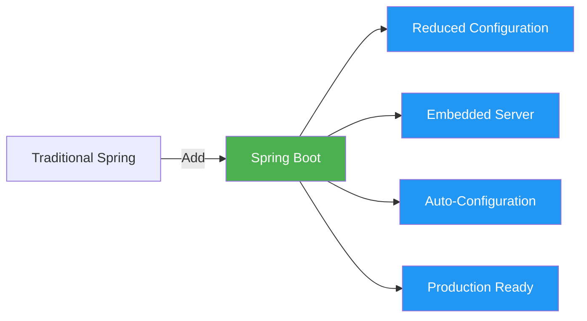
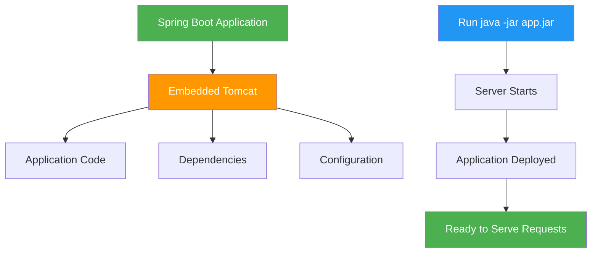
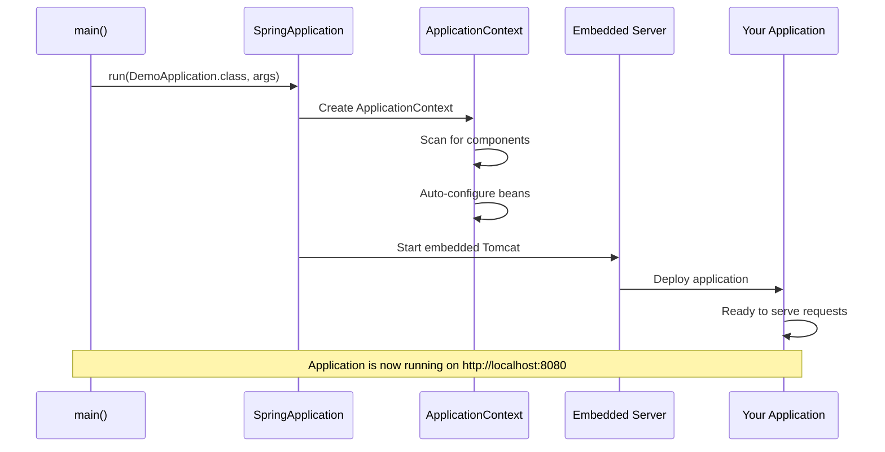
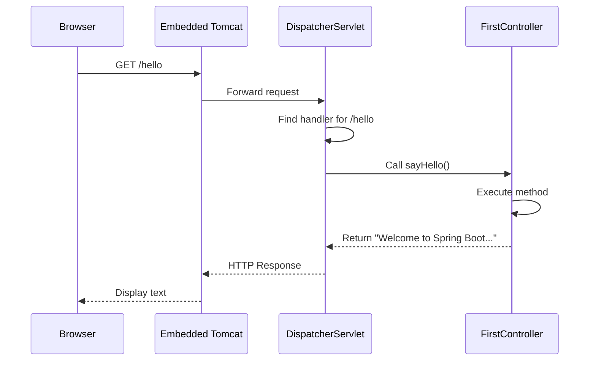

# Spring Boot Introduction - Complete Guide

## Table of Contents
1. [Introduction](#introduction)
2. [What is Spring Boot?](#what-is-spring-boot)
3. [Problems with Traditional Spring Framework](#problems-with-traditional-spring-framework)
4. [Spring Boot Features and Benefits](#spring-boot-features-and-benefits)
5. [Spring Boot Formula](#spring-boot-formula)
6. [Convention Over Configuration](#convention-over-configuration)
7. [Embedded Servers](#embedded-servers)
8. [Creating Your First Spring Boot Application](#creating-your-first-spring-boot-application)
9. [Understanding the Project Structure](#understanding-the-project-structure)
10. [Running Spring Boot Applications](#running-spring-boot-applications)
11. [Configuration Files](#configuration-files)
12. [Best Practices](#best-practices)
13. [Summary](#summary)

---

## Introduction

**Spring Boot** is a revolutionary tool that has transformed Java application development. It's built on top of the Spring Framework and designed to simplify the development of production-ready applications by reducing boilerplate configuration and setup time.

> [!IMPORTANT]
> **Key Concept**: Spring Boot is NOT a framework itself. It is a **tool/platform/extension** built on top of the Spring Framework that provides auto-configuration, embedded servers, and opinionated defaults.

---

## What is Spring Boot?

### Definition

Spring Boot is a **module of Spring** that speeds up development by providing:
- An easier and faster way to set up, configure, and run both simple and web-based applications
- Automatic configuration based on conventions
- Embedded servers (no need for external server deployment)
- Production-ready features out of the box

### Core Philosophy

The main goal of Spring Boot is to **quickly create Spring-based applications** without requiring developers to write the same boilerplate configuration again and again.



---

## Problems with Traditional Spring Framework

Before Spring Boot, developers faced several challenges when working with the Spring Framework:

### 1. **Excessive Configuration**
- Required extensive XML configuration files
- Manual bean definitions
- Complex dependency management
- Repetitive boilerplate code

### 2. **Server Deployment Complexity**
- Need to install and configure external servers (Tomcat, Jetty, etc.)
- Manual WAR file creation
- Deployment descriptor (web.xml) configuration
- Server-specific configurations

### 3. **Dependency Management Nightmare**
- Manual selection of compatible library versions
- Dependency conflicts
- Version compatibility issues
- Time-consuming dependency resolution

### 4. **Slow Development Cycle**
- Long setup time for new projects
- Repetitive configuration for similar applications
- Difficult to get started for beginners

### Example: Traditional Spring Configuration

```xml
<!-- web.xml - Required in traditional Spring -->
<web-app>
    <servlet>
        <servlet-name>dispatcher</servlet-name>
        <servlet-class>org.springframework.web.servlet.DispatcherServlet</servlet-class>
        <load-on-startup>1</load-on-startup>
    </servlet>
    
    <servlet-mapping>
        <servlet-name>dispatcher</servlet-name>
        <url-pattern>/</url-pattern>
    </servlet-mapping>
</web-app>
```

```xml
<!-- dispatcher-servlet.xml - Spring MVC Configuration -->
<beans>
    <context:component-scan base-package="com.example"/>
    
    <bean class="org.springframework.web.servlet.view.InternalResourceViewResolver">
        <property name="prefix" value="/WEB-INF/views/"/>
        <property name="suffix" value=".jsp"/>
    </bean>
</beans>
```

> [!NOTE]
> With Spring Boot, **ALL of the above configuration is automatic**. You don't need web.xml or XML configuration files.

---

## Spring Boot Features and Benefits

### 1. **Stand-Alone Applications**

Spring Boot creates **stand-alone Spring applications** that can be started using `java -jar`.

```bash
# Running a Spring Boot application
java -jar myapp.jar
```

**What happens when you run this command:**
1. The JAR file contains your application code
2. It also contains an embedded server (Tomcat by default)
3. The server starts automatically
4. Your application gets deployed on the server
5. Application is ready to serve requests

### 2. **Embedded Servers**

Spring Boot embeds servers directly into your application:
- **Tomcat** (default)
- **Jetty**
- **Undertow**

**Benefits:**
- No need to deploy WAR files
- No external server installation required
- Simplified deployment process
- Consistent environment across development and production

### 3. **Opinionated Defaults (Auto-Configuration)**

Spring Boot follows the **"Convention over Configuration"** principle.

> [!TIP]
> **Convention over Configuration**: If you follow Spring Boot's conventions, it will automatically configure everything for you. You only need to provide configuration when you want to override the defaults.

**How it works:**
- Spring Boot analyzes your classpath
- Detects the libraries you're using
- Automatically configures beans and settings
- Provides sensible defaults

**Example:**
```java
// Just add this dependency in pom.xml
<dependency>
    <groupId>org.springframework.boot</groupId>
    <artifactId>spring-boot-starter-web</artifactId>
</dependency>

// Spring Boot automatically configures:
// - DispatcherServlet
// - Embedded Tomcat server
// - JSON converters (Jackson)
// - Error handling
// - Static resource handling
// And much more!
```

### 4. **Starter Dependencies**

Spring Boot provides **"starter"** POMs that simplify dependency management.

```xml
<!-- Instead of adding 10+ dependencies manually -->
<dependency>
    <groupId>org.springframework.boot</groupId>
    <artifactId>spring-boot-starter-web</artifactId>
</dependency>

<!-- This single dependency brings in:
     - Spring MVC
     - Tomcat
     - Jackson (JSON)
     - Validation
     - And all compatible versions!
-->
```

### 5. **Production-Ready Features**

- Health checks
- Metrics
- Application monitoring
- Externalized configuration
- Logging

---

## Spring Boot Formula

> [!IMPORTANT]
> **Spring Boot = Spring Framework + Embedded Server - Configuration**

This formula encapsulates the essence of Spring Boot:
- **Spring Framework**: Core functionality and features
- **+ Embedded Server**: No need for external server
- **- Configuration**: Minimal configuration required

---

## Convention Over Configuration

### What Does "Opinionated" Mean?

Spring Boot is **opinionated**, meaning it has strong preferences about how things should be done.

**Two Scenarios:**

1. **You follow conventions** → Spring Boot auto-configures everything
2. **You need customization** → You can override defaults with minimal configuration

### Example: View Resolver Configuration

**Traditional Spring (Manual Configuration):**
```xml
<bean class="org.springframework.web.servlet.view.InternalResourceViewResolver">
    <property name="prefix" value="/WEB-INF/views/"/>
    <property name="suffix" value=".jsp"/>
</bean>
```

**Spring Boot (Auto-Configuration):**
```properties
# application.properties
spring.mvc.view.prefix=/
spring.mvc.view.suffix=.html
```

**How it works:**
- `/` means the "templates" folder in Spring Boot project
- `.html` means when a controller returns `"success"`, Spring Boot looks for `success.html` in the templates folder

---

## Embedded Servers

### Understanding Embedded Servers

In traditional Java web applications:
1. You write your application
2. Package it as a WAR file
3. Install a server (Tomcat, Jetty, etc.)
4. Deploy the WAR to the server
5. Start the server

**With Spring Boot:**
1. You write your application
2. Package it as a JAR file (server is embedded inside)
3. Run the JAR file
4. Server starts automatically and application is deployed



### Changing the Default Port

By default, Spring Boot's embedded Tomcat runs on **port 8080**.

**To change the port:**

```properties
# application.properties
server.port=9595
```

Now your application will run on `http://localhost:9595`

### Choosing a Different Embedded Server

**Default: Tomcat**
```xml
<dependency>
    <groupId>org.springframework.boot</groupId>
    <artifactId>spring-boot-starter-web</artifactId>
</dependency>
```

**Switch to Jetty:**
```xml
<dependency>
    <groupId>org.springframework.boot</groupId>
    <artifactId>spring-boot-starter-web</artifactId>
    <exclusions>
        <exclusion>
            <groupId>org.springframework.boot</groupId>
            <artifactId>spring-boot-starter-tomcat</artifactId>
        </exclusion>
    </exclusions>
</dependency>

<dependency>
    <groupId>org.springframework.boot</groupId>
    <artifactId>spring-boot-starter-jetty</artifactId>
</dependency>
```

---

## Creating Your First Spring Boot Application

### Using Spring Initializr (Recommended)

Spring Initializr is a web-based tool for generating Spring Boot projects.

**Step-by-Step Guide:**

#### Step 1: Navigate to Spring Initializr
Go to: **https://start.spring.io/**

#### Step 2: Configure Project Metadata

```
Project:        Maven
Language:       Java
Spring Boot:    2.7.8 (or latest stable version)

Group:          com.example
Artifact:       demo
Package:        com.example.demo

Packaging:      JAR
Java:           8 (or 11, 17)
```

#### Step 3: Add Dependencies

Click on **"Add Dependencies"** button and select:
- **Spring Web** (for web applications)

#### Step 4: Generate Project

1. Click **"Generate"** button
2. A file named `demo.zip` will be downloaded
3. Unzip the folder anywhere on your system

#### Step 5: Import into IDE

**For Eclipse:**
1. Open Eclipse
2. File → Import → Existing Maven Project
3. Select root directory: `C:\path\to\demo\demo`
   - Note: Unzipping creates a `demo` folder inside `demo` folder
4. `pom.xml` should be automatically selected
5. Click **Finish**

**Important Checks:**
- Compiler: Java 8
- JRE: JRE 8
- Project Facet: Java 8

> [!NOTE]
> **Internet connection is required** during the first import as Maven downloads all dependencies.

---

## Understanding the Project Structure

After importing, you'll see this structure:

```
demo/
├── src/
│   ├── main/
│   │   ├── java/
│   │   │   └── com/
│   │   │       └── example/
│   │   │           └── demo/
│   │   │               └── DemoApplication.java
│   │   └── resources/
│   │       ├── static/          (for CSS, JS, images)
│   │       ├── templates/       (for HTML templates)
│   │       └── application.properties
│   └── test/
│       └── java/
├── pom.xml
└── mvnw (Maven Wrapper)
```

### Key Files Explained

#### 1. **DemoApplication.java** (Main Application Class)

```java
package com.example.demo;

import org.springframework.boot.SpringApplication;
import org.springframework.boot.autoconfigure.SpringBootApplication;

@SpringBootApplication
public class DemoApplication {
    
    public static void main(String[] args) {
        SpringApplication.run(DemoApplication.class, args);
    }
}
```

**Line-by-Line Analysis:**

| Line | Code | Explanation |
|------|------|-------------|
| 1 | `package com.example.demo;` | Package declaration |
| 3-4 | `import ...` | Importing Spring Boot classes |
| 6 | `@SpringBootApplication` | **Most important annotation** - enables auto-configuration, component scanning, and configuration |
| 7 | `public class DemoApplication` | Main application class |
| 9 | `public static void main(String[] args)` | Entry point of the application |
| 10 | `SpringApplication.run(...)` | Starts the Spring Boot application, embedded server, and deploys the app |

**What happens when you run this class:**



#### 2. **pom.xml** (Maven Configuration)

```xml
<?xml version="1.0" encoding="UTF-8"?>
<project xmlns="http://maven.apache.org/POM/4.0.0"
         xmlns:xsi="http://www.w3.org/2001/XMLSchema-instance"
         xsi:schemaLocation="http://maven.apache.org/POM/4.0.0 
         https://maven.apache.org/xsd/maven-4.0.0.xsd">
    <modelVersion>4.0.0</modelVersion>
    
    <!-- Spring Boot Parent -->
    <parent>
        <groupId>org.springframework.boot</groupId>
        <artifactId>spring-boot-starter-parent</artifactId>
        <version>2.7.8</version>
        <relativePath/>
    </parent>
    
    <!-- Project Metadata -->
    <groupId>com.example</groupId>
    <artifactId>demo</artifactId>
    <version>0.0.1-SNAPSHOT</version>
    <name>demo</name>
    <description>Demo project for Spring Boot</description>
    
    <!-- Java Version -->
    <properties>
        <java.version>1.8</java.version>
    </properties>
    
    <!-- Dependencies -->
    <dependencies>
        <!-- Spring Web Starter -->
        <dependency>
            <groupId>org.springframework.boot</groupId>
            <artifactId>spring-boot-starter-web</artifactId>
        </dependency>
        
        <!-- Spring Boot Test -->
        <dependency>
            <groupId>org.springframework.boot</groupId>
            <artifactId>spring-boot-starter-test</artifactId>
            <scope>test</scope>
        </dependency>
    </dependencies>
    
    <!-- Build Plugin -->
    <build>
        <plugins>
            <plugin>
                <groupId>org.springframework.boot</groupId>
                <artifactId>spring-boot-maven-plugin</artifactId>
            </plugin>
        </plugins>
    </build>
</project>
```

**Key Elements:**

1. **Parent POM**: `spring-boot-starter-parent`
   - Provides dependency management
   - Sets default versions for all Spring Boot dependencies
   - Configures Maven plugins

2. **Starter Dependencies**: `spring-boot-starter-web`
   - Single dependency that brings in multiple libraries
   - All versions are compatible (managed by parent POM)

3. **Maven Plugin**: `spring-boot-maven-plugin`
   - Enables creating executable JAR files
   - Packages embedded server with your application

#### 3. **application.properties** (Configuration File)

```properties
# Server Configuration
server.port=8080

# View Resolver Configuration
spring.mvc.view.prefix=/
spring.mvc.view.suffix=.html

# Logging Configuration
logging.level.root=INFO
logging.level.com.example.demo=DEBUG

# Application Name
spring.application.name=demo
```

---

## Running Spring Boot Applications

### Method 1: Run from IDE

**In Eclipse:**
1. Right-click on `DemoApplication.java`
2. Run As → Java Application

**Console Output:**
```
  .   ____          _            __ _ _
 /\\ / ___'_ __ _ _(_)_ __  __ _ \ \ \ \
( ( )\___ | '_ | '_| | '_ \/ _` | \ \ \ \
 \\/  ___)| |_)| | | | | || (_| |  ) ) ) )
  '  |____| .__|_| |_|_| |_\__, | / / / /
 =========|_|==============|___/=/_/_/_/
 :: Spring Boot ::                (v2.7.8)

2024-01-02 18:00:00.000  INFO 12345 --- [main] c.e.demo.DemoApplication: Starting DemoApplication
2024-01-02 18:00:01.000  INFO 12345 --- [main] o.s.b.w.embedded.tomcat.TomcatWebServer: Tomcat initialized with port(s): 8080 (http)
2024-01-02 18:00:02.000  INFO 12345 --- [main] o.s.b.w.embedded.tomcat.TomcatWebServer: Tomcat started on port(s): 8080 (http)
2024-01-02 18:00:02.100  INFO 12345 --- [main] c.e.demo.DemoApplication: Started DemoApplication in 2.5 seconds
```

### Method 2: Run from Command Line

```bash
# Navigate to project directory
cd C:\path\to\demo

# Run using Maven
mvn spring-boot:run

# Or build JAR and run
mvn clean package
java -jar target/demo-0.0.1-SNAPSHOT.jar
```

### Creating Your First REST Controller

Add a controller to make your application respond to HTTP requests:

```java
package com.example.demo;

import org.springframework.web.bind.annotation.GetMapping;
import org.springframework.web.bind.annotation.RestController;

@RestController
public class FirstController {
    
    @GetMapping("/hello")
    public String sayHello() {
        return "Welcome to Spring Boot with Spring Initializer";
    }
}
```

**Line-by-Line Analysis:**

| Line | Code | Explanation |
|------|------|-------------|
| 1 | `package com.example.demo;` | Same package as main application |
| 3-4 | `import ...` | Import annotations |
| 6 | `@RestController` | Marks this class as a REST controller; combines `@Controller` + `@ResponseBody` |
| 7 | `public class FirstController` | Controller class name |
| 9 | `@GetMapping("/hello")` | Maps HTTP GET requests to `/hello` path |
| 10 | `public String sayHello()` | Handler method |
| 11 | `return "Welcome..."` | Response body (automatically converted to HTTP response) |

**Testing the Controller:**

1. Stop the server if running
2. Right-click `DemoApplication.java` → Run As → Java Application
3. Wait for server to start
4. Open browser and navigate to: `http://localhost:8080/hello`
5. You should see: `Welcome to Spring Boot with Spring Initializer`

**Request Flow:**



---

## Configuration Files

### application.properties vs application.yml

Spring Boot supports two configuration formats:

#### 1. **application.properties** (Traditional)

```properties
server.port=8080
spring.application.name=demo
spring.datasource.url=jdbc:mysql://localhost:3306/mydb
spring.datasource.username=root
spring.datasource.password=password
```

#### 2. **application.yml** (Hierarchical)

```yaml
server:
  port: 8080

spring:
  application:
    name: demo
  datasource:
    url: jdbc:mysql://localhost:3306/mydb
    username: root
    password: password
```

> [!TIP]
> **YAML** is preferred for complex configurations because of its hierarchical structure and better readability.

### Common Configuration Properties

```properties
# Server Configuration
server.port=8080
server.servlet.context-path=/myapp

# Logging
logging.level.root=INFO
logging.level.org.springframework.web=DEBUG
logging.file.name=application.log

# Database
spring.datasource.url=jdbc:mysql://localhost:3306/mydb
spring.datasource.username=root
spring.datasource.password=secret
spring.jpa.hibernate.ddl-auto=update
spring.jpa.show-sql=true

# View Resolver (for Thymeleaf)
spring.mvc.view.prefix=/
spring.mvc.view.suffix=.html

# File Upload
spring.servlet.multipart.max-file-size=10MB
spring.servlet.multipart.max-request-size=10MB
```

---

## Best Practices

### 1. **Use Starter Dependencies**

✅ **Good:**
```xml
<dependency>
    <groupId>org.springframework.boot</groupId>
    <artifactId>spring-boot-starter-web</artifactId>
</dependency>
```

❌ **Bad:**
```xml
<!-- Manually adding individual dependencies -->
<dependency>
    <groupId>org.springframework</groupId>
    <artifactId>spring-webmvc</artifactId>
    <version>5.3.20</version>
</dependency>
<dependency>
    <groupId>org.apache.tomcat.embed</groupId>
    <artifactId>tomcat-embed-core</artifactId>
    <version>9.0.62</version>
</dependency>
<!-- ... many more -->
```

### 2. **Follow Package Structure Conventions**

```
com.example.demo/
├── DemoApplication.java (Main class)
├── controller/
│   └── UserController.java
├── service/
│   └── UserService.java
├── repository/
│   └── UserRepository.java
└── model/
    └── User.java
```

### 3. **Use Profiles for Different Environments**

```properties
# application-dev.properties
server.port=8080
spring.datasource.url=jdbc:mysql://localhost:3306/dev_db

# application-prod.properties
server.port=80
spring.datasource.url=jdbc:mysql://prod-server:3306/prod_db
```

Activate profile:
```bash
java -jar app.jar --spring.profiles.active=prod
```

### 4. **Externalize Configuration**

Don't hardcode values in code:

❌ **Bad:**
```java
String dbUrl = "jdbc:mysql://localhost:3306/mydb";
```

✅ **Good:**
```java
@Value("${spring.datasource.url}")
private String dbUrl;
```

### 5. **Use DevTools for Development**

```xml
<dependency>
    <groupId>org.springframework.boot</groupId>
    <artifactId>spring-boot-devtools</artifactId>
    <scope>runtime</scope>
    <optional>true</optional>
</dependency>
```

Benefits:
- Automatic restart on code changes
- LiveReload support
- Faster development cycle

---

## Summary

### Key Takeaways

1. **Spring Boot is NOT a framework** - it's a tool built on top of Spring Framework

2. **Formula**: Spring Boot = Spring Framework + Embedded Server - Configuration

3. **Main Benefits**:
   - Minimal configuration
   - Embedded servers (Tomcat, Jetty, Undertow)
   - Starter dependencies for easy dependency management
   - Auto-configuration based on classpath
   - Production-ready features

4. **Convention over Configuration**: Follow conventions, and Spring Boot handles the rest

5. **Opinionated Defaults**: Spring Boot provides sensible defaults that can be overridden

6. **Stand-alone Applications**: Package as JAR and run with `java -jar`

### Quick Reference

| Aspect | Traditional Spring | Spring Boot |
|--------|-------------------|-------------|
| Configuration | Extensive XML/Java config | Minimal (auto-configuration) |
| Server | External (Tomcat, etc.) | Embedded |
| Deployment | WAR file | JAR file |
| Dependencies | Manual management | Starter POMs |
| Setup Time | Hours/Days | Minutes |
| web.xml | Required | Not required |
| View Resolver | Manual configuration | Auto-configured |

### What's Next?

In the next note, we'll dive deep into:
- **@SpringBootApplication** annotation internals
- Component scanning mechanism
- Auto-configuration details
- Application startup flow
- Customizing auto-configuration

---

## Practice Questions

1. What is the difference between Spring Framework and Spring Boot?
2. Explain the formula: Spring Boot = Spring Framework + Embedded Server - Configuration
3. What does "opinionated" mean in the context of Spring Boot?
4. How does Spring Boot eliminate the need for web.xml?
5. What is the purpose of `SpringApplication.run()` method?
6. How can you change the default port of the embedded Tomcat server?
7. What are starter dependencies? Give examples.
8. Explain the "Convention over Configuration" principle.
9. What happens when you run a Spring Boot application?
10. Compare application.properties and application.yml formats.

---

**End of Note 01: Spring Boot Introduction**

*Next: [02_Spring_Boot_Architecture.md](file:///c:/Users/2706p/Desktop/mcq/notes/02_Spring_Boot_Architecture.md)*
