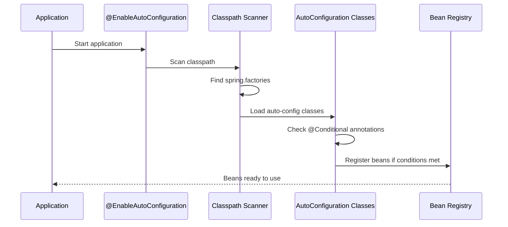
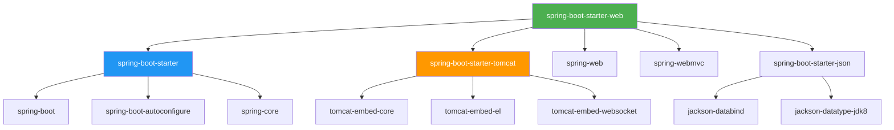
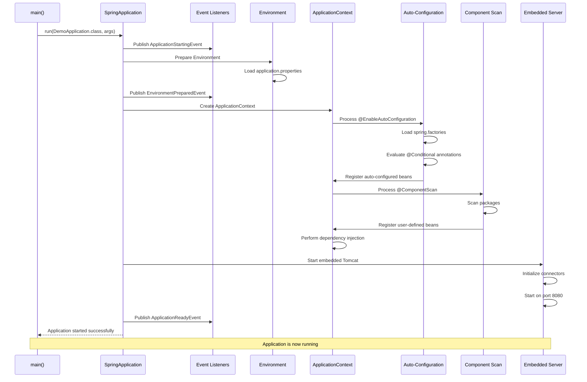
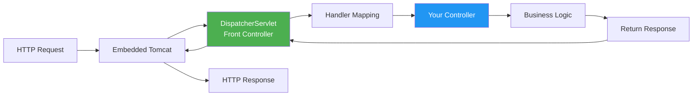

# Spring Boot Architecture - Deep Dive

## Table of Contents
1. [Introduction](#introduction)
2. [@SpringBootApplication Annotation](#springbootapplication-annotation)
3. [Component Scanning Mechanism](#component-scanning-mechanism)
4. [Auto-Configuration Internals](#auto-configuration-internals)
5. [Starter Dependencies Explained](#starter-dependencies-explained)
6. [Application Startup Flow](#application-startup-flow)
7. [DispatcherServlet Auto-Configuration](#dispatcherservlet-auto-configuration)
8. [Configuration Files Deep Dive](#configuration-files-deep-dive)
9. [Spring Boot Project Structure](#spring-boot-project-structure)
10. [Best Practices](#best-practices)
11. [Summary](#summary)

---

## Introduction

In this note, we'll explore the **internal architecture** of Spring Boot applications. We'll understand how `@SpringBootApplication` works, how component scanning happens, and how auto-configuration makes Spring Boot so powerful.

> [!IMPORTANT]
> Understanding Spring Boot's architecture is crucial for:
> - Debugging issues effectively
> - Customizing auto-configuration
> - Building production-ready applications
> - Optimizing application performance

---

## @SpringBootApplication Annotation

### The Most Important Annotation

`@SpringBootApplication` is a **meta-annotation** that combines three powerful annotations:

```java
@SpringBootApplication
public class DemoApplication {
    public static void main(String[] args) {
        SpringApplication.run(DemoApplication.class, args);
    }
}
```

### What @SpringBootApplication Actually Is

```java
@Target(ElementType.TYPE)
@Retention(RetentionPolicy.RUNTIME)
@Documented
@Inherited
@SpringBootConfiguration
@EnableAutoConfiguration
@ComponentScan(excludeFilters = {
    @Filter(type = FilterType.CUSTOM, classes = TypeExcludeFilter.class),
    @Filter(type = FilterType.CUSTOM, classes = AutoConfigurationExcludeFilter.class)
})
public @interface SpringBootApplication {
    // ... annotation attributes
}
```

### The Three Core Annotations

```mermaid
graph TD
    A[@SpringBootApplication] --> B[@SpringBootConfiguration]
    A --> C[@EnableAutoConfiguration]
    A --> D[@ComponentScan]
    
    B --> B1[Allows bean definitions]
    B --> B2[Marks as configuration class]
    
    C --> C1[Auto-creates framework beans]
    C --> C2[Configures based on classpath]
    
    D --> D1[Finds user-defined beans]
    D --> D2[Scans packages for components]
    
    style A fill:#4CAF50,color:#fff
    style B fill:#2196F3,color:#fff
    style C fill:#FF9800,color:#fff
    style D fill:#9C27B0,color:#fff
```

#### 1. @SpringBootConfiguration

**Purpose**: Allows bean definitions in the application class.

```java
@SpringBootConfiguration
public class DemoApplication {
    
    @Bean
    public MyService myService() {
        return new MyServiceImpl();
    }
}
```

**Equivalent to**: `@Configuration` (Spring Framework annotation)

**What it does**:
- Marks the class as a source of bean definitions
- Allows `@Bean` methods to be defined
- Indicates this is a configuration class

#### 2. @EnableAutoConfiguration

**Purpose**: Auto-creates framework beans based on classpath dependencies.

**How it works**:



**Example**: When you add `spring-boot-starter-web`:

```xml
<dependency>
    <groupId>org.springframework.boot</groupId>
    <artifactId>spring-boot-starter-web</artifactId>
</dependency>
```

**Auto-configuration creates**:
- `DispatcherServlet` bean
- `TomcatEmbeddedServletContainerFactory` bean
- `HttpMessageConverters` (for JSON, XML)
- `ErrorMvcAutoConfiguration` (error handling)
- `WebMvcAutoConfiguration` (Spring MVC setup)

**Behind the scenes**:

```java
// Spring Boot checks: "Is spring-webmvc on the classpath?"
@ConditionalOnClass({Servlet.class, DispatcherServlet.class, WebMvcConfigurer.class})
@ConditionalOnMissingBean(WebMvcConfigurationSupport.class)
@AutoConfigureOrder(Ordered.HIGHEST_PRECEDENCE + 10)
@AutoConfigureAfter({DispatcherServletAutoConfiguration.class, ...})
public class WebMvcAutoConfiguration {
    // Auto-configures Spring MVC
}
```

#### 3. @ComponentScan

**Purpose**: Finds user-defined beans (components, services, repositories, controllers).

**Default behavior**:
- Scans the package where `@SpringBootApplication` class is located
- Scans all sub-packages

**Example**:

```
com.example.demo/              ← @SpringBootApplication here
├── DemoApplication.java       ← Scanned
├── controller/
│   └── UserController.java    ← Scanned (sub-package)
├── service/
│   └── UserService.java       ← Scanned (sub-package)
└── repository/
    └── UserRepository.java    ← Scanned (sub-package)

com.other.package/
└── SomeClass.java             ← NOT scanned (different package)
```

**Customizing component scan**:

```java
@SpringBootApplication(scanBasePackages = {"com.example.demo", "com.other.package"})
public class DemoApplication {
    // Now scans both packages
}
```

### What Happens Without @SpringBootApplication?

```java
// This will NOT work properly
public class DemoApplication {
    public static void main(String[] args) {
        SpringApplication.run(DemoApplication.class, args);
    }
}
```

**Problems**:
- ❌ No component scanning → Controllers, Services not found
- ❌ No auto-configuration → No DispatcherServlet, no embedded server
- ❌ No embedded server startup → Application won't run
- ❌ Application context won't be created properly

---

## Component Scanning Mechanism

### How Component Scanning Works

```mermaid
graph TD
    A[Application Starts] --> B[@ComponentScan Activated]
    B --> C[Scan Base Package]
    C --> D{Find Classes with Stereotypes}
    D -->|@Component| E[Register as Bean]
    D -->|@Service| E
    D -->|@Repository| E
    D -->|@Controller| E
    D -->|@RestController| E
    D -->|@Configuration| E
    E --> F[Add to Application Context]
    F --> G[Beans Ready for Dependency Injection]
    
    style B fill:#4CAF50,color:#fff
    style E fill:#2196F3,color:#fff
    style G fill:#FF9800,color:#fff
```

### Stereotype Annotations

| Annotation | Purpose | Example Use Case |
|------------|---------|------------------|
| `@Component` | Generic component | Utility classes |
| `@Service` | Business logic layer | UserService, OrderService |
| `@Repository` | Data access layer | UserRepository, ProductRepository |
| `@Controller` | MVC controller | Returns views (HTML) |
| `@RestController` | REST API controller | Returns JSON/XML data |
| `@Configuration` | Configuration class | Bean definitions |

### Example: Component Scanning in Action

**Project Structure**:
```
com.example.demo/
├── DemoApplication.java
├── controller/
│   └── BookController.java
├── service/
│   └── BookService.java
└── repository/
    └── BookRepository.java
```

**Code**:

```java
// DemoApplication.java
package com.example.demo;

@SpringBootApplication
public class DemoApplication {
    public static void main(String[] args) {
        SpringApplication.run(DemoApplication.class, args);
    }
}
```

```java
// BookController.java
package com.example.demo.controller;

@RestController
@RequestMapping("/books")
public class BookController {
    
    @Autowired
    private BookService bookService;  // Injected automatically
    
    @GetMapping
    public List<Book> getAllBooks() {
        return bookService.findAll();
    }
}
```

```java
// BookService.java
package com.example.demo.service;

@Service
public class BookService {
    
    @Autowired
    private BookRepository bookRepository;  // Injected automatically
    
    public List<Book> findAll() {
        return bookRepository.findAll();
    }
}
```

```java
// BookRepository.java
package com.example.demo.repository;

@Repository
public interface BookRepository extends JpaRepository<Book, Long> {
    // Spring Data JPA provides implementation
}
```

**What happens at startup**:

1. `@ComponentScan` starts from `com.example.demo`
2. Finds `BookController` (has `@RestController`) → Registers as bean
3. Finds `BookService` (has `@Service`) → Registers as bean
4. Finds `BookRepository` (has `@Repository`) → Registers as bean
5. Spring performs dependency injection:
   - Injects `BookService` into `BookController`
   - Injects `BookRepository` into `BookService`

---

## Auto-Configuration Internals

### How Auto-Configuration Works

Spring Boot uses **conditional configuration** to decide which beans to create.

### Key Conditional Annotations

| Annotation | Condition | Example |
|------------|-----------|---------|
| `@ConditionalOnClass` | Class is on classpath | `@ConditionalOnClass(DataSource.class)` |
| `@ConditionalOnMissingBean` | Bean doesn't exist | `@ConditionalOnMissingBean(DataSource.class)` |
| `@ConditionalOnProperty` | Property is set | `@ConditionalOnProperty("spring.datasource.url")` |
| `@ConditionalOnWebApplication` | Is a web application | Auto-configure web features |

### Example: DataSource Auto-Configuration

```java
@Configuration
@ConditionalOnClass({DataSource.class, EmbeddedDatabaseType.class})
@EnableConfigurationProperties(DataSourceProperties.class)
public class DataSourceAutoConfiguration {
    
    @Bean
    @ConditionalOnMissingBean
    public DataSource dataSource(DataSourceProperties properties) {
        // Create DataSource only if:
        // 1. DataSource.class is on classpath
        // 2. No DataSource bean already exists
        return properties.initializeDataSourceBuilder().build();
    }
}
```

### spring.factories File

Auto-configuration classes are listed in `META-INF/spring.factories`:

```properties
# Auto Configure
org.springframework.boot.autoconfigure.EnableAutoConfiguration=\
org.springframework.boot.autoconfigure.web.servlet.DispatcherServletAutoConfiguration,\
org.springframework.boot.autoconfigure.web.servlet.WebMvcAutoConfiguration,\
org.springframework.boot.autoconfigure.data.jpa.JpaRepositoriesAutoConfiguration,\
org.springframework.boot.autoconfigure.jdbc.DataSourceAutoConfiguration,\
...
```

### Viewing Auto-Configuration Report

Add this to `application.properties`:

```properties
debug=true
```

**Output** (partial):
```
============================
CONDITIONS EVALUATION REPORT
============================

Positive matches:
-----------------
   DataSourceAutoConfiguration matched:
      - @ConditionalOnClass found required classes 'javax.sql.DataSource', 'org.springframework.jdbc.datasource.embedded.EmbeddedDatabaseType'
      
   WebMvcAutoConfiguration matched:
      - @ConditionalOnClass found required classes 'javax.servlet.Servlet', 'org.springframework.web.servlet.DispatcherServlet'
      - found 'session' scope

Negative matches:
-----------------
   MongoAutoConfiguration:
      Did not match:
         - @ConditionalOnClass did not find required class 'com.mongodb.client.MongoClient'
```

---

## Starter Dependencies Explained

### What Are Starter Dependencies?

**Starter dependencies** are pre-defined sets of commonly used dependencies grouped together.

**Naming Pattern**: `spring-boot-starter-<feature>`

### Benefits

1. **Simplified Management**: One starter replaces multiple manual JAR entries
2. **Guaranteed Compatibility**: All libraries are tested to work together
3. **Faster Development**: Focus on business logic, not dependency management

### Popular Starters

#### 1. spring-boot-starter-web

```xml
<dependency>
    <groupId>org.springframework.boot</groupId>
    <artifactId>spring-boot-starter-web</artifactId>
</dependency>
```

**Includes**:
- Spring MVC
- Embedded Tomcat
- Jackson (JSON processing)
- Validation API
- Spring Boot Autoconfigure

**Use Case**: Building web applications and REST APIs

#### 2. spring-boot-starter-data-jpa

```xml
<dependency>
    <groupId>org.springframework.boot</groupId>
    <artifactId>spring-boot-starter-data-jpa</artifactId>
</dependency>
```

**Includes**:
- Spring Data JPA
- Hibernate ORM
- JPA API
- Spring Transactions
- JDBC

**Use Case**: Database access with JPA/Hibernate

#### 3. spring-boot-starter-security

```xml
<dependency>
    <groupId>org.springframework.boot</groupId>
    <artifactId>spring-boot-starter-security</artifactId>
</dependency>
```

**Includes**:
- Spring Security Core
- Authentication modules
- BCrypt password encoder
- Security configuration

**Use Case**: Adding authentication and authorization

#### 4. spring-boot-starter-test

```xml
<dependency>
    <groupId>org.springframework.boot</groupId>
    <artifactId>spring-boot-starter-test</artifactId>
    <scope>test</scope>
</dependency>
```

**Includes**:
- JUnit 5
- Mockito
- Spring Test
- AssertJ
- Hamcrest

**Use Case**: Testing Spring Boot applications

### Starter Dependency Tree Example



---

## Application Startup Flow

### Complete Startup Sequence



### Detailed Step-by-Step Breakdown

#### Step 1: main() Method Execution

```java
public static void main(String[] args) {
    SpringApplication.run(DemoApplication.class, args);
}
```

**What happens**:
- JVM starts
- `main()` method is invoked
- `SpringApplication.run()` is called

#### Step 2: SpringApplication Initialization

```java
public static ConfigurableApplicationContext run(Class<?> primarySource, String... args) {
    return new SpringApplication(primarySource).run(args);
}
```

**Creates**:
- `SpringApplication` instance
- Determines application type (Web, Reactive, or None)
- Loads `ApplicationContextInitializer` instances
- Loads `ApplicationListener` instances

#### Step 3: Environment Preparation

**Loads configuration from**:
1. `application.properties` (or `application.yml`)
2. Command-line arguments
3. System properties
4. Environment variables

**Priority order** (highest to lowest):
```
Command-line args > application.properties > System properties > Default values
```

#### Step 4: ApplicationContext Creation

**For web applications**:
```java
context = new AnnotationConfigServletWebServerApplicationContext();
```

**This context**:
- Manages all beans
- Handles dependency injection
- Manages bean lifecycle

#### Step 5: Auto-Configuration

```java
@EnableAutoConfiguration
↓
Loads META-INF/spring.factories
↓
Evaluates @Conditional annotations
↓
Registers beans if conditions are met
```

#### Step 6: Component Scanning

```java
@ComponentScan
↓
Scans base package and sub-packages
↓
Finds classes with @Component, @Service, @Repository, @Controller
↓
Registers as beans in ApplicationContext
```

#### Step 7: Dependency Injection

```java
@Autowired fields/constructors
↓
ApplicationContext injects dependencies
↓
Beans are fully initialized
```

#### Step 8: Embedded Server Startup

```java
TomcatServletWebServerFactory
↓
Creates Tomcat instance
↓
Configures connectors (HTTP on port 8080)
↓
Starts Tomcat
↓
Application deployed
```

#### Step 9: Application Ready

```
Application is now running on http://localhost:8080
```

### Console Output Explained

```
  .   ____          _            __ _ _
 /\\ / ___'_ __ _ _(_)_ __  __ _ \ \ \ \
( ( )\___ | '_ | '_| | '_ \/ _` | \ \ \ \
 \\/  ___)| |_)| | | | | || (_| |  ) ) ) )
  '  |____| .__|_| |_|_| |_\__, | / / / /
 =========|_|==============|___/=/_/_/_/
 :: Spring Boot ::                (v2.7.8)

2024-01-02 18:00:00.000  INFO 12345 --- [main] c.e.demo.DemoApplication                 : Starting DemoApplication
2024-01-02 18:00:00.500  INFO 12345 --- [main] c.e.demo.DemoApplication                 : No active profile set, falling back to default profiles: default
2024-01-02 18:00:01.000  INFO 12345 --- [main] o.s.b.w.embedded.tomcat.TomcatWebServer  : Tomcat initialized with port(s): 8080 (http)
2024-01-02 18:00:01.200  INFO 12345 --- [main] o.apache.catalina.core.StandardService   : Starting service [Tomcat]
2024-01-02 18:00:01.300  INFO 12345 --- [main] o.apache.catalina.core.StandardEngine    : Starting Servlet engine: [Apache Tomcat/9.0.71]
2024-01-02 18:00:01.500  INFO 12345 --- [main] o.s.b.w.servlet.ServletRegistrationBean  : Servlet dispatcherServlet mapped to [/]
2024-01-02 18:00:02.000  INFO 12345 --- [main] o.s.b.w.embedded.tomcat.TomcatWebServer  : Tomcat started on port(s): 8080 (http)
2024-01-02 18:00:02.100  INFO 12345 --- [main] c.e.demo.DemoApplication                 : Started DemoApplication in 2.5 seconds (JVM running for 3.0)
```

**Key Lines**:
1. **Starting DemoApplication**: Application initialization begins
2. **No active profile set**: Using default configuration
3. **Tomcat initialized with port(s): 8080**: Embedded server created
4. **Servlet dispatcherServlet mapped to [/]**: Front controller configured
5. **Tomcat started on port(s): 8080**: Server is running
6. **Started DemoApplication in 2.5 seconds**: Application ready

---

## DispatcherServlet Auto-Configuration

### Why No web.xml in Spring Boot?

In traditional Spring MVC, you needed `web.xml`:

```xml
<!-- Traditional Spring MVC - web.xml required -->
<web-app>
    <servlet>
        <servlet-name>dispatcher</servlet-name>
        <servlet-class>org.springframework.web.servlet.DispatcherServlet</servlet-class>
        <load-on-startup>1</load-on-startup>
    </servlet>
    
    <servlet-mapping>
        <servlet-name>dispatcher</servlet-name>
        <url-pattern>/</url-pattern>
    </servlet-mapping>
</web-app>
```

### Spring Boot Auto-Configuration

**Three reasons web.xml is not needed**:

#### 1. WebMvcAutoConfiguration

```java
@Configuration
@ConditionalOnWebApplication(type = Type.SERVLET)
@ConditionalOnClass({Servlet.class, DispatcherServlet.class, WebMvcConfigurer.class})
@ConditionalOnMissingBean(WebMvcConfigurationSupport.class)
public class WebMvcAutoConfiguration {
    // Automatically configures DispatcherServlet
}
```

**What it does**:
- Detects you're building a web application
- Creates `DispatcherServlet` bean automatically
- Configures servlet mappings

#### 2. Embedded Tomcat

```java
@Configuration
@ConditionalOnClass({Servlet.class, Tomcat.class, UpgradeProtocol.class})
@ConditionalOnMissingBean(value = ServletWebServerFactory.class, search = SearchStrategy.CURRENT)
public class TomcatServletWebServerFactoryCustomizer {
    // Configures embedded Tomcat
}
```

**What it does**:
- Embeds Tomcat server in your application
- Tells Tomcat to load `DispatcherServlet` on startup
- No external server configuration needed

#### 3. Result

✅ **You save time** because you don't have to manually configure:
- Servlets
- Filters
- Listeners
- Servlet mappings

### DispatcherServlet as Front Controller



**Front Controller Pattern Benefits**:
- Centralizes request handling
- Simplifies configuration
- Provides consistent error handling
- Enables cross-cutting concerns (logging, security)

---

## Configuration Files Deep Dive

### application.properties

**Location**: `src/main/resources/application.properties`

```properties
# Server Configuration
server.port=8080
server.servlet.context-path=/myapp

# Logging
logging.level.root=INFO
logging.level.com.example.demo=DEBUG
logging.file.name=logs/application.log

# Database
spring.datasource.url=jdbc:mysql://localhost:3306/mydb
spring.datasource.username=root
spring.datasource.password=secret
spring.datasource.driver-class-name=com.mysql.cj.jdbc.Driver

# JPA/Hibernate
spring.jpa.hibernate.ddl-auto=update
spring.jpa.show-sql=true
spring.jpa.properties.hibernate.format_sql=true

# View Resolver (Thymeleaf)
spring.mvc.view.prefix=/
spring.mvc.view.suffix=.html

# File Upload
spring.servlet.multipart.max-file-size=10MB
spring.servlet.multipart.max-request-size=10MB
```

### application.yml (YAML Format)

**Location**: `src/main/resources/application.yml`

```yaml
server:
  port: 8080
  servlet:
    context-path: /myapp

logging:
  level:
    root: INFO
    com.example.demo: DEBUG
  file:
    name: logs/application.log

spring:
  datasource:
    url: jdbc:mysql://localhost:3306/mydb
    username: root
    password: secret
    driver-class-name: com.mysql.cj.jdbc.Driver
  
  jpa:
    hibernate:
      ddl-auto: update
    show-sql: true
    properties:
      hibernate:
        format_sql: true
  
  mvc:
    view:
      prefix: /
      suffix: .html
  
  servlet:
    multipart:
      max-file-size: 10MB
      max-request-size: 10MB
```

### Profile-Specific Configuration

**application-dev.properties**:
```properties
server.port=8080
spring.datasource.url=jdbc:mysql://localhost:3306/dev_db
logging.level.root=DEBUG
```

**application-prod.properties**:
```properties
server.port=80
spring.datasource.url=jdbc:mysql://prod-server:3306/prod_db
logging.level.root=WARN
```

**Activate profile**:
```bash
# Command line
java -jar app.jar --spring.profiles.active=prod

# In application.properties
spring.profiles.active=dev
```

---

## Spring Boot Project Structure

### Standard Maven Project Structure

```
demo/
├── src/
│   ├── main/
│   │   ├── java/
│   │   │   └── com/
│   │   │       └── example/
│   │   │           └── demo/
│   │   │               ├── DemoApplication.java
│   │   │               ├── controller/
│   │   │               │   └── UserController.java
│   │   │               ├── service/
│   │   │               │   ├── UserService.java
│   │   │               │   └── impl/
│   │   │               │       └── UserServiceImpl.java
│   │   │               ├── repository/
│   │   │               │   └── UserRepository.java
│   │   │               ├── model/
│   │   │               │   └── User.java
│   │   │               ├── dto/
│   │   │               │   └── UserDTO.java
│   │   │               ├── config/
│   │   │               │   └── AppConfig.java
│   │   │               └── exception/
│   │   │                   └── UserNotFoundException.java
│   │   └── resources/
│   │       ├── static/
│   │       │   ├── css/
│   │       │   ├── js/
│   │       │   └── images/
│   │       ├── templates/
│   │       │   ├── index.html
│   │       │   └── user.html
│   │       ├── application.properties
│   │       ├── application-dev.properties
│   │       └── application-prod.properties
│   └── test/
│       └── java/
│           └── com/
│               └── example/
│                   └── demo/
│                       ├── DemoApplicationTests.java
│                       └── controller/
│                           └── UserControllerTest.java
├── target/
├── pom.xml
├── mvnw
├── mvnw.cmd
└── .mvn/
```

### Folder Purpose

| Folder | Purpose |
|--------|---------|
| `src/main/java` | Java source code |
| `src/main/resources` | Configuration files, templates, static resources |
| `src/main/resources/static` | Static files (CSS, JS, images) - served at `/` |
| `src/main/resources/templates` | HTML templates (Thymeleaf) |
| `src/test/java` | Test code |
| `target` | Compiled classes and JAR file |
| `pom.xml` | Maven configuration |

---

## Best Practices

### 1. Package Structure

✅ **Good**:
```
com.example.demo/
├── DemoApplication.java
├── controller/
├── service/
├── repository/
└── model/
```

❌ **Bad**:
```
com.example.demo/
└── AllClassesInOnePackage.java
```

### 2. Use Constructor Injection

✅ **Good**:
```java
@Service
public class UserService {
    
    private final UserRepository userRepository;
    
    @Autowired  // Optional in Spring 4.3+
    public UserService(UserRepository userRepository) {
        this.userRepository = userRepository;
    }
}
```

❌ **Bad**:
```java
@Service
public class UserService {
    
    @Autowired
    private UserRepository userRepository;  // Field injection
}
```

### 3. Externalize Configuration

✅ **Good**:
```java
@Value("${app.max-users}")
private int maxUsers;
```

❌ **Bad**:
```java
private int maxUsers = 100;  // Hardcoded
```

### 4. Use Profiles

```properties
# application-dev.properties
logging.level.root=DEBUG

# application-prod.properties
logging.level.root=WARN
```

### 5. Keep Main Class Simple

✅ **Good**:
```java
@SpringBootApplication
public class DemoApplication {
    public static void main(String[] args) {
        SpringApplication.run(DemoApplication.class, args);
    }
}
```

❌ **Bad**:
```java
@SpringBootApplication
public class DemoApplication {
    public static void main(String[] args) {
        // Lots of business logic here
        // Database connections
        // File operations
        SpringApplication.run(DemoApplication.class, args);
    }
}
```

---

## Summary

### Key Takeaways

1. **@SpringBootApplication = @SpringBootConfiguration + @EnableAutoConfiguration + @ComponentScan**

2. **Component Scanning**:
   - Scans base package and sub-packages
   - Finds stereotype annotations (@Component, @Service, @Repository, @Controller)
   - Registers beans in ApplicationContext

3. **Auto-Configuration**:
   - Uses `@Conditional` annotations
   - Configures beans based on classpath
   - Can be customized or disabled

4. **Starter Dependencies**:
   - Simplify dependency management
   - Provide compatible library versions
   - Follow naming pattern: `spring-boot-starter-<feature>`

5. **Application Startup Flow**:
   - main() → SpringApplication → Environment → ApplicationContext → Auto-Configuration → Component Scan → Server Start

6. **No web.xml Required**:
   - WebMvcAutoConfiguration handles DispatcherServlet
   - Embedded server eliminates external configuration

### Quick Reference

| Component | Purpose |
|-----------|---------|
| @SpringBootConfiguration | Allows bean definitions |
| @EnableAutoConfiguration | Auto-creates framework beans |
| @ComponentScan | Finds user-defined beans |
| SpringApplication.run() | Starts the application |
| application.properties | Configuration file |
| Starter dependencies | Grouped dependencies |

---

## Practice Questions

1. What three annotations does @SpringBootApplication combine?
2. Explain the difference between @EnableAutoConfiguration and @ComponentScan.
3. How does Spring Boot eliminate the need for web.xml?
4. What is the purpose of spring.factories file?
5. Describe the complete application startup flow.
6. How can you customize component scanning?
7. What are @Conditional annotations used for?
8. Explain the Front Controller design pattern.
9. How do you activate a specific profile?
10. What is the difference between field injection and constructor injection?

---

**End of Note 02: Spring Boot Architecture**

*Previous: [01_Spring_Boot_Introduction.md](file:///c:/Users/2706p/Desktop/mcq/notes/01_Spring_Boot_Introduction.md)*  
*Next: [03_MVC_Architecture_Pattern.md](file:///c:/Users/2706p/Desktop/mcq/notes/03_MVC_Architecture_Pattern.md)*
