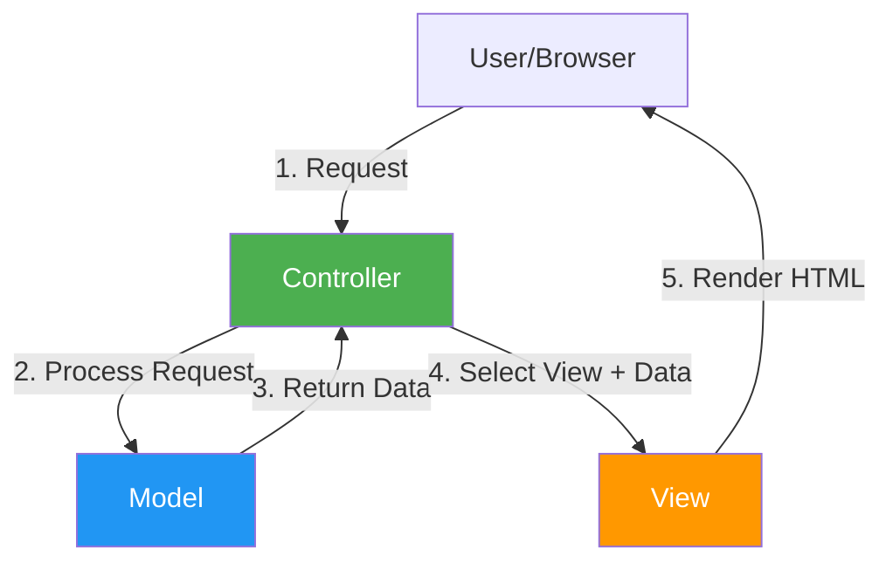
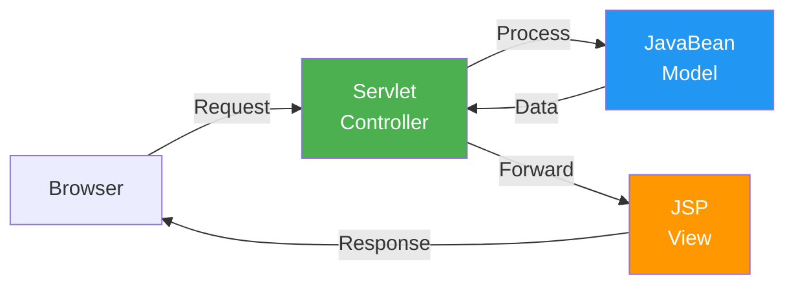
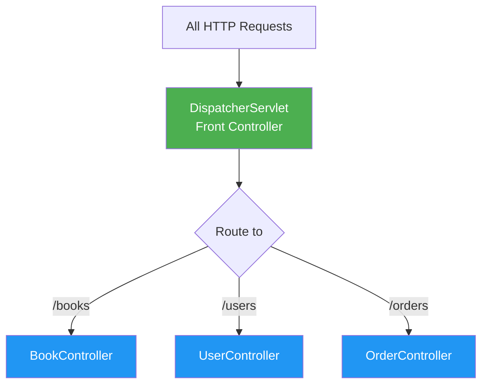
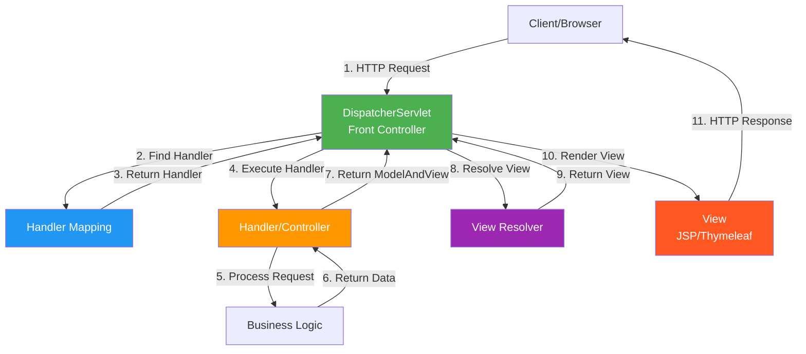
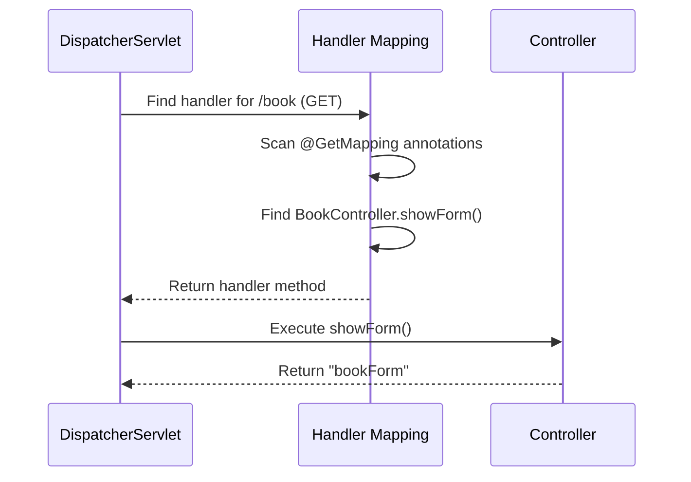
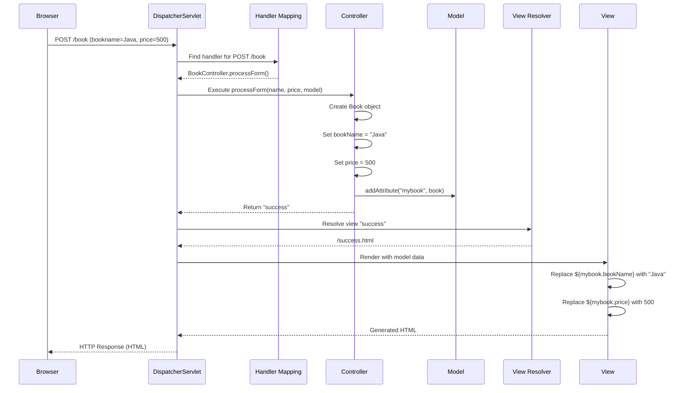

# MVC Architecture Pattern - Complete Guide

## Table of Contents
1. [Introduction](#introduction)
2. [What is MVC?](#what-is-mvc)
3. [Why MVC-Based Frameworks?](#why-mvc-based-frameworks)
4. [Model 1 vs Model 2 Architecture](#model-1-vs-model-2-architecture)
5. [Front Controller Design Pattern](#front-controller-design-pattern)
6. [Spring MVC Architecture](#spring-mvc-architecture)
7. [DispatcherServlet - The Front Controller](#dispatcherservlet---the-front-controller)
8. [Handler Mapping](#handler-mapping)
9. [View Resolver](#view-resolver)
10. [Complete Request-Response Flow](#complete-request-response-flow)
11. [Summary](#summary)

---

## Introduction

**MVC (Model-View-Controller)** is a design pattern that separates an application into three interconnected components. This separation helps organize code, improve maintainability, and enable parallel development.

> [!IMPORTANT]
> MVC is not just a pattern—it's a philosophy of separating concerns:
> - **Model**: Data and business logic
> - **View**: User interface
> - **Controller**: Request handling and flow control

---

## What is MVC?

### The Three Components



#### 1. Model

**Responsibility**: Represents data and business logic

**Contains**:
- Domain objects (entities)
- Business logic
- Data access logic
- Validation rules

**Example**:
```java
public class Book {
    private String bookName;
    private long price;
    
    // Getters and setters
    public String getBookName() {
        return bookName;
    }
    
    public void setBookName(String bookName) {
        this.bookName = bookName;
    }
    
    public long getPrice() {
        return price;
    }
    
    public void setPrice(long price) {
        this.price = price;
    }
}
```

#### 2. View

**Responsibility**: Presents data to the user

**Contains**:
- HTML templates
- JSP files
- Thymeleaf templates
- UI components

**Example** (Thymeleaf):
```html
<!DOCTYPE html>
<html xmlns:th="http://www.thymeleaf.org">
<head>
    <title>Book Details</title>
</head>
<body>
    <h1>Book Information</h1>
    <p>Book Name: <span th:text="${mybook.bookName}"></span></p>
    <p>Price: <span th:text="${mybook.price}"></span></p>
</body>
</html>
```

#### 3. Controller

**Responsibility**: Handles user requests and controls application flow

**Contains**:
- Request mapping
- Request parameter extraction
- Model preparation
- View selection

**Example**:
```java
@Controller
public class BookController {
    
    @GetMapping("/book")
    public String showForm() {
        return "bookForm";  // View name
    }
    
    @PostMapping("/book")
    public String processForm(@RequestParam("bookname") String name,
                             @RequestParam("price") long price,
                             Model model) {
        Book book = new Book();
        book.setBookName(name);
        book.setPrice(price);
        
        model.addAttribute("mybook", book);  // Add to model
        return "success";  // View name
    }
}
```

### Benefits of MVC

| Benefit | Description |
|---------|-------------|
| **Separation of Concerns** | Each component has a specific responsibility |
| **Parallel Development** | Different teams can work on Model, View, Controller simultaneously |
| **Testability** | Each component can be tested independently |
| **Maintainability** | Changes in one component don't affect others |
| **Reusability** | Models can be reused across different views |

---

## Why MVC-Based Frameworks?

### Problems with Core MVC (Model 2)

When you implement MVC manually using Servlets and JSPs:

**Scenario**: Large application with many forms, JavaBeans, and view components

**Problems**:

1. **Controller Overload**
   - Single servlet handles all requests
   - Becomes very large and complex
   - Difficult to maintain

2. **Workflow Changes**
   - If application workflow changes, controller needs major modifications
   - High maintenance cost

3. **Repetitive Code**
   - Similar request handling logic repeated
   - No reusability

**Example of Overloaded Controller**:
```java
// Core MVC - Single servlet handling everything
public class MainController extends HttpServlet {
    protected void doGet(HttpServletRequest request, HttpServletResponse response) {
        String action = request.getParameter("action");
        
        if ("showBooks".equals(action)) {
            // Book listing logic
        } else if ("showUsers".equals(action)) {
            // User listing logic
        } else if ("showOrders".equals(action)) {
            // Order listing logic
        }
        // ... hundreds of if-else statements
    }
}
```

### Solution: MVC-Based Frameworks

**How frameworks solve these problems**:

1. **Provide a Controller**
   - Framework provides a sophisticated front controller
   - You don't write the main controller

2. **Configuration-Based Workflow**
   - Application workflow defined in XML or annotations
   - Controller adapts based on configuration

3. **Dynamic and Flexible**
   - Controller understands your workflow from configuration
   - Easy to modify without changing controller code

```mermaid
graph TD
    A[Core MVC Problems] --> B[MVC Framework Solution]
    B --> C[Front Controller Provided]
    B --> D[Configuration-Based Routing]
    B --> E[Flexible Workflow]
    
    C --> F[DispatcherServlet]
    D --> G[Annotations/@RequestMapping]
    E --> H[Easy Maintenance]
    
    style A fill:#f44336,color:#fff
    style B fill:#4CAF50,color:#fff
    style F fill:#2196F3,color:#fff
```

---

## Model 1 vs Model 2 Architecture

### Model 1 Architecture (JSP-Centric)


**Characteristics**:
- JSP handles both presentation and business logic
- JavaBeans for data
- Simple for small applications

**Problems**:
- ❌ JSP becomes cluttered with Java code
- ❌ Difficult to maintain
- ❌ Poor separation of concerns
- ❌ Not suitable for large applications

### Model 2 Architecture (Servlet-Centric MVC)



**Characteristics**:
- Servlet acts as controller
- JavaBeans for business logic (Model)
- JSP for presentation (View)
- Clear separation of concerns

**Advantages**:
- ✅ Better organization
- ✅ Separation of concerns
- ✅ Easier to maintain
- ✅ Suitable for larger applications

---

## Front Controller Design Pattern

### Definition

**Front Controller** is a structural design pattern where:
- All requests are handled by a **single handler**
- This handler dispatches requests to appropriate specific handlers

### In Spring MVC

**DispatcherServlet** is the Front Controller



### Workflow

```
Request → DispatcherServlet → HandlerMapping → Your Controller → ViewResolver → Response
```

### Benefits

| Benefit | Description |
|---------|-------------|
| **Centralized Control** | Single entry point for all requests |
| **Simplified Configuration** | No need to map every servlet in web.xml |
| **Centralized Error Handling** | Handle errors in one place |
| **Centralized Security** | Apply security checks at one point |
| **Decoupling** | Request processing decoupled from business logic |

---

## Spring MVC Architecture

### Complete Architecture Diagram



### Step-by-Step Flow

#### Step 1: Client Sends Request

```
Browser → http://localhost:8080/book
```

#### Step 2: DispatcherServlet Receives Request

```java
// DispatcherServlet (provided by Spring)
public class DispatcherServlet extends FrameworkServlet {
    protected void doDispatch(HttpServletRequest request, HttpServletResponse response) {
        // Handle the request
    }
}
```

#### Step 3: Handler Mapping

**DispatcherServlet asks**: "Which controller should handle `/book`?"

**Handler Mapping responds**: "BookController's method with @GetMapping(\"/book\")"

```java
@Controller
public class BookController {
    
    @GetMapping("/book")  // ← Handler Mapping finds this
    public String showForm() {
        return "bookForm";
    }
}
```

#### Step 4: Controller Execution

```java
@PostMapping("/book")
public String processForm(@RequestParam("bookname") String name,
                         @RequestParam("price") long price,
                         Model model) {
    // Business logic
    Book book = new Book();
    book.setBookName(name);
    book.setPrice(price);
    
    // Add to model
    model.addAttribute("mybook", book);
    
    // Return view name
    return "success";
}
```

**Controller returns**:
- **Data** (Model): `book` object
- **View name**: `"success"`

#### Step 5: ModelAndView

Internally, Spring creates a `ModelAndView` object:

```java
ModelAndView mav = new ModelAndView();
mav.addObject("mybook", book);  // Data
mav.setViewName("success");     // View name
```

#### Step 6: View Resolver

**DispatcherServlet asks**: "Where is the view named 'success'?"

**View Resolver configuration** (application.properties):
```properties
spring.mvc.view.prefix=/
spring.mvc.view.suffix=.html
```

**View Resolver responds**: "The view is at `/success.html`"

**Full path**: `src/main/resources/templates/success.html`

#### Step 7: View Rendering

```html
<!-- success.html -->
<!DOCTYPE html>
<html xmlns:th="http://www.thymeleaf.org">
<body>
    <h1>Book Saved Successfully!</h1>
    <p>Book Name: <span th:text="${mybook.bookName}"></span></p>
    <p>Price: <span th:text="${mybook.price}"></span></p>
</body>
</html>
```

**Thymeleaf engine**:
- Replaces `${mybook.bookName}` with actual value
- Replaces `${mybook.price}` with actual value
- Generates final HTML

#### Step 8: Response to Client

```html
<!-- Final HTML sent to browser -->
<!DOCTYPE html>
<html>
<body>
    <h1>Book Saved Successfully!</h1>
    <p>Book Name: Java Programming</p>
    <p>Price: 500</p>
</body>
</html>
```

---

## DispatcherServlet - The Front Controller

### What is DispatcherServlet?

**DispatcherServlet** is:
- An **in-built servlet** provided by Spring
- The **Front Controller** in Spring MVC
- The **entry point** for all requests

### Traditional Spring MVC (Without Spring Boot)

In traditional Spring MVC, you had to configure DispatcherServlet in `web.xml`:

```xml
<!-- web.xml -->
<web-app>
    <servlet>
        <servlet-name>dispatcher</servlet-name>
        <servlet-class>org.springframework.web.servlet.DispatcherServlet</servlet-class>
        <load-on-startup>1</load-on-startup>
    </servlet>
    
    <servlet-mapping>
        <servlet-name>dispatcher</servlet-name>
        <url-pattern>/</url-pattern>
    </servlet-mapping>
</web-app>
```

**Key points**:
- `<load-on-startup>1</load-on-startup>`: Initialize DispatcherServlet when server starts
- `<url-pattern>/</url-pattern>`: Handle all requests

### Spring Boot (Auto-Configuration)

With Spring Boot, **NO web.xml needed**!

**Why?**

1. **WebMvcAutoConfiguration** detects you're building a web app
2. Creates DispatcherServlet automatically
3. Embedded Tomcat loads DispatcherServlet on startup

```java
// Spring Boot does this automatically
@Bean
public DispatcherServlet dispatcherServlet() {
    return new DispatcherServlet();
}
```

**Console output confirms**:
```
Servlet dispatcherServlet mapped to [/]
```

---

## Handler Mapping

### What is Handler Mapping?

**Handler Mapping** is the component that:
- Maps incoming requests to appropriate handlers (controllers)
- Uses annotations or XML configuration

### Annotation-Based Handler Mapping

```java
@Controller
public class BookController {
    
    @GetMapping("/book")  // Handler mapping: GET /book → this method
    public String showForm() {
        return "bookForm";
    }
    
    @PostMapping("/book")  // Handler mapping: POST /book → this method
    public String processForm(...) {
        return "success";
    }
}
```

### How It Works



### Request Mapping Annotations

| Annotation | HTTP Method | Use Case |
|------------|-------------|----------|
| `@GetMapping` | GET | Read/Display data |
| `@PostMapping` | POST | Create/Submit data |
| `@PutMapping` | PUT | Update data |
| `@DeleteMapping` | DELETE | Delete data |
| `@PatchMapping` | PATCH | Partial update |
| `@RequestMapping` | Any | Generic mapping |

---

## View Resolver

### What is View Resolver?

**View Resolver** is the component that:
- Resolves logical view names to actual view files
- Configured via application.properties

### Configuration

```properties
# application.properties
spring.mvc.view.prefix=/
spring.mvc.view.suffix=.html
```

### How It Works

**Controller returns**: `"success"`

**View Resolver resolves**:
```
prefix + viewName + suffix
  /    + success  + .html
= /success.html
```

**Full path**: `src/main/resources/templates/success.html`

### Example

```java
@Controller
public class BookController {
    
    @GetMapping("/book")
    public String showForm() {
        return "bookForm";  // Resolved to /bookForm.html
    }
    
    @PostMapping("/book")
    public String processForm(...) {
        return "success";  // Resolved to /success.html
    }
}
```

**View Resolver Process**:

```mermaid
graph LR
    A[Controller returns 'success'] --> B[View Resolver]
    B --> C{Apply prefix and suffix}
    C --> D[/success.html]
    D --> E[Look in templates folder]
    E --> F[src/main/resources/templates/success.html]
    
    style B fill:#4CAF50,color:#fff
    style F fill:#2196F3,color:#fff
```

---

## Complete Request-Response Flow

### Detailed Example

**Scenario**: User submits a book form

#### 1. User Fills Form

```html
<!-- bookForm.html -->
<form th:action="@{/book}" method="post">
    <input type="text" name="bookname" placeholder="Book Name"/>
    <input type="number" name="price" placeholder="Price"/>
    <button type="submit">Submit</button>
</form>
```

#### 2. Form Submission

```
POST http://localhost:8080/book
Body: bookname=Java&price=500
```

#### 3. DispatcherServlet Receives Request

```
DispatcherServlet: "I received a POST request to /book"
```

#### 4. Handler Mapping

```
DispatcherServlet: "Which controller handles POST /book?"
Handler Mapping: "BookController.processForm() handles it"
```

#### 5. Controller Execution

```java
@PostMapping("/book")
public String processForm(@RequestParam("bookname") String name,
                         @RequestParam("price") long price,
                         Model model) {
    // Line 1: Extract parameters
    // name = "Java"
    // price = 500
    
    // Line 2-4: Create and populate Book object
    Book book = new Book();
    book.setBookName(name);
    book.setPrice(price);
    
    // Line 5: Add to model
    model.addAttribute("mybook", book);
    
    // Line 6: Return view name
    return "success";
}
```

**Line-by-Line Execution**:

| Line | Code | Explanation |
|------|------|-------------|
| 1 | `@RequestParam("bookname") String name` | Extract "bookname" from request → `name = "Java"` |
| 2 | `@RequestParam("price") long price` | Extract "price" from request → `price = 500` |
| 3 | `Book book = new Book();` | Create new Book object |
| 4 | `book.setBookName(name);` | Set bookName = "Java" |
| 5 | `book.setPrice(price);` | Set price = 500 |
| 6 | `model.addAttribute("mybook", book);` | Add book to model with key "mybook" |
| 7 | `return "success";` | Return view name "success" |

#### 6. ModelAndView Creation

```java
// Spring internally creates
ModelAndView mav = new ModelAndView();
mav.addObject("mybook", book);  // Data: {mybook: Book{bookName='Java', price=500}}
mav.setViewName("success");     // View: "success"
```

#### 7. View Resolution

```
DispatcherServlet: "Where is view 'success'?"
View Resolver: "It's at /success.html"
Full path: src/main/resources/templates/success.html
```

#### 8. View Rendering

```html
<!-- success.html (before rendering) -->
<p>Book Name: <span th:text="${mybook.bookName}"></span></p>
<p>Price: <span th:text="${mybook.price}"></span></p>

<!-- success.html (after rendering) -->
<p>Book Name: <span>Java</span></p>
<p>Price: <span>500</span></p>
```

#### 9. Response to Browser

```html
<!DOCTYPE html>
<html>
<body>
    <h1>Book Saved Successfully!</h1>
    <p>Book Name: Java</p>
    <p>Price: 500</p>
</body>
</html>
```

### Complete Flow Diagram



---

## Summary

### Key Takeaways

1. **MVC Pattern**:
   - **Model**: Data and business logic
   - **View**: User interface
   - **Controller**: Request handling and flow control

2. **Why MVC Frameworks**:
   - Solve controller overload problem
   - Configuration-based workflow
   - Dynamic and flexible

3. **Front Controller Pattern**:
   - Single entry point (DispatcherServlet)
   - Centralized request handling
   - Dispatches to specific controllers

4. **Spring MVC Flow**:
   ```
   Request → DispatcherServlet → Handler Mapping → Controller → 
   ModelAndView → View Resolver → View → Response
   ```

5. **DispatcherServlet**:
   - Front Controller in Spring MVC
   - Auto-configured in Spring Boot
   - No web.xml needed

6. **Handler Mapping**:
   - Maps requests to controllers
   - Uses annotations (@GetMapping, @PostMapping, etc.)

7. **View Resolver**:
   - Resolves logical view names to actual files
   - Configured via application.properties

### Quick Reference

| Component | Purpose | Example |
|-----------|---------|---------|
| Model | Data | `Book` class |
| View | UI | `success.html` |
| Controller | Request handling | `BookController` |
| DispatcherServlet | Front Controller | Auto-configured |
| Handler Mapping | Route requests | `@GetMapping("/book")` |
| View Resolver | Find views | `prefix + name + suffix` |

---

## Practice Questions

1. What are the three components of MVC pattern?
2. Explain the difference between Model 1 and Model 2 architecture.
3. What is the Front Controller design pattern?
4. Describe the complete Spring MVC request-response flow.
5. What is the role of DispatcherServlet?
6. How does Handler Mapping work?
7. What is View Resolver and how is it configured?
8. Why don't we need web.xml in Spring Boot?
9. What is the difference between @Controller and @RestController?
10. Explain how ModelAndView works.

---

**End of Note 03: MVC Architecture Pattern**

*Previous: [02_Spring_Boot_Architecture.md](file:///c:/Users/2706p/Desktop/mcq/notes/02_Spring_Boot_Architecture.md)*  
*Next: [04_Controllers_Request_Mapping.md](file:///c:/Users/2706p/Desktop/mcq/notes/04_Controllers_Request_Mapping.md)*
