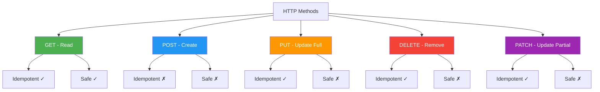
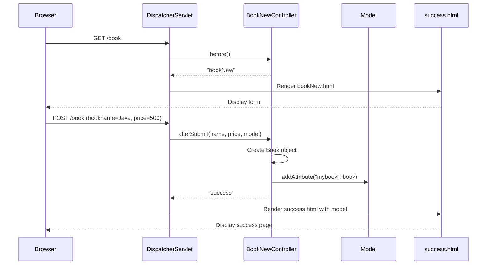

# Controllers and Request Mapping - Complete Guide

## Table of Contents
1. [Introduction](#introduction)
2. [@Controller vs @RestController](#controller-vs-restcontroller)
3. [Request Mapping Annotations](#request-mapping-annotations)
4. [Path Variables](#path-variables)
5. [Request Parameters](#request-parameters)
6. [Request Body and Response Body](#request-body-and-response-body)
7. [ResponseEntity and HTTP Status Codes](#responseentity-and-http-status-codes)
8. [Using Hyperlinks in Spring MVC](#using-hyperlinks-in-spring-mvc)
9. [Complete Code Examples](#complete-code-examples)
10. [Best Practices](#best-practices)
11. [Summary](#summary)

---

## Introduction

Controllers are the heart of Spring MVC applications. They handle incoming HTTP requests, process them, and return appropriate responses. Understanding controllers and request mapping is fundamental to building web applications with Spring Boot.

> [!IMPORTANT]
> Controllers act as the bridge between the user interface and business logic:
> - Receive HTTP requests
> - Extract request data
> - Invoke business logic
> - Prepare response data
> - Return views or data

---

## @Controller vs @RestController

### @Controller

**Purpose**: Returns **views** (HTML pages) for server-side rendering

**Use Case**: Traditional web applications with Thymeleaf/JSP

```java
@Controller
public class BookController {
    
    @GetMapping("/book")
    public String showForm() {
        return "bookForm";  // Returns view name → bookForm.html
    }
    
    @PostMapping("/book")
    public String processForm(@RequestParam("bookname") String name,
                             @RequestParam("price") long price,
                             Model model) {
        Book book = new Book();
        book.setBookName(name);
        book.setPrice(price);
        model.addAttribute("mybook", book);
        return "success";  // Returns view name → success.html
    }
}
```

**How it works**:
1. Controller method returns a String
2. String is treated as a **view name**
3. ViewResolver resolves the view name to actual file
4. View is rendered with model data
5. HTML is sent to browser

### @RestController

**Purpose**: Returns **data** (JSON/XML) directly to the client

**Use Case**: REST APIs, Single Page Applications (SPAs), Mobile backends

```java
@RestController
@RequestMapping("/api")
public class BookRestController {
    
    @GetMapping("/books")
    public List<Book> getAllBooks() {
        return bookService.findAll();  // Returns JSON directly
    }
    
    @GetMapping("/books/{id}")
    public Book getBook(@PathVariable Long id) {
        return bookService.findById(id);  // Returns JSON directly
    }
    
    @PostMapping("/books")
    public Book createBook(@RequestBody Book book) {
        return bookService.save(book);  // Returns JSON directly
    }
}
```

**How it works**:
1. Controller method returns an object
2. Object is automatically converted to JSON (using Jackson)
3. JSON is sent directly to the client
4. No view resolution happens

### Comparison

| Aspect | @Controller | @RestController |
|--------|-------------|-----------------|
| **Returns** | View names (String) | Data (Objects) |
| **Response Type** | HTML | JSON/XML |
| **View Resolution** | Yes | No |
| **Equivalent to** | `@Controller` | `@Controller` + `@ResponseBody` |
| **Use Case** | Web pages | REST APIs |
| **Content-Type** | text/html | application/json |

### @RestController Internals

```java
// @RestController is a combination of two annotations
@Target(ElementType.TYPE)
@Retention(RetentionPolicy.RUNTIME)
@Documented
@Controller
@ResponseBody
public @interface RestController {
    // ...
}
```

**@ResponseBody**: Tells Spring to write the return value directly to the HTTP response body

---

## Request Mapping Annotations

### @RequestMapping (Generic)

**The parent of all mapping annotations**

```java
@Controller
@RequestMapping("/books")  // Base path for all methods
public class BookController {
    
    @RequestMapping(value = "/list", method = RequestMethod.GET)
    public String listBooks(Model model) {
        model.addAttribute("books", bookService.findAll());
        return "bookList";
    }
    
    @RequestMapping(value = "/add", method = RequestMethod.POST)
    public String addBook(@ModelAttribute Book book) {
        bookService.save(book);
        return "redirect:/books/list";
    }
}
```

### @GetMapping

**HTTP Method**: GET  
**Purpose**: Read/Retrieve data  
**Idempotent**: Yes (multiple calls produce same result)

```java
@GetMapping("/book")
public String showForm() {
    return "bookForm";
}

@GetMapping("/books/{id}")
public String showBook(@PathVariable Long id, Model model) {
    Book book = bookService.findById(id);
    model.addAttribute("book", book);
    return "bookDetails";
}
```

**When to use**:
- Displaying forms
- Listing data
- Viewing details
- Search operations

### @PostMapping

**HTTP Method**: POST  
**Purpose**: Create/Submit data  
**Idempotent**: No (multiple calls may create multiple resources)

```java
@PostMapping("/book")
public String processForm(@RequestParam("bookname") String name,
                         @RequestParam("price") long price,
                         Model model) {
    Book book = new Book();
    book.setBookName(name);
    book.setPrice(price);
    
    bookService.save(book);
    
    model.addAttribute("mybook", book);
    return "success";
}
```

**When to use**:
- Form submissions
- Creating new resources
- File uploads
- Complex data submission

### @PutMapping

**HTTP Method**: PUT  
**Purpose**: Update existing resource (complete replacement)  
**Idempotent**: Yes

```java
@PutMapping("/books/{id}")
public ResponseEntity<Book> updateBook(@PathVariable Long id,
                                       @RequestBody Book book) {
    book.setId(id);
    Book updatedBook = bookService.update(book);
    return ResponseEntity.ok(updatedBook);
}
```

### @DeleteMapping

**HTTP Method**: DELETE  
**Purpose**: Delete a resource  
**Idempotent**: Yes

```java
@DeleteMapping("/books/{id}")
public ResponseEntity<Void> deleteBook(@PathVariable Long id) {
    bookService.deleteById(id);
    return ResponseEntity.noContent().build();
}
```

### @PatchMapping

**HTTP Method**: PATCH  
**Purpose**: Partial update of a resource  
**Idempotent**: Yes

```java
@PatchMapping("/books/{id}")
public ResponseEntity<Book> partialUpdate(@PathVariable Long id,
                                          @RequestBody Map<String, Object> updates) {
    Book book = bookService.partialUpdate(id, updates);
    return ResponseEntity.ok(book);
}
```

### HTTP Methods Summary



---

## Path Variables

### What are Path Variables?

**Path variables** extract values from the URL path itself.

### Basic Usage

```java
@GetMapping("/books/{id}")
public String getBook(@PathVariable Long id, Model model) {
    Book book = bookService.findById(id);
    model.addAttribute("book", book);
    return "bookDetails";
}
```

**Example**: `GET /books/123` → `id = 123`

### Multiple Path Variables

```java
@GetMapping("/authors/{authorId}/books/{bookId}")
public String getAuthorBook(@PathVariable Long authorId,
                           @PathVariable Long bookId,
                           Model model) {
    Book book = bookService.findByAuthorAndBook(authorId, bookId);
    model.addAttribute("book", book);
    return "bookDetails";
}
```

**Example**: `GET /authors/5/books/123` → `authorId = 5, bookId = 123`

### Named Path Variables

```java
@GetMapping("/books/{bookId}")
public String getBook(@PathVariable("bookId") Long id, Model model) {
    // Parameter name 'id' is different from path variable 'bookId'
    Book book = bookService.findById(id);
    model.addAttribute("book", book);
    return "bookDetails";
}
```

### Optional Path Variables

```java
@GetMapping({"/books", "/books/{category}"})
public String listBooks(@PathVariable(required = false) String category,
                       Model model) {
    List<Book> books;
    if (category != null) {
        books = bookService.findByCategory(category);
    } else {
        books = bookService.findAll();
    }
    model.addAttribute("books", books);
    return "bookList";
}
```

**Examples**:
- `GET /books` → `category = null` (all books)
- `GET /books/fiction` → `category = "fiction"` (fiction books only)

### Path Variable with Regular Expressions

```java
@GetMapping("/books/{id:[0-9]+}")
public String getBook(@PathVariable Long id, Model model) {
    // Only matches numeric IDs
    Book book = bookService.findById(id);
    model.addAttribute("book", book);
    return "bookDetails";
}
```

**Matches**: `/books/123` ✓  
**Doesn't match**: `/books/abc` ✗

---

## Request Parameters

### What are Request Parameters?

**Request parameters** are key-value pairs sent in the URL query string or form data.

### Old Way (HttpServletRequest)

```java
@PostMapping("/book")
public String afterSubmit(HttpServletRequest request) {
    // Old way to read request parameters
    String bookName = request.getParameter("bookname");
    String priceStr = request.getParameter("price");
    long price = Long.parseLong(priceStr);  // Manual conversion
    
    Book book = new Book();
    book.setBookName(bookName);
    book.setPrice(price);
    
    request.setAttribute("mb", book);
    return "success";
}
```

**Problems**:
- ❌ Manual type conversion
- ❌ Verbose code
- ❌ No type safety
- ❌ Error-prone

### New Way (@RequestParam)

```java
@PostMapping("/book")
public String afterSubmit(@RequestParam("bookname") String name,
                         @RequestParam("price") long bookprice,
                         Model model) {
    // New way - cleaner and type-safe
    Book book = new Book();
    book.setBookName(name);
    book.setPrice(bookprice);  // Automatic type conversion!
    
    model.addAttribute("mybook", book);
    return "success";
}
```

**Benefits**:
- ✅ Automatic type conversion
- ✅ Cleaner code
- ✅ Type-safe
- ✅ Validation support

### Line-by-Line Analysis

| Line | Code | Explanation |
|------|------|-------------|
| 1 | `@PostMapping("/book")` | Maps POST requests to /book |
| 2 | `@RequestParam("bookname") String name` | Extract "bookname" parameter from request |
| 3 | `@RequestParam("price") long bookprice` | Extract "price" parameter and convert to long |
| 4 | `Model model` | Spring provides Model object for data transfer |
| 6 | `Book book = new Book();` | Create new Book instance |
| 7 | `book.setBookName(name);` | Set bookName property |
| 8 | `book.setPrice(bookprice);` | Set price property |
| 10 | `model.addAttribute("mybook", book);` | Add book to model with key "mybook" |
| 11 | `return "success";` | Return view name "success" |

### Optional Request Parameters

```java
@GetMapping("/books")
public String listBooks(@RequestParam(required = false) String category,
                       @RequestParam(defaultValue = "10") int pageSize,
                       Model model) {
    List<Book> books;
    if (category != null) {
        books = bookService.findByCategory(category, pageSize);
    } else {
        books = bookService.findAll(pageSize);
    }
    model.addAttribute("books", books);
    return "bookList";
}
```

**Examples**:
- `GET /books` → `category = null, pageSize = 10`
- `GET /books?category=fiction` → `category = "fiction", pageSize = 10`
- `GET /books?category=fiction&pageSize=20` → `category = "fiction", pageSize = 20`

### Multiple Values for Same Parameter

```java
@GetMapping("/books")
public String listBooks(@RequestParam List<String> categories, Model model) {
    List<Book> books = bookService.findByCategories(categories);
    model.addAttribute("books", books);
    return "bookList";
}
```

**Example**: `GET /books?categories=fiction&categories=mystery&categories=thriller`  
→ `categories = ["fiction", "mystery", "thriller"]`

---

## Request Body and Response Body

### @RequestBody

**Purpose**: Bind HTTP request body to a Java object (JSON → Object)

```java
@RestController
@RequestMapping("/api/books")
public class BookRestController {
    
    @PostMapping
    public Book createBook(@RequestBody Book book) {
        // book object is automatically created from JSON
        return bookService.save(book);
    }
}
```

**Request**:
```http
POST /api/books
Content-Type: application/json

{
  "bookName": "Spring Boot in Action",
  "price": 599
}
```

**What happens**:
1. Jackson (JSON library) reads the JSON from request body
2. Creates a `Book` object
3. Sets `bookName = "Spring Boot in Action"`
4. Sets `price = 599`
5. Passes the object to the method

### @ResponseBody

**Purpose**: Write method return value directly to HTTP response body (Object → JSON)

```java
@Controller
@RequestMapping("/api/books")
public class BookController {
    
    @GetMapping("/{id}")
    @ResponseBody  // Explicitly mark as response body
    public Book getBook(@PathVariable Long id) {
        return bookService.findById(id);  // Converted to JSON
    }
}
```

**Response**:
```http
HTTP/1.1 200 OK
Content-Type: application/json

{
  "id": 1,
  "bookName": "Spring Boot in Action",
  "price": 599
}
```

> [!NOTE]
> With `@RestController`, you don't need `@ResponseBody` on every method because `@RestController` = `@Controller` + `@ResponseBody`

---

## ResponseEntity and HTTP Status Codes

### What is ResponseEntity?

**ResponseEntity** gives you full control over the HTTP response:
- Status code
- Headers
- Body

### Basic Usage

```java
@RestController
@RequestMapping("/api/books")
public class BookRestController {
    
    @GetMapping("/{id}")
    public ResponseEntity<Book> getBook(@PathVariable Long id) {
        Book book = bookService.findById(id);
        
        if (book != null) {
            return ResponseEntity.ok(book);  // 200 OK
        } else {
            return ResponseEntity.notFound().build();  // 404 Not Found
        }
    }
}
```

### HTTP Status Codes

#### 2xx Success

```java
// 200 OK
return ResponseEntity.ok(book);

// 201 Created
return ResponseEntity.status(HttpStatus.CREATED).body(book);

// 204 No Content
return ResponseEntity.noContent().build();
```

#### 4xx Client Errors

```java
// 400 Bad Request
return ResponseEntity.badRequest().body("Invalid input");

// 404 Not Found
return ResponseEntity.notFound().build();

// 409 Conflict
return ResponseEntity.status(HttpStatus.CONFLICT).body("Book already exists");
```

#### 5xx Server Errors

```java
// 500 Internal Server Error
return ResponseEntity.status(HttpStatus.INTERNAL_SERVER_ERROR).body("Server error");
```

### Complete CRUD Example with ResponseEntity

```java
@RestController
@RequestMapping("/api/books")
public class BookRestController {
    
    @Autowired
    private BookService bookService;
    
    // CREATE
    @PostMapping
    public ResponseEntity<Book> createBook(@RequestBody Book book) {
        Book savedBook = bookService.save(book);
        return ResponseEntity
                .status(HttpStatus.CREATED)
                .body(savedBook);
    }
    
    // READ (Single)
    @GetMapping("/{id}")
    public ResponseEntity<Book> getBook(@PathVariable Long id) {
        Book book = bookService.findById(id);
        if (book != null) {
            return ResponseEntity.ok(book);
        }
        return ResponseEntity.notFound().build();
    }
    
    // READ (All)
    @GetMapping
    public ResponseEntity<List<Book>> getAllBooks() {
        List<Book> books = bookService.findAll();
        return ResponseEntity.ok(books);
    }
    
    // UPDATE
    @PutMapping("/{id}")
    public ResponseEntity<Book> updateBook(@PathVariable Long id,
                                          @RequestBody Book book) {
        Book existingBook = bookService.findById(id);
        if (existingBook == null) {
            return ResponseEntity.notFound().build();
        }
        
        book.setId(id);
        Book updatedBook = bookService.update(book);
        return ResponseEntity.ok(updatedBook);
    }
    
    // DELETE
    @DeleteMapping("/{id}")
    public ResponseEntity<Void> deleteBook(@PathVariable Long id) {
        Book book = bookService.findById(id);
        if (book == null) {
            return ResponseEntity.notFound().build();
        }
        
        bookService.deleteById(id);
        return ResponseEntity.noContent().build();
    }
}
```

### Adding Custom Headers

```java
@GetMapping("/{id}")
public ResponseEntity<Book> getBook(@PathVariable Long id) {
    Book book = bookService.findById(id);
    
    return ResponseEntity.ok()
            .header("Custom-Header", "Value")
            .header("X-Total-Count", "100")
            .body(book);
}
```

---

## Using Hyperlinks in Spring MVC

### Hyperlinks in HTML (Thymeleaf)

#### Basic Hyperlink

```html
<!-- bookList.html -->
<a th:href="@{/books/details}">View Book Details</a>
```

**Generates**: `<a href="/books/details">View Book Details</a>`

#### Hyperlink with Path Variable

```html
<a th:href="@{/books/{id}(id=${book.id})}">View Details</a>
```

**If `book.id = 123`**:  
**Generates**: `<a href="/books/123">View Details</a>`

#### Hyperlink with Query Parameters

```html
<a th:href="@{/books(category='fiction',page=1)}">Fiction Books</a>
```

**Generates**: `<a href="/books?category=fiction&page=1">Fiction Books</a>`

#### Hyperlink with Both

```html
<a th:href="@{/books/{id}(id=${book.id},action='edit')}">Edit</a>
```

**If `book.id = 123`**:  
**Generates**: `<a href="/books/123?action=edit">Edit</a>`

### Controller Handling Hyperlinks

```java
@Controller
@RequestMapping("/books")
public class BookController {
    
    @GetMapping("/details")
    public String viewDetails(Model model) {
        // Handle /books/details
        return "bookDetails";
    }
    
    @GetMapping("/{id}")
    public String viewBook(@PathVariable Long id, Model model) {
        // Handle /books/123
        Book book = bookService.findById(id);
        model.addAttribute("book", book);
        return "bookView";
    }
    
    @GetMapping
    public String listBooks(@RequestParam(required = false) String category,
                           @RequestParam(defaultValue = "1") int page,
                           Model model) {
        // Handle /books?category=fiction&page=1
        List<Book> books = bookService.findByCategory(category, page);
        model.addAttribute("books", books);
        return "bookList";
    }
}
```

### Complete Example: Book Listing with Links

**Controller**:
```java
@Controller
@RequestMapping("/books")
public class BookController {
    
    @GetMapping
    public String listBooks(Model model) {
        List<Book> books = bookService.findAll();
        model.addAttribute("books", books);
        return "bookList";
    }
    
    @GetMapping("/{id}")
    public String viewBook(@PathVariable Long id, Model model) {
        Book book = bookService.findById(id);
        model.addAttribute("book", book);
        return "bookView";
    }
    
    @GetMapping("/{id}/edit")
    public String editBook(@PathVariable Long id, Model model) {
        Book book = bookService.findById(id);
        model.addAttribute("book", book);
        return "bookEdit";
    }
    
    @GetMapping("/{id}/delete")
    public String deleteBook(@PathVariable Long id) {
        bookService.deleteById(id);
        return "redirect:/books";
    }
}
```

**View (bookList.html)**:
```html
<!DOCTYPE html>
<html xmlns:th="http://www.thymeleaf.org">
<head>
    <title>Book List</title>
</head>
<body>
    <h1>All Books</h1>
    <table>
        <thead>
            <tr>
                <th>ID</th>
                <th>Name</th>
                <th>Price</th>
                <th>Actions</th>
            </tr>
        </thead>
        <tbody>
            <tr th:each="book : ${books}">
                <td th:text="${book.id}"></td>
                <td th:text="${book.bookName}"></td>
                <td th:text="${book.price}"></td>
                <td>
                    <a th:href="@{/books/{id}(id=${book.id})}">View</a> |
                    <a th:href="@{/books/{id}/edit(id=${book.id})}">Edit</a> |
                    <a th:href="@{/books/{id}/delete(id=${book.id})}"
                       onclick="return confirm('Are you sure?')">Delete</a>
                </td>
            </tr>
        </tbody>
    </table>
</body>
</html>
```

---

## Complete Code Examples

### Book.java (Model)

```java
package mypack;

public class Book {
    private Long id;
    private String bookName;
    private long price;
    
    // Constructors
    public Book() {}
    
    public Book(String bookName, long price) {
        this.bookName = bookName;
        this.price = price;
    }
    
    @Override
    public String toString() {
        return "[" + bookName + "   " + price + "]";
    }
    
    // Getters and Setters
    public Long getId() {
        return id;
    }
    
    public void setId(Long id) {
        this.id = id;
    }
    
    public String getBookName() {
        return bookName;
    }
    
    public void setBookName(String bookName) {
        this.bookName = bookName;
    }
    
    public long getPrice() {
        return price;
    }
    
    public void setPrice(long price) {
        this.price = price;
    }
}
```

### BookNewController.java (Controller)

```java
package com.example.demo;

import org.springframework.stereotype.Controller;
import org.springframework.ui.Model;
import org.springframework.web.bind.annotation.GetMapping;
import org.springframework.web.bind.annotation.PostMapping;
import org.springframework.web.bind.annotation.RequestParam;

@Controller
public class BookNewController {
    
    @GetMapping("book")
    public String before() {
        return "bookNew";
    }
    
    @PostMapping("book")
    public String afterSubmit(@RequestParam("bookname") String name,
                             @RequestParam("price") long bookprice,
                             Model model) {
        // New way to read request parameter
        Book book = new Book();
        book.setBookName(name);
        book.setPrice(bookprice);
        model.addAttribute("mybook", book);
        return "success";
    }
}
```

### Execution Flow



---

## Best Practices

### 1. Use Specific Mapping Annotations

✅ **Good**:
```java
@GetMapping("/books")
@PostMapping("/books")
@PutMapping("/books/{id}")
@DeleteMapping("/books/{id}")
```

❌ **Bad**:
```java
@RequestMapping(value = "/books", method = RequestMethod.GET)
@RequestMapping(value = "/books", method = RequestMethod.POST)
```

### 2. Use Path Variables for Resource Identification

✅ **Good**:
```java
@GetMapping("/books/{id}")
public String getBook(@PathVariable Long id) { ... }
```

❌ **Bad**:
```java
@GetMapping("/books")
public String getBook(@RequestParam Long id) { ... }
```

### 3. Use Request Parameters for Filtering/Pagination

✅ **Good**:
```java
@GetMapping("/books")
public String listBooks(@RequestParam(required = false) String category,
                       @RequestParam(defaultValue = "0") int page) { ... }
```

### 4. Return ResponseEntity for REST APIs

✅ **Good**:
```java
@GetMapping("/books/{id}")
public ResponseEntity<Book> getBook(@PathVariable Long id) {
    Book book = bookService.findById(id);
    return book != null ? 
        ResponseEntity.ok(book) : 
        ResponseEntity.notFound().build();
}
```

❌ **Bad**:
```java
@GetMapping("/books/{id}")
public Book getBook(@PathVariable Long id) {
    return bookService.findById(id);  // No error handling
}
```

### 5. Use Meaningful HTTP Status Codes

```java
// 201 Created for successful creation
@PostMapping("/books")
public ResponseEntity<Book> createBook(@RequestBody Book book) {
    Book saved = bookService.save(book);
    return ResponseEntity.status(HttpStatus.CREATED).body(saved);
}

// 204 No Content for successful deletion
@DeleteMapping("/books/{id}")
public ResponseEntity<Void> deleteBook(@PathVariable Long id) {
    bookService.deleteById(id);
    return ResponseEntity.noContent().build();
}
```

---

## Summary

### Key Takeaways

1. **@Controller vs @RestController**:
   - `@Controller`: Returns views (HTML)
   - `@RestController`: Returns data (JSON/XML)

2. **Request Mapping Annotations**:
   - `@GetMapping`: Read/Display
   - `@PostMapping`: Create/Submit
   - `@PutMapping`: Update (full)
   - `@DeleteMapping`: Delete
   - `@PatchMapping`: Update (partial)

3. **Path Variables**: Extract values from URL path
   - `@PathVariable`: `/books/{id}`

4. **Request Parameters**: Extract query parameters
   - `@RequestParam`: `/books?category=fiction`

5. **Request/Response Body**:
   - `@RequestBody`: JSON → Object
   - `@ResponseBody`: Object → JSON

6. **ResponseEntity**: Full control over HTTP response
   - Status codes
   - Headers
   - Body

### Quick Reference

| Annotation | Purpose | Example |
|------------|---------|---------|
| `@Controller` | Returns views | `return "bookList";` |
| `@RestController` | Returns data | `return bookList;` |
| `@GetMapping` | Handle GET | `@GetMapping("/books")` |
| `@PostMapping` | Handle POST | `@PostMapping("/books")` |
| `@PathVariable` | URL path value | `@PathVariable Long id` |
| `@RequestParam` | Query parameter | `@RequestParam String name` |
| `@RequestBody` | JSON to Object | `@RequestBody Book book` |
| `ResponseEntity` | HTTP response | `ResponseEntity.ok(book)` |

---

## Practice Questions

1. What is the difference between @Controller and @RestController?
2. Explain the difference between @PathVariable and @RequestParam.
3. What are the benefits of using @RequestParam over HttpServletRequest?
4. How do you handle optional request parameters?
5. What is ResponseEntity and why is it useful?
6. List the HTTP methods and their purposes.
7. How do you create hyperlinks in Thymeleaf?
8. What is the difference between @RequestBody and @ResponseBody?
9. How do you return different HTTP status codes?
10. What are idempotent HTTP methods?

---

**End of Note 04: Controllers and Request Mapping**

*Previous: [03_MVC_Architecture_Pattern.md](file:///c:/Users/2706p/Desktop/mcq/notes/03_MVC_Architecture_Pattern.md)*  
*Next: [05_Model_Attribute_Form_Binding.md](file:///c:/Users/2706p/Desktop/mcq/notes/05_Model_Attribute_Form_Binding.md)*
