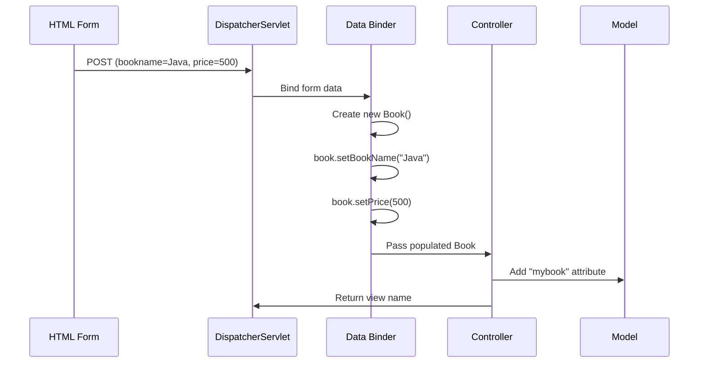
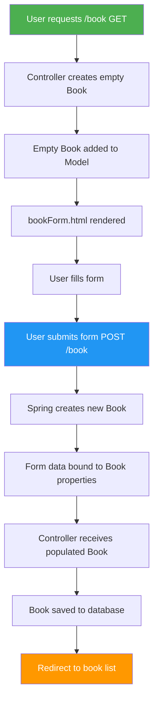

# @ModelAttribute and Form Binding - Complete Guide

## Table of Contents
1. [Introduction](#introduction)
2. [Understanding @ModelAttribute](#understanding-modelattribute)
3. [Form Binding Basics](#form-binding-basics)
4. [Complete Form Workflow](#complete-form-workflow)
5. [Code Examples](#code-examples)
6. [Best Practices](#best-practices)
7. [Summary](#summary)

---

## Introduction

**@ModelAttribute** is a powerful Spring MVC annotation that binds form data directly to Java objects. Instead of manually extracting each form field, Spring automatically creates and populates your model object.

> [!IMPORTANT]
> @ModelAttribute simplifies form handling by:
> - Automatically binding form fields to object properties
> - Reducing boilerplate code
> - Providing type conversion
> - Supporting validation

---

## Understanding @ModelAttribute

### What is @ModelAttribute?

`@ModelAttribute` automatically binds HTTP request parameters to a Java object.

### Without @ModelAttribute (Manual Binding)

```java
@PostMapping("/book")
public String processForm(@RequestParam("bookname") String name,
                         @RequestParam("price") long price,
                         Model model) {
    // Manual object creation and population
    Book book = new Book();
    book.setBookName(name);
    book.setPrice(price);
    
    model.addAttribute("mybook", book);
    return "success";
}
```

**Problems**:
- ❌ Verbose code for many fields
- ❌ Error-prone with complex forms
- ❌ Manual type conversion needed

### With @ModelAttribute (Automatic Binding)

```java
@PostMapping("/book")
public String processForm(@ModelAttribute("mybook") Book book) {
    // Book object automatically created and populated!
    // bookname form field → book.setBookName()
    // price form field → book.setPrice()
    
    return "success";  // book automatically added to model as "mybook"
}
```

**Benefits**:
- ✅ Cleaner, more concise code
- ✅ Automatic type conversion
- ✅ Automatic model attribute addition
- ✅ Works seamlessly with validation

### How @ModelAttribute Works



### Naming Convention

The form field names MUST match the object property names:

| Form Field Name | Object Property | Setter Called |
|-----------------|-----------------|---------------|
| `bookname` | `bookName` | `setBookName()` |
| `price` | `price` | `setPrice()` |
| `authorName` | `authorName` | `setAuthorName()` |

---

## Form Binding Basics

### HTML Form (Thymeleaf)

```html
<!DOCTYPE html>
<html xmlns:th="http://www.thymeleaf.org">
<head>
    <title>Add Book</title>
</head>
<body>
    <h1>Add New Book</h1>
    
    <form th:action="@{/book}" th:object="${book}" method="post">
        <div>
            <label>Book Name:</label>
            <input type="text" th:field="*{bookName}" />
        </div>
        <div>
            <label>Price:</label>
            <input type="number" th:field="*{price}" />
        </div>
        <button type="submit">Save Book</button>
    </form>
</body>
</html>
```

**Key Thymeleaf Attributes**:
- `th:object="${book}"`: Binds form to the book object
- `th:field="*{bookName}"`: Binds input to bookName property
- `th:action="@{/book}"`: Form submission URL

### Controller

```java
@Controller
public class BookController {
    
    // Display empty form
    @GetMapping("/book")
    public String showForm(Model model) {
        model.addAttribute("book", new Book());  // Empty book for form binding
        return "bookForm";
    }
    
    // Process submitted form
    @PostMapping("/book")
    public String processForm(@ModelAttribute("book") Book book) {
        // book is automatically populated with form data
        bookService.save(book);
        return "redirect:/books";
    }
}
```

### Model Class

```java
public class Book {
    private Long id;
    private String bookName;
    private long price;
    private String author;
    private String category;
    
    // Default constructor (required for binding)
    public Book() {}
    
    // Getters and Setters (required for binding)
    public String getBookName() { return bookName; }
    public void setBookName(String bookName) { this.bookName = bookName; }
    
    public long getPrice() { return price; }
    public void setPrice(long price) { this.price = price; }
    
    // ... other getters/setters
}
```

---

## Complete Form Workflow

### Step-by-Step Flow



### Execution Flow

1. **GET /book**: User visits the form page
2. **Controller**: Creates empty `Book` and adds to model
3. **View**: Form rendered with empty fields
4. **User**: Fills in form data
5. **POST /book**: Form submitted
6. **Spring**: Creates new `Book`, binds form data
7. **Controller**: Receives populated `Book`
8. **Service**: Saves book
9. **Redirect**: User sees book list

---

## Code Examples

### Complete Example

**Book.java**:
```java
public class Book {
    private Long id;
    private String bookName;
    private long price;
    private String author;
    
    public Book() {}
    
    // Getters and Setters
    public Long getId() { return id; }
    public void setId(Long id) { this.id = id; }
    
    public String getBookName() { return bookName; }
    public void setBookName(String bookName) { this.bookName = bookName; }
    
    public long getPrice() { return price; }
    public void setPrice(long price) { this.price = price; }
    
    public String getAuthor() { return author; }
    public void setAuthor(String author) { this.author = author; }
}
```

**BookController.java**:
```java
@Controller
@RequestMapping("/books")
public class BookController {
    
    @Autowired
    private BookService bookService;
    
    // List all books
    @GetMapping
    public String listBooks(Model model) {
        model.addAttribute("books", bookService.findAll());
        return "bookList";
    }
    
    // Show add form
    @GetMapping("/add")
    public String showAddForm(Model model) {
        model.addAttribute("book", new Book());
        return "bookForm";
    }
    
    // Process add form
    @PostMapping("/add")
    public String addBook(@ModelAttribute Book book) {
        bookService.save(book);
        return "redirect:/books";
    }
    
    // Show edit form
    @GetMapping("/edit/{id}")
    public String showEditForm(@PathVariable Long id, Model model) {
        Book book = bookService.findById(id);
        model.addAttribute("book", book);
        return "bookForm";
    }
    
    // Process edit form
    @PostMapping("/edit/{id}")
    public String updateBook(@PathVariable Long id, @ModelAttribute Book book) {
        book.setId(id);
        bookService.update(book);
        return "redirect:/books";
    }
}
```

**bookForm.html**:
```html
<!DOCTYPE html>
<html xmlns:th="http://www.thymeleaf.org">
<head>
    <title>Book Form</title>
</head>
<body>
    <h1 th:text="${book.id != null} ? 'Edit Book' : 'Add Book'">Book Form</h1>
    
    <form th:action="${book.id != null} ? @{/books/edit/{id}(id=${book.id})} : @{/books/add}" 
          th:object="${book}" method="post">
        
        <div>
            <label>Book Name:</label>
            <input type="text" th:field="*{bookName}" required />
        </div>
        
        <div>
            <label>Author:</label>
            <input type="text" th:field="*{author}" />
        </div>
        
        <div>
            <label>Price:</label>
            <input type="number" th:field="*{price}" min="0" />
        </div>
        
        <button type="submit">Save</button>
        <a th:href="@{/books}">Cancel</a>
    </form>
</body>
</html>
```

---

## Best Practices

### 1. Always Provide Empty Object for GET

```java
@GetMapping("/book/add")
public String showForm(Model model) {
    model.addAttribute("book", new Book());  // Required for th:object
    return "bookForm";
}
```

### 2. Use Meaningful Attribute Names

```java
// Good
@ModelAttribute("book") Book book
@ModelAttribute("customer") Customer customer

// Avoid ambiguous names
@ModelAttribute("obj") Object obj  // Not descriptive
```

### 3. Combine with Validation

```java
@PostMapping("/book")
public String processForm(@Valid @ModelAttribute Book book,
                         BindingResult result) {
    if (result.hasErrors()) {
        return "bookForm";  // Return to form with errors
    }
    bookService.save(book);
    return "redirect:/books";
}
```

---

## Summary

### Key Takeaways

1. **@ModelAttribute** automatically binds form data to Java objects
2. Form field names must match object property names
3. Provide empty object in model for GET requests
4. Use `th:object` and `th:field` in Thymeleaf forms
5. Combine with `@Valid` for validation

### Quick Reference

| Annotation | Purpose |
|------------|---------|
| `@ModelAttribute` | Bind form data to object |
| `th:object` | Bind form to model object |
| `th:field` | Bind input to object property |
| `@Valid` | Enable validation |

---

## Practice Questions

1. What is the purpose of @ModelAttribute?
2. How does form binding work in Spring MVC?
3. What naming convention must be followed for form binding?
4. Why do we need to add an empty object to the model for GET requests?
5. How do you combine @ModelAttribute with validation?

---

**End of Note 05: @ModelAttribute and Form Binding**

*Previous: [04_Controllers_Request_Mapping.md](file:///c:/Users/2706p/Desktop/mcq/notes/04_Controllers_Request_Mapping.md)*  
*Next: [06_Session_Management.md](file:///c:/Users/2706p/Desktop/mcq/notes/06_Session_Management.md)*
