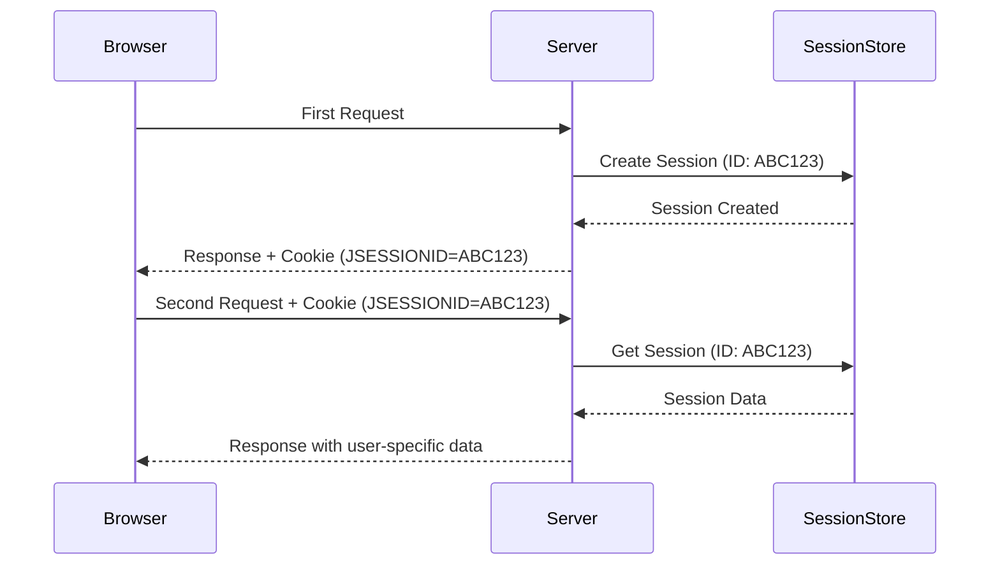
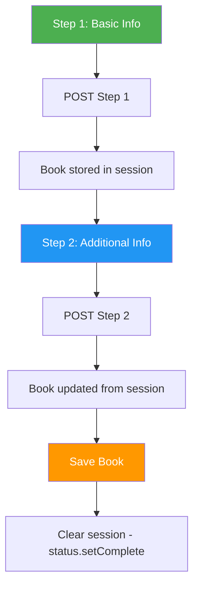

# Session Management in Spring MVC - Complete Guide

## Table of Contents
1. [Introduction](#introduction)
2. [HTTP Session Basics](#http-session-basics)
3. [@SessionAttributes Annotation](#sessionattributes-annotation)
4. [HttpSession Direct Access](#httpsession-direct-access)
5. [Session Scope Beans](#session-scope-beans)
6. [Complete Examples](#complete-examples)
7. [Best Practices](#best-practices)
8. [Summary](#summary)

---

## Introduction

HTTP is a **stateless protocol**, meaning each request is independent. Session management allows you to maintain user state across multiple requests.

> [!IMPORTANT]
> Session management is essential for:
> - User authentication (login state)
> - Shopping carts
> - Multi-step forms (wizards)
> - User preferences

---

## HTTP Session Basics

### What is a Session?

A **session** is a server-side storage mechanism that:
- Stores user-specific data
- Persists across multiple HTTP requests
- Has a unique session ID (stored in cookie)
- Expires after inactivity timeout

### Session Flow



---

## @SessionAttributes Annotation

### What is @SessionAttributes?

`@SessionAttributes` stores model attributes in the session across multiple requests.

### Basic Usage

```java
@Controller
@SessionAttributes("book")  // Store "book" attribute in session
public class BookController {
    
    @GetMapping("/book/step1")
    public String step1(Model model) {
        model.addAttribute("book", new Book());  // Stored in session
        return "step1";
    }
    
    @PostMapping("/book/step1")
    public String processStep1(@ModelAttribute Book book) {
        // Book data from step 1 preserved in session
        return "redirect:/book/step2";
    }
    
    @GetMapping("/book/step2")
    public String step2(@ModelAttribute Book book) {
        // Book still available from session
        return "step2";
    }
    
    @PostMapping("/book/step2")
    public String processStep2(@ModelAttribute Book book, SessionStatus status) {
        bookService.save(book);
        status.setComplete();  // Clear session attribute
        return "redirect:/books";
    }
}
```

### Multi-Step Form Flow



### Multiple Session Attributes

```java
@Controller
@SessionAttributes({"book", "author", "category"})
public class BookController {
    // Multiple objects stored in session
}
```

### SessionStatus - Clearing Session

```java
@PostMapping("/book/complete")
public String complete(@ModelAttribute Book book, SessionStatus status) {
    bookService.save(book);
    status.setComplete();  // Clears all @SessionAttributes for this controller
    return "redirect:/books";
}
```

---

## HttpSession Direct Access

### Injecting HttpSession

```java
@Controller
public class UserController {
    
    @PostMapping("/login")
    public String login(@RequestParam String username,
                       @RequestParam String password,
                       HttpSession session) {
        User user = userService.authenticate(username, password);
        if (user != null) {
            session.setAttribute("loggedInUser", user);  // Store in session
            return "redirect:/dashboard";
        }
        return "login";
    }
    
    @GetMapping("/dashboard")
    public String dashboard(HttpSession session, Model model) {
        User user = (User) session.getAttribute("loggedInUser");  // Retrieve
        if (user == null) {
            return "redirect:/login";
        }
        model.addAttribute("user", user);
        return "dashboard";
    }
    
    @GetMapping("/logout")
    public String logout(HttpSession session) {
        session.invalidate();  // Destroy entire session
        return "redirect:/login";
    }
}
```

### HttpSession Methods

| Method | Purpose |
|--------|---------|
| `setAttribute(name, value)` | Store data in session |
| `getAttribute(name)` | Retrieve data from session |
| `removeAttribute(name)` | Remove specific attribute |
| `invalidate()` | Destroy entire session |
| `getId()` | Get session ID |
| `getCreationTime()` | When session was created |
| `getLastAccessedTime()` | Last access time |

---

## Session Scope Beans

### @SessionScope Annotation

```java
@Component
@SessionScope
public class ShoppingCart {
    private List<CartItem> items = new ArrayList<>();
    
    public void addItem(CartItem item) {
        items.add(item);
    }
    
    public List<CartItem> getItems() {
        return items;
    }
    
    public void clear() {
        items.clear();
    }
    
    public double getTotal() {
        return items.stream()
                   .mapToDouble(item -> item.getPrice() * item.getQuantity())
                   .sum();
    }
}
```

### Using Session-Scoped Bean

```java
@Controller
@RequestMapping("/cart")
public class CartController {
    
    @Autowired
    private ShoppingCart cart;  // Session-scoped, unique per user
    
    @PostMapping("/add")
    public String addToCart(@RequestParam Long productId) {
        Product product = productService.findById(productId);
        cart.addItem(new CartItem(product, 1));
        return "redirect:/cart";
    }
    
    @GetMapping
    public String viewCart(Model model) {
        model.addAttribute("items", cart.getItems());
        model.addAttribute("total", cart.getTotal());
        return "cart";
    }
    
    @PostMapping("/checkout")
    public String checkout() {
        orderService.createOrder(cart.getItems());
        cart.clear();
        return "redirect:/orders";
    }
}
```

---

## Complete Examples

### Multi-Step Book Registration

**BookController.java**:
```java
@Controller
@RequestMapping("/book")
@SessionAttributes("book")
public class BookController {
    
    // Step 1: Basic Info
    @GetMapping("/new")
    public String newBook(Model model) {
        model.addAttribute("book", new Book());
        return "book/step1";
    }
    
    @PostMapping("/step1")
    public String processStep1(@ModelAttribute Book book) {
        return "redirect:/book/step2";
    }
    
    // Step 2: Details
    @GetMapping("/step2")
    public String step2(@ModelAttribute Book book, Model model) {
        model.addAttribute("categories", categoryService.findAll());
        return "book/step2";
    }
    
    @PostMapping("/step2")
    public String processStep2(@ModelAttribute Book book) {
        return "redirect:/book/step3";
    }
    
    // Step 3: Confirm
    @GetMapping("/step3")
    public String step3(@ModelAttribute Book book) {
        return "book/confirm";
    }
    
    @PostMapping("/complete")
    public String complete(@ModelAttribute Book book, SessionStatus status) {
        bookService.save(book);
        status.setComplete();
        return "redirect:/books";
    }
}
```

### Login/Logout with Session

```java
@Controller
public class AuthController {
    
    @Autowired
    private UserService userService;
    
    @GetMapping("/login")
    public String loginPage() {
        return "login";
    }
    
    @PostMapping("/login")
    public String login(@RequestParam String username,
                       @RequestParam String password,
                       HttpSession session,
                       Model model) {
        User user = userService.authenticate(username, password);
        if (user != null) {
            session.setAttribute("user", user);
            session.setAttribute("loginTime", LocalDateTime.now());
            return "redirect:/home";
        }
        model.addAttribute("error", "Invalid credentials");
        return "login";
    }
    
    @GetMapping("/logout")
    public String logout(HttpSession session) {
        session.invalidate();
        return "redirect:/login?logout";
    }
}
```

---

## Best Practices

### 1. Use @SessionAttributes for Multi-Step Forms

```java
@Controller
@SessionAttributes("registrationForm")
public class RegistrationController {
    // Form data preserved across steps
}
```

### 2. Always Clear Session When Done

```java
@PostMapping("/complete")
public String complete(SessionStatus status) {
    // ... save data
    status.setComplete();  // Important! Clear session attributes
    return "redirect:/success";
}
```

### 3. Use Session Scope for User-Specific Beans

```java
@Component
@SessionScope
public class UserPreferences {
    // Each user gets their own instance
}
```

### 4. Don't Store Large Objects in Session

```java
// Bad - Large object in session
session.setAttribute("allProducts", productService.findAll());

// Good - Store only IDs, fetch when needed
session.setAttribute("selectedProductIds", selectedIds);
```

---

## Summary

### Key Takeaways

1. **HTTP is stateless** - Sessions maintain state across requests
2. **@SessionAttributes** - Store model attributes in session
3. **HttpSession** - Direct session access
4. **SessionStatus.setComplete()** - Clear session attributes
5. **@SessionScope** - Create session-scoped beans

### Comparison

| Approach | Use Case | Scope |
|----------|----------|-------|
| `@SessionAttributes` | Multi-step forms | Controller |
| `HttpSession` | Login/User data | Application-wide |
| `@SessionScope` | Shopping cart | Component |

---

## Practice Questions

1. Why is session management needed in web applications?
2. What is the purpose of @SessionAttributes?
3. How do you clear session attributes using SessionStatus?
4. What is the difference between @SessionAttributes and HttpSession?
5. When would you use a session-scoped bean?

---

**End of Note 06: Session Management**

*Previous: [05_Model_Attribute_Form_Binding.md](file:///c:/Users/2706p/Desktop/mcq/notes/05_Model_Attribute_Form_Binding.md)*  
*Next: [07_Thymeleaf_Template_Engine.md](file:///c:/Users/2706p/Desktop/mcq/notes/07_Thymeleaf_Template_Engine.md)*
