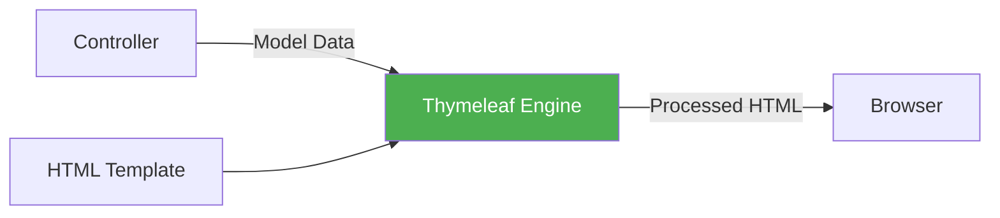

# Thymeleaf Template Engine - Complete Guide

## Table of Contents
1. [Introduction](#introduction)
2. [What is Thymeleaf?](#what-is-thymeleaf)
3. [Basic Syntax](#basic-syntax)
4. [Variable Expressions](#variable-expressions)
5. [Iteration with th:each](#iteration-with-theach)
6. [Conditional Rendering](#conditional-rendering)
7. [Form Handling](#form-handling)
8. [URL Expressions](#url-expressions)
9. [Fragment Reuse](#fragment-reuse)
10. [Summary](#summary)

---

## Introduction

**Thymeleaf** is a modern server-side Java template engine for web and standalone environments. It's the default template engine in Spring Boot.

> [!IMPORTANT]
> Thymeleaf processes HTML templates on the **server-side**, replacing expressions with actual data before sending to the browser. Unlike JSP, Thymeleaf templates are valid HTML files that can be viewed in a browser without processing.

---

## What is Thymeleaf?

### Key Features

1. **Natural Templates**: Valid HTML that browsers can display
2. **Spring Integration**: Seamless Spring MVC integration
3. **Expression Language**: Powerful expression syntax
4. **Server-Side Rendering**: HTML generated on server

### How Thymeleaf Works



### Setup in Spring Boot

**pom.xml**:
```xml
<dependency>
    <groupId>org.springframework.boot</groupId>
    <artifactId>spring-boot-starter-thymeleaf</artifactId>
</dependency>
```

**Template Location**: `src/main/resources/templates/`

---

## Basic Syntax

### Thymeleaf Namespace

```html
<!DOCTYPE html>
<html xmlns:th="http://www.thymeleaf.org">
<head>
    <title>My Page</title>
</head>
<body>
    <!-- Thymeleaf content here -->
</body>
</html>
```

### Common Attributes

| Attribute | Purpose | Example |
|-----------|---------|---------|
| `th:text` | Set text content | `<p th:text="${name}"></p>` |
| `th:utext` | Set unescaped HTML | `<p th:utext="${html}"></p>` |
| `th:value` | Set input value | `<input th:value="${name}"/>` |
| `th:href` | Set link URL | `<a th:href="@{/home}">Home</a>` |
| `th:src` | Set image source | `` |
| `th:each` | Iterate collection | `<tr th:each="item : ${items}">` |
| `th:if` | Conditional render | `<p th:if="${condition}">` |
| `th:object` | Bind form object | `<form th:object="${book}">` |
| `th:field` | Bind form field | `<input th:field="*{name}"/>` |

---

## Variable Expressions

### Basic Expression: ${...}

```html
<!-- Display simple variable -->
<p th:text="${message}">Default message</p>

<!-- Display object property -->
<p th:text="${book.bookName}">Book Title</p>
<p th:text="${book.price}">0</p>

<!-- Display nested property -->
<p th:text="${book.author.name}">Author Name</p>
```

### Selection Expression: *{...}

Used with `th:object` to access properties of the bound object:

```html
<div th:object="${book}">
    <p th:text="*{bookName}">Title</p>
    <p th:text="*{price}">0</p>
    <p th:text="*{author}">Author</p>
</div>
```

**Equivalent to**:
```html
<div>
    <p th:text="${book.bookName}">Title</p>
    <p th:text="${book.price}">0</p>
    <p th:text="${book.author}">Author</p>
</div>
```

### Message Expression: #{...}

For internationalization (i18n):

```html
<p th:text="#{welcome.message}">Welcome</p>
<p th:text="#{error.notfound}">Not Found</p>
```

**messages.properties**:
```properties
welcome.message=Welcome to our website!
error.notfound=The requested resource was not found.
```

---

## Iteration with th:each

### Basic Iteration

```html
<table>
    <thead>
        <tr>
            <th>ID</th>
            <th>Name</th>
            <th>Price</th>
        </tr>
    </thead>
    <tbody>
        <tr th:each="book : ${books}">
            <td th:text="${book.id}">1</td>
            <td th:text="${book.bookName}">Book Name</td>
            <td th:text="${book.price}">0</td>
        </tr>
    </tbody>
</table>
```

### Iteration with Status Variable

```html
<tr th:each="book, status : ${books}">
    <td th:text="${status.index}">0</td>        <!-- 0-based index -->
    <td th:text="${status.count}">1</td>        <!-- 1-based count -->
    <td th:text="${book.bookName}">Name</td>
    <td th:text="${status.first}">true</td>     <!-- First iteration? -->
    <td th:text="${status.last}">false</td>     <!-- Last iteration? -->
    <td th:text="${status.even}">true</td>      <!-- Even index? -->
    <td th:text="${status.odd}">false</td>      <!-- Odd index? -->
</tr>
```

### Iteration Status Properties

| Property | Type | Description |
|----------|------|-------------|
| `index` | int | Current index (0-based) |
| `count` | int | Current count (1-based) |
| `size` | int | Total elements |
| `current` | Object | Current element |
| `first` | boolean | Is first element |
| `last` | boolean | Is last element |
| `even` | boolean | Is even index |
| `odd` | boolean | Is odd index |

### Example: Alternating Row Colors

```html
<tr th:each="book, status : ${books}"
    th:class="${status.even} ? 'even-row' : 'odd-row'">
    <td th:text="${book.bookName}">Name</td>
</tr>
```

---

## Conditional Rendering

### th:if and th:unless

```html
<!-- Show if condition is true -->
<p th:if="${books.size() > 0}">Books available</p>

<!-- Show if condition is false -->
<p th:unless="${books.size() > 0}">No books found</p>
```

### th:switch and th:case

```html
<div th:switch="${book.category}">
    <p th:case="'FICTION'">This is a fiction book</p>
    <p th:case="'SCIENCE'">This is a science book</p>
    <p th:case="'HISTORY'">This is a history book</p>
    <p th:case="*">Unknown category</p>
</div>
```

### Elvis Operator (?:)

```html
<!-- Display value or default -->
<p th:text="${book.author} ?: 'Unknown Author'">Author</p>
```

### Ternary Operator

```html
<!-- Conditional value -->
<p th:text="${book.price > 500} ? 'Expensive' : 'Affordable'">Price</p>

<!-- Conditional class -->
<p th:class="${book.available} ? 'in-stock' : 'out-of-stock'">Status</p>
```

---

## Form Handling

### Basic Form

```html
<form th:action="@{/book}" th:object="${book}" method="post">
    <div>
        <label>Book Name:</label>
        <input type="text" th:field="*{bookName}" />
    </div>
    <div>
        <label>Price:</label>
        <input type="number" th:field="*{price}" />
    </div>
    <button type="submit">Save</button>
</form>
```

### Form with Validation Errors

```html
<form th:action="@{/book}" th:object="${book}" method="post">
    <div>
        <label>Book Name:</label>
        <input type="text" th:field="*{bookName}" 
               th:classappend="${#fields.hasErrors('bookName')} ? 'error'" />
        <span th:if="${#fields.hasErrors('bookName')}" 
              th:errors="*{bookName}" class="error-message">Error</span>
    </div>
    <button type="submit">Save</button>
</form>
```

### Select Dropdown

```html
<select th:field="*{category}">
    <option value="">-- Select Category --</option>
    <option th:each="cat : ${categories}"
            th:value="${cat.id}"
            th:text="${cat.name}">Category</option>
</select>
```

### Checkbox and Radio

```html
<!-- Checkbox -->
<input type="checkbox" th:field="*{available}" />

<!-- Radio buttons -->
<div th:each="cat : ${categories}">
    <input type="radio" th:field="*{category}" th:value="${cat.id}" />
    <label th:text="${cat.name}">Category</label>
</div>
```

---

## URL Expressions

### Basic URL: @{...}

```html
<!-- Static URL -->
<a th:href="@{/home}">Home</a>

<!-- URL with path variable -->
<a th:href="@{/books/{id}(id=${book.id})}">View</a>

<!-- URL with query parameters -->
<a th:href="@{/books(page=${page},size=10)}">Next Page</a>

<!-- URL with both -->
<a th:href="@{/books/{id}(id=${book.id},action='edit')}">Edit</a>
```

### URL Examples

| Expression | Result |
|------------|--------|
| `@{/home}` | `/home` |
| `@{/books/{id}(id=123)}` | `/books/123` |
| `@{/books(page=1,size=10)}` | `/books?page=1&size=10` |
| `@{/books/{id}(id=123,action='edit')}` | `/books/123?action=edit` |

---

## Fragment Reuse

### Defining Fragments

**fragments.html**:
```html
<!DOCTYPE html>
<html xmlns:th="http://www.thymeleaf.org">
<head th:fragment="head(title)">
    <title th:text="${title}">Default Title</title>
    <link rel="stylesheet" th:href="@{/css/style.css}"/>
</head>

<body>
    <header th:fragment="header">
        <nav>
            <a th:href="@{/}">Home</a>
            <a th:href="@{/books}">Books</a>
            <a th:href="@{/about}">About</a>
        </nav>
    </header>
    
    <footer th:fragment="footer">
        <p>&copy; 2024 My Application</p>
    </footer>
</body>
</html>
```

### Using Fragments

```html
<!DOCTYPE html>
<html xmlns:th="http://www.thymeleaf.org">
<head th:replace="~{fragments :: head('Book List')}">
    <title>Book List</title>
</head>
<body>
    <header th:replace="~{fragments :: header}"></header>
    
    <main>
        <h1>All Books</h1>
        <!-- Page content -->
    </main>
    
    <footer th:replace="~{fragments :: footer}"></footer>
</body>
</html>
```

### th:insert vs th:replace

- **th:insert**: Inserts fragment inside the host element
- **th:replace**: Replaces the host element with the fragment

---

## Summary

### Key Takeaways

1. **Thymeleaf** is a server-side template engine
2. **${...}** - Variable expressions
3. ***{...}** - Selection expressions (with th:object)
4. **@{...}** - URL expressions
5. **th:each** - Iteration
6. **th:if/th:unless** - Conditionals
7. **th:field** - Form field binding
8. **Fragments** - Reusable template parts

### Quick Reference

| Expression | Purpose | Example |
|------------|---------|---------|
| `${...}` | Variable | `${book.name}` |
| `*{...}` | Selection | `*{name}` |
| `@{...}` | URL | `@{/books/{id}(id=1)}` |
| `#{...}` | Message | `#{welcome}` |
| `~{...}` | Fragment | `~{fragments :: header}` |

---

## Practice Questions

1. What is Thymeleaf and why is it used?
2. Explain the difference between th:text and th:utext.
3. How do you iterate over a collection in Thymeleaf?
4. What are the iteration status properties available?
5. How do you create reusable fragments?

---

**End of Note 07: Thymeleaf Template Engine**

*Previous: [06_Session_Management.md](file:///c:/Users/2706p/Desktop/mcq/notes/06_Session_Management.md)*  
*Next: [08_Server_Side_Validation.md](file:///c:/Users/2706p/Desktop/mcq/notes/08_Server_Side_Validation.md)*
