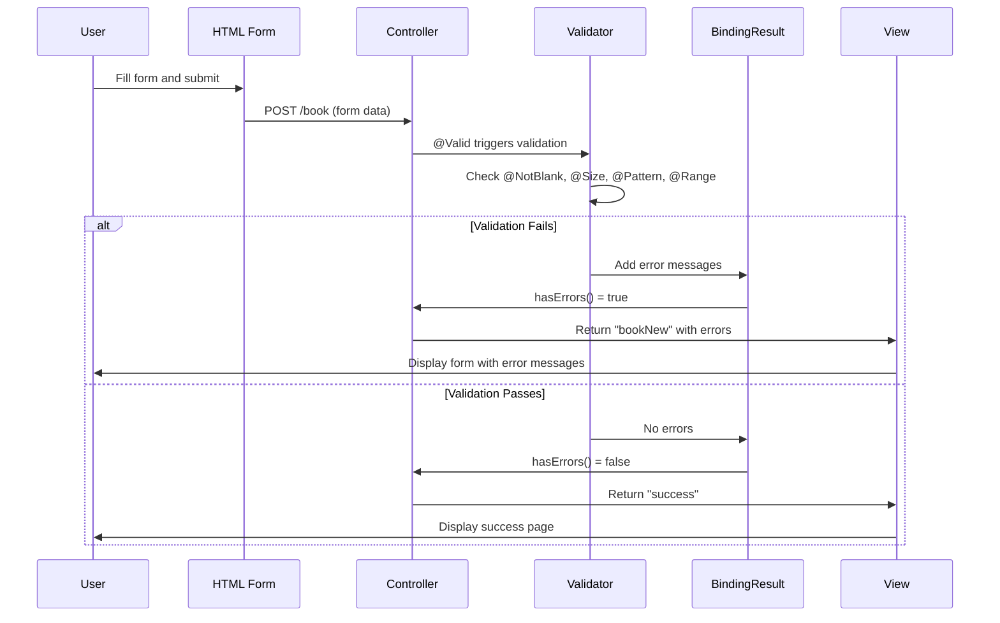

# Server-Side Validation - Complete Guide

## Table of Contents
1. [Introduction to Server-Side Validation](#introduction-to-server-side-validation)
2. [Why Server-Side Validation?](#why-server-side-validation)
3. [Bean Validation API (JSR-380)](#bean-validation-api-jsr-380)
4. [Setting Up Validation](#setting-up-validation)
5. [Validation Annotations - Complete Reference](#validation-annotations---complete-reference)
6. [Real Example from Source Code](#real-example-from-source-code)
7. [Controller Integration with @Valid](#controller-integration-with-valid)
8. [BindingResult - Handling Validation Errors](#bindingresult---handling-validation-errors)
9. [Displaying Errors in Thymeleaf](#displaying-errors-in-thymeleaf)
10. [Custom Validation Annotations](#custom-validation-annotations)
11. [Execution Flow](#execution-flow)
12. [Best Practices](#best-practices)
13. [Summary](#summary)

---

## Introduction to Server-Side Validation

**Server-side validation** is the process of validating user input on the server before processing it. This ensures data integrity and security regardless of what the client sends.

> [!IMPORTANT]
> **Never trust client-side validation alone!** Client-side validation can be bypassed by:
> - Disabling JavaScript
> - Using tools like Postman or cURL
> - Modifying HTML in browser dev tools
> Server-side validation is your **last line of defense**.

---

## Why Server-Side Validation?

### Problems Without Validation

```java
@PostMapping("/book")
public String saveBook(@ModelAttribute Book book) {
    // What if bookName is null?
    // What if price is negative?
    // What if data contains SQL injection?
    bookRepository.save(book);  // DANGEROUS!
    return "success";
}
```

### Benefits of Server-Side Validation

1. **Data Integrity**: Ensure data meets business rules
2. **Security**: Prevent malicious input (SQL injection, XSS)
3. **Consistency**: Same validation regardless of client
4. **User Experience**: Provide meaningful error messages

---

## Bean Validation API (JSR-380)

### What is Bean Validation?

**Bean Validation** is a Java specification (JSR-380) that allows you to express validation constraints on object properties using annotations.

- **Specification**: JSR-380 (Bean Validation 2.0)
- **Reference Implementation**: Hibernate Validator
- **Package**: `jakarta.validation.constraints` (Jakarta EE 9+)

### Architecture

```mermaid
graph TD
    A[User Input] --> B[Controller]
    B --> C{@Valid Annotation}
    C --> D[Validator Engine]
    D --> E[Check Annotations on Model]
    E --> F{Validation Passed?}
    F -->|Yes| G[Business Logic]
    F -->|No| H[BindingResult with Errors]
    H --> I[Return to Form with Errors]
    
    style C fill:#4CAF50,color:#fff
    style D fill:#2196F3,color:#fff
    style F fill:#FF9800,color:#fff
```

---

## Setting Up Validation

### 1. Add Dependency

**pom.xml**:
```xml
<dependency>
    <groupId>org.springframework.boot</groupId>
    <artifactId>spring-boot-starter-validation</artifactId>
</dependency>
```

> [!NOTE]
> If using `spring-boot-starter-web`, Hibernate Validator is included automatically in older versions. For Spring Boot 2.3+, you need to add `spring-boot-starter-validation` explicitly.

### 2. Additional Dependencies (if needed)

From source: `Additional dependencies required.txt`:
```xml
<dependency>
    <groupId>org.springframework.boot</groupId>
    <artifactId>spring-boot-starter-validation</artifactId>
</dependency>
```

---

## Validation Annotations - Complete Reference

### Standard Constraints (jakarta.validation.constraints)

| Annotation | Description | Example |
|------------|-------------|---------|
| `@NotNull` | Must not be null | `@NotNull` |
| `@NotEmpty` | Not null, not empty string/collection | `@NotEmpty` |
| `@NotBlank` | Not null, not empty, not whitespace only | `@NotBlank` |
| `@Size` | Size within range | `@Size(min=2, max=50)` |
| `@Min` | Minimum numeric value | `@Min(0)` |
| `@Max` | Maximum numeric value | `@Max(100)` |
| `@Email` | Valid email format | `@Email` |
| `@Pattern` | Matches regex pattern | `@Pattern(regexp="[A-Za-z]+")` |
| `@Past` | Date must be in past | `@Past` |
| `@Future` | Date must be in future | `@Future` |
| `@Positive` | Must be positive number | `@Positive` |
| `@Negative` | Must be negative number | `@Negative` |
| `@Digits` | Numeric constraints | `@Digits(integer=5, fraction=2)` |

### Hibernate Validator Extensions (org.hibernate.validator.constraints)

| Annotation | Description | Example |
|------------|-------------|---------|
| `@Range` | Value within range | `@Range(min=100, max=10000)` |
| `@Length` | String length within range | `@Length(min=2, max=50)` |
| `@URL` | Valid URL format | `@URL` |
| `@CreditCardNumber` | Valid credit card | `@CreditCardNumber` |

---

## Real Example from Source Code

### Book.java (Entity with Validation)

This is the **actual code from your course materials**:

```java
package com.example.demo;

import org.hibernate.validator.constraints.Range;

import jakarta.validation.constraints.NotBlank;
import jakarta.validation.constraints.Pattern;
import jakarta.validation.constraints.Size;

public class Book
{
    @Override
    public String toString() {
        return "[" + bookName + "   " + price + "]";
    }
    
    // Validation: Book name must be entered (not blank)
    @NotBlank(message = "book name must be entered")
    
    // Validation: Book name must be between 4 to 20 characters
    @Size(min = 4, max = 20, message = "bookname must be between 4 to 20")
    
    // Validation: Book name must contain only alphabetic characters
    @Pattern(regexp = "^[a-zA-Z]+$", message = "book name must contain characters")
    private String bookName;
    
    // Validation: Price should not be less than 100
    @Range(min = 100, message = "Price should not be less than {min}")
    private long price;

    // Getters and Setters
    public String getBookName() {
        return bookName;
    }
    public void setBookName(String bookName) {
        this.bookName = bookName;
    }
    public long getPrice() {
        return price;
    }
    public void setPrice(long price) {
        this.price = price;
    }
}
```

### Line-by-Line Explanation

| Line | Annotation | Purpose |
|------|------------|---------|
| 17 | `@NotBlank` | Ensures bookName is not null, not empty, not whitespace |
| 18 | `@Size(min=4, max=20)` | Ensures bookName length is between 4 and 20 |
| 19 | `@Pattern(regexp="^[a-zA-Z]+$")` | Ensures bookName contains only letters |
| 22 | `@Range(min=100)` | Ensures price is at least 100 |

---

## Controller Integration with @Valid

### BookNewController.java (Actual Source Code)

```java
package com.example.demo;

import org.springframework.stereotype.Controller;
import org.springframework.validation.BindingResult;
import org.springframework.web.bind.annotation.GetMapping;
import org.springframework.web.bind.annotation.ModelAttribute;
import org.springframework.web.bind.annotation.PostMapping;
import org.springframework.web.servlet.ModelAndView;

import jakarta.validation.Valid;

@Controller
public class BookNewController
{
    // GET: Display empty form
    @GetMapping("book")
    public ModelAndView before()
    {
        Book defaultBook = new Book();
        
        // Return view "bookNew" with model attribute "mybook"
        return new ModelAndView("bookNew", "mybook", defaultBook);
    }
    
    // POST: Process form submission with validation
    // @Valid is to trigger the validations set inside POJO
    // BindingResult is the one where validation results are stored
    @PostMapping("book")
    public String afterSubmit(@Valid @ModelAttribute("mybook") Book book,
                              BindingResult result) 
    {
        // Check if there are validation errors
        if (result.hasErrors())
        {
            return "bookNew";  // Return to form with errors
        }
        return "success";  // Validation passed
    }
}
```

### Line-by-Line Execution Flow

1. **Line 26**: `@Valid` triggers validation on the `Book` object
2. **Line 26**: `@ModelAttribute("mybook")` binds form data to Book
3. **Line 27**: `BindingResult` captures all validation errors
4. **Line 30**: `result.hasErrors()` checks if any validation failed
5. **Line 32**: If errors exist, return to form (errors displayed)
6. **Line 34**: If no errors, proceed to success page

---

## BindingResult - Handling Validation Errors

### What is BindingResult?

`BindingResult` holds the results of validation and data binding. It contains:
- Field errors (validation failures)
- Global errors (object-level errors)
- Rejected values

### Key Methods

| Method | Purpose |
|--------|---------|
| `hasErrors()` | Returns true if any errors exist |
| `getFieldErrors()` | Get all field-level errors |
| `getFieldError("fieldName")` | Get error for specific field |
| `getGlobalErrors()` | Get object-level errors |
| `getAllErrors()` | Get all errors |
| `getErrorCount()` | Total number of errors |

### Important Rule

> [!CAUTION]
> **BindingResult must come IMMEDIATELY AFTER the @Valid object!**
> ```java
> // CORRECT ✓
> public String save(@Valid Book book, BindingResult result)
> 
> // WRONG ✗ - BindingResult not immediately after
> public String save(@Valid Book book, Model model, BindingResult result)
> ```

---

## Displaying Errors in Thymeleaf

### bookNew.html (Actual Source Code)

```html
<!DOCTYPE html>
<html xmlns:th="http://www.thymeleaf.org">
<head>
    <meta charset="ISO-8859-1">
    <title>Insert title here</title>
    <style>
        .error {
            color: red;
        }
    </style>
</head>
<body>
    <form th:action="@{/book}" th:object="${mybook}" method="post">
        
        <!-- Book Name Field -->
        <div>
            <label for="bookName">Name</label> 
            <input type="text" th:field="*{bookName}" 
                   id="bookName" placeholder="Book Name">
            
            <!-- Display all errors for bookName field -->
            <ul>
                <li th:each="err : ${#fields.errors('bookName')}" 
                    th:text="${err}" class="error"/>
            </ul>
        </div>
        
        <!-- Price Field -->
        <div>
            <label for="price">Price</label> 
            <input type="text" th:field="*{price}" 
                   id="price" placeholder="Price">
            
            <!-- Display all errors for price field -->
            <ul>
                <li th:each="err : ${#fields.errors('price')}" 
                    th:text="${err}" class="error" />
            </ul>
        </div>
        
        <input type="submit" value="Submit"/>
    </form>
</body>
</html>
```

### Key Thymeleaf Error Display Syntax

| Syntax | Purpose |
|--------|---------|
| `${#fields.errors('fieldName')}` | Get all errors for a field |
| `${#fields.hasErrors('fieldName')}` | Check if field has errors |
| `${#fields.hasAnyErrors()}` | Check if any field has errors |
| `th:errors="*{fieldName}"` | Display first error for field |

### Alternative Error Display

```html
<!-- Option 1: Display all errors as list -->
<ul>
    <li th:each="err : ${#fields.errors('bookName')}" 
        th:text="${err}" class="error"/>
</ul>

<!-- Option 2: Display first error only -->
<span th:if="${#fields.hasErrors('bookName')}" 
      th:errors="*{bookName}" class="error"></span>

<!-- Option 3: Conditional CSS class -->
<input type="text" th:field="*{bookName}" 
       th:classappend="${#fields.hasErrors('bookName')} ? 'input-error'"/>
```

---

## Execution Flow

### Complete Validation Flow



---

## Custom Validation Annotations

### Creating Custom Validator

**Step 1: Define Annotation**
```java
@Target({ElementType.FIELD})
@Retention(RetentionPolicy.RUNTIME)
@Constraint(validatedBy = UniqueBookNameValidator.class)
public @interface UniqueBookName {
    String message() default "Book name already exists";
    Class<?>[] groups() default {};
    Class<? extends Payload>[] payload() default {};
}
```

**Step 2: Implement Validator**
```java
@Component
public class UniqueBookNameValidator 
        implements ConstraintValidator<UniqueBookName, String> {
    
    @Autowired
    private BookRepository bookRepository;
    
    @Override
    public boolean isValid(String bookName, ConstraintValidatorContext context) {
        if (bookName == null) return true;
        return !bookRepository.existsByBookName(bookName);
    }
}
```

**Step 3: Use Annotation**
```java
public class Book {
    @UniqueBookName
    private String bookName;
}
```

---

## Best Practices

### 1. Use Appropriate Annotations

```java
// For strings that must have content
@NotBlank  // Preferred over @NotNull for strings

// For numeric ranges
@Range(min = 0, max = 100)  // Hibernate
// or
@Min(0) @Max(100)  // Standard JSR
```

### 2. Provide User-Friendly Messages

```java
// Good: Specific, helpful message
@NotBlank(message = "Book name is required")
@Size(min = 4, max = 20, message = "Name must be 4-20 characters")

// Bad: Technical or vague
@NotBlank  // Uses default message
```

### 3. Use Message Placeholders

```java
@Range(min = 100, message = "Price should not be less than {min}")
// Output: "Price should not be less than 100"
```

### 4. Always Use BindingResult

```java
if (result.hasErrors()) {
    return "formPage";  // Don't proceed if validation fails
}
```

---

## Summary

### Key Takeaways

1. **@Valid** triggers validation on model objects
2. **BindingResult** must immediately follow the @Valid parameter
3. **Bean Validation annotations**: @NotBlank, @Size, @Pattern, @Range, etc.
4. **Thymeleaf** displays errors using `${#fields.errors('fieldName')}`
5. **Custom validators** for business-specific validation

### Quick Reference

| Component | Purpose |
|-----------|---------|
| `@Valid` | Trigger validation |
| `BindingResult` | Hold validation errors |
| `@NotBlank` | String not null/empty/whitespace |
| `@Size` | Length constraints |
| `@Pattern` | Regex validation |
| `@Range` | Numeric range |
| `${#fields.errors()}` | Display errors in Thymeleaf |

---

## Practice Questions

1. What is the purpose of @Valid annotation?
2. Why must BindingResult come immediately after @Valid?
3. What is the difference between @NotNull, @NotEmpty, and @NotBlank?
4. How do you display validation errors in Thymeleaf?
5. Write a Book entity with at least 3 validation annotations.
6. What is the difference between JSR-380 and Hibernate Validator annotations?
7. How do you create a custom validation annotation?

---

**End of Note 08: Server-Side Validation**

*Previous: [07_Thymeleaf_Template_Engine.md](file:///c:/Users/2706p/Desktop/mcq/notes/07_Thymeleaf_Template_Engine.md)*  
*Next: [09_Spring_Data_JPA.md](file:///c:/Users/2706p/Desktop/mcq/notes/09_Spring_Data_JPA.md)*
