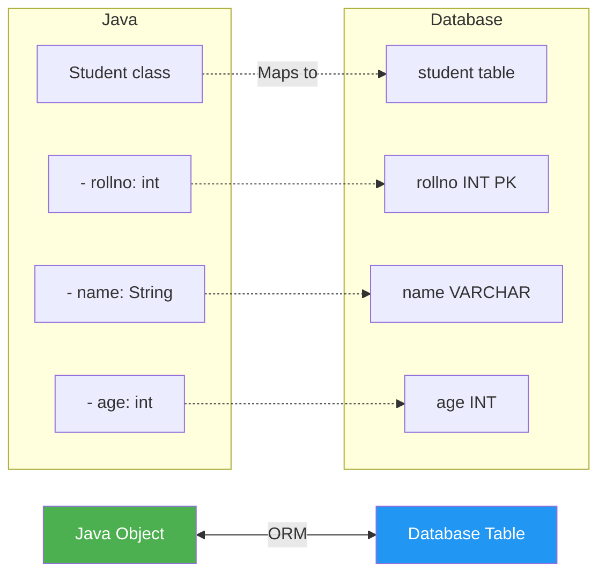
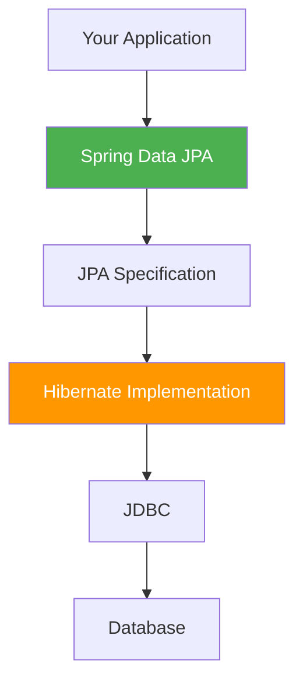
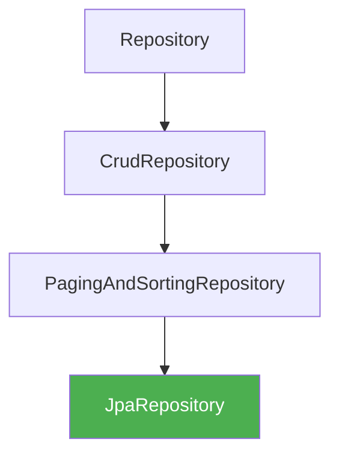
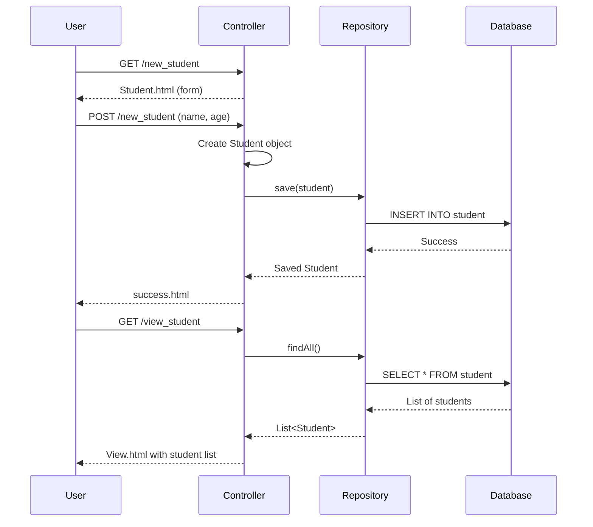

# Spring Data JPA - Complete Guide

## Table of Contents
1. [Introduction to JPA](#introduction-to-jpa)
2. [JPA vs Hibernate vs Spring Data JPA](#jpa-vs-hibernate-vs-spring-data-jpa)
3. [Setting Up Spring Data JPA](#setting-up-spring-data-jpa)
4. [Entity Mapping](#entity-mapping)
5. [Real Entity Example from Source](#real-entity-example-from-source)
6. [JpaRepository Interface](#jparepository-interface)
7. [Repository Pattern](#repository-pattern)
8. [@Repository and @Transactional](#repository-and-transactional)
9. [CRUD Operations](#crud-operations)
10. [Complete Controller Example](#complete-controller-example)
11. [Derived Query Methods](#derived-query-methods)
12. [@Query Annotation for Custom Queries](#query-annotation-for-custom-queries)
13. [Configuration](#configuration)
14. [Execution Flow](#execution-flow)
15. [Summary](#summary)

---

## Introduction to JPA

### What is JPA?

**JPA (Java Persistence API)** is a specification for Object-Relational Mapping (ORM) in Java. It defines how Java objects should be persisted to relational databases.

> [!IMPORTANT]
> JPA is just a **specification** (interfaces and annotations). It needs an **implementation** to work. Hibernate is the most popular JPA implementation.

### ORM Concept



---

## JPA vs Hibernate vs Spring Data JPA

### Comparison

| Layer | Type | Purpose |
|-------|------|---------|
| **JPA** | Specification | Defines ORM standard (interfaces) |
| **Hibernate** | Implementation | Actual ORM implementation |
| **Spring Data JPA** | Abstraction | Simplifies JPA usage |

### Relationship



---

## Setting Up Spring Data JPA

### Dependencies to Select

From source: `Dependencies you will select while creating the project.txt`:
- Spring Web
- Spring Data JPA
- MySQL Driver (or your database)

### pom.xml Dependencies

```xml
<dependencies>
    <!-- Spring Data JPA -->
    <dependency>
        <groupId>org.springframework.boot</groupId>
        <artifactId>spring-boot-starter-data-jpa</artifactId>
    </dependency>
    
    <!-- Database Driver (MySQL) -->
    <dependency>
        <groupId>com.mysql</groupId>
        <artifactId>mysql-connector-j</artifactId>
        <scope>runtime</scope>
    </dependency>
    
    <!-- Or H2 for testing -->
    <dependency>
        <groupId>com.h2database</groupId>
        <artifactId>h2</artifactId>
        <scope>runtime</scope>
    </dependency>
</dependencies>
```

---

## Entity Mapping

### Core JPA Annotations

| Annotation | Purpose | Example |
|------------|---------|---------|
| `@Entity` | Marks class as JPA entity | `@Entity` |
| `@Table` | Specifies table name | `@Table(name="student")` |
| `@Id` | Marks primary key | `@Id` |
| `@GeneratedValue` | Auto-generate ID | `@GeneratedValue(strategy=GenerationType.IDENTITY)` |
| `@Column` | Specifies column mapping | `@Column(name="student_name")` |
| `@Transient` | Exclude from persistence | `@Transient` |

### ID Generation Strategies

| Strategy | Description | Use Case |
|----------|-------------|----------|
| `IDENTITY` | Auto-increment (DB handles) | MySQL, PostgreSQL |
| `SEQUENCE` | Database sequence | Oracle |
| `TABLE` | ID table | Portability |
| `AUTO` | Provider chooses | Default |

---

## Real Entity Example from Source

### Student.java (Actual Code from Course Materials)

```java
package com.example.demo;

import jakarta.persistence.Column;
import jakarta.persistence.Entity;
import jakarta.persistence.GeneratedValue;
import jakarta.persistence.GenerationType;
import jakarta.persistence.Id;
import jakarta.persistence.Table;

@Entity
@Table(name = "student")
public class Student 
{
    private int rollno;
    private String name;
    private int age;
    
    @Id
    @GeneratedValue(strategy = GenerationType.IDENTITY)
    @Column
    public int getRollno() {
        return rollno;
    }
    
    public void setRollno(int rollno) {
        this.rollno = rollno;
    }
    
    public String getName() {
        return name;
    }
    
    @Column
    public void setName(String name) {
        this.name = name;
    }
    
    public int getAge() {
        return age;
    }
    
    @Column
    public void setAge(int age) {
        this.age = age;
    }
}
```

### Line-by-Line Explanation

| Line | Annotation | Purpose |
|------|------------|---------|
| 10 | `@Entity` | Marks Student as a JPA entity (managed by Hibernate) |
| 11 | `@Table(name="student")` | Maps to 'student' table in database |
| 18 | `@Id` | Marks rollno as the primary key |
| 19 | `@GeneratedValue(strategy=GenerationType.IDENTITY)` | Auto-increment (database handles ID generation) |
| 20 | `@Column` | Maps property to database column |

### Database Table Created

```sql
CREATE TABLE student (
    rollno INT PRIMARY KEY AUTO_INCREMENT,
    name VARCHAR(255),
    age INT
);
```

---

## JpaRepository Interface

### What is JpaRepository?

`JpaRepository<T, ID>` is a Spring Data interface that provides CRUD operations without writing any implementation code.

- **T**: Entity type (e.g., Student)
- **ID**: Primary key type (e.g., Integer)

### Inheritance Hierarchy



### Built-in Methods

| Method | Purpose | Example |
|--------|---------|---------|
| `save(entity)` | Insert or update | `repository.save(student)` |
| `findById(id)` | Find by primary key | `repository.findById(1)` |
| `findAll()` | Get all entities | `repository.findAll()` |
| `deleteById(id)` | Delete by ID | `repository.deleteById(1)` |
| `delete(entity)` | Delete entity | `repository.delete(student)` |
| `count()` | Count all records | `repository.count()` |
| `existsById(id)` | Check if exists | `repository.existsById(1)` |

---

## Repository Pattern

### StudentRepository.java (Actual Code from Course Materials)

```java
package com.example.demo;

import java.util.List;

import org.springframework.data.jpa.repository.JpaRepository;
import org.springframework.data.jpa.repository.Modifying;
import org.springframework.data.jpa.repository.Query;
import org.springframework.data.repository.query.Param;
import org.springframework.stereotype.Repository;
import org.springframework.transaction.annotation.Transactional;

@Repository
@Transactional
public interface StudentRepository extends JpaRepository<Student, Integer> 
{
    // No implementation needed!
    // Spring Data JPA provides all CRUD operations automatically
}
```

### Why No Implementation?

Spring Data JPA creates a **proxy implementation** at runtime:

1. Scans for interfaces extending `JpaRepository`
2. Creates implementation class at runtime
3. Injects it wherever `@Autowired` is used

---

## @Repository and @Transactional

### Why @Repository?

From source: `About Repository and Transactional annotations.docx`:

> **@Repository** is required when your POJO is performing database logic. It:
> - Marks the interface as a Spring Data repository
> - Enables exception translation (DB exceptions → Spring's DataAccessException)
> - Makes the interface a Spring bean

### Why @Transactional?

> **@Transactional** ensures:
> - All database operations in a method run in a single transaction
> - Automatic rollback on exceptions
> - Proper connection management

```java
@Repository     // Marks as repository bean
@Transactional  // Enables transaction management
public interface StudentRepository extends JpaRepository<Student, Integer> {
}
```

---

## CRUD Operations

### Complete CRUD Example

```java
@Service
public class StudentService {
    
    @Autowired
    private StudentRepository repository;
    
    // CREATE
    public Student save(Student student) {
        return repository.save(student);  // Insert new
    }
    
    // READ (Single)
    public Optional<Student> findById(int rollno) {
        return repository.findById(rollno);
    }
    
    // READ (All)
    public List<Student> findAll() {
        return repository.findAll();
    }
    
    // UPDATE
    public Student update(Student student) {
        return repository.save(student);  // Update existing
    }
    
    // DELETE
    public void deleteById(int rollno) {
        repository.deleteById(rollno);
    }
}
```

---

## Complete Controller Example

### StudentController.java (Actual Code from Course Materials)

```java
package com.example.demo;

import java.util.List;

import org.springframework.beans.factory.annotation.Autowired;
import org.springframework.stereotype.Controller;
import org.springframework.web.bind.annotation.GetMapping;
import org.springframework.web.bind.annotation.PostMapping;
import org.springframework.web.bind.annotation.RequestParam;
import org.springframework.web.servlet.ModelAndView;

import jakarta.servlet.http.HttpServletRequest;

@Controller
public class StudentController 
{
    @Autowired
    StudentRepository srepository;  // Inject repository
    
    // Display form to add new student
    @GetMapping("new_student")
    public String before()
    {
        return "Student";  // Return Student.html
    }
    
    // Display all students
    @GetMapping("view_student")
    public String getStudents(HttpServletRequest request)
    {
        List<Student> studentlist = srepository.findAll();  // Get all students
        request.setAttribute("mylist", studentlist);        // Add to request
        return "View";                                       // Return View.html
    }
    
    // Save new student
    @PostMapping("new_student")
    public String afterSubmit(@RequestParam("name") String name,
                              @RequestParam("age") int age)
    {
        Student student = new Student();
        student.setName(name);
        student.setAge(age);
        srepository.save(student);  // Save to database
        return "success";
    }
}
```

### Execution Flow



---

## Derived Query Methods

### How It Works

Spring Data JPA generates SQL queries from method names:

```java
public interface StudentRepository extends JpaRepository<Student, Integer> {
    
    // SELECT * FROM student WHERE name = ?
    List<Student> findByName(String name);
    
    // SELECT * FROM student WHERE age > ?
    List<Student> findByAgeGreaterThan(int age);
    
    // SELECT * FROM student WHERE name = ? AND age = ?
    List<Student> findByNameAndAge(String name, int age);
    
    // SELECT * FROM student WHERE name LIKE '%?%'
    List<Student> findByNameContaining(String name);
    
    // SELECT * FROM student ORDER BY age DESC
    List<Student> findAllByOrderByAgeDesc();
    
    // SELECT * FROM student WHERE age BETWEEN ? AND ?
    List<Student> findByAgeBetween(int min, int max);
}
```

### Query Method Keywords

| Keyword | Example | Generated SQL |
|---------|---------|---------------|
| `And` | `findByNameAndAge` | `WHERE name=? AND age=?` |
| `Or` | `findByNameOrAge` | `WHERE name=? OR age=?` |
| `Between` | `findByAgeBetween` | `WHERE age BETWEEN ? AND ?` |
| `LessThan` | `findByAgeLessThan` | `WHERE age < ?` |
| `GreaterThan` | `findByAgeGreaterThan` | `WHERE age > ?` |
| `Like` | `findByNameLike` | `WHERE name LIKE ?` |
| `Containing` | `findByNameContaining` | `WHERE name LIKE %?%` |
| `OrderBy` | `findByOrderByAgeAsc` | `ORDER BY age ASC` |
| `True/False` | `findByActiveTrue` | `WHERE active = true` |

---

## @Query Annotation for Custom Queries

### JPQL Queries

```java
public interface StudentRepository extends JpaRepository<Student, Integer> {
    
    // JPQL - Query entity, not table
    @Query("SELECT s FROM Student s WHERE s.age > :age")
    List<Student> findStudentsOlderThan(@Param("age") int age);
    
    // JPQL with multiple parameters
    @Query("SELECT s FROM Student s WHERE s.name = :name AND s.age > :age")
    List<Student> findByNameAndMinAge(@Param("name") String name, 
                                      @Param("age") int age);
}
```

### Native SQL Queries

```java
@Query(value = "SELECT * FROM student WHERE age > ?1", nativeQuery = true)
List<Student> findOlderStudentsNative(int age);
```

### Update/Delete Queries

```java
@Modifying
@Transactional
@Query("UPDATE Student s SET s.age = :age WHERE s.rollno = :id")
int updateAge(@Param("id") int rollno, @Param("age") int age);

@Modifying
@Transactional
@Query("DELETE FROM Student s WHERE s.age < :age")
int deleteYoungerThan(@Param("age") int age);
```

---

## Configuration

### application.properties (Actual Code from Course Materials)

```properties
# Database Connection
spring.datasource.url=jdbc:mysql://localhost:3306/test
spring.datasource.username=root
spring.datasource.password=password
spring.datasource.driver-class-name=com.mysql.cj.jdbc.Driver

# JPA/Hibernate
spring.jpa.hibernate.ddl-auto=update
spring.jpa.show-sql=true
spring.jpa.properties.hibernate.format_sql=true
spring.jpa.properties.hibernate.dialect=org.hibernate.dialect.MySQL8Dialect
```

### DDL-Auto Options

| Value | Description |
|-------|-------------|
| `none` | No schema management |
| `validate` | Validate schema, don't change |
| `update` | Update schema (add columns, don't drop) |
| `create` | Drop and create on startup |
| `create-drop` | Drop on shutdown |

---

## Execution Flow

```mermaid
graph TD
    A[Spring Boot Starts] --> B[Scan @Entity classes]
    B --> C[Create/Validate tables based on ddl-auto]
    C --> D[Scan @Repository interfaces]
    D --> E[Create proxy implementations]
    E --> F[Register as Spring beans]
    F --> G[@Autowired injects repository]
    G --> H[App ready to use JPA]
    
    style A fill:#4CAF50,color:#fff
    style H fill:#2196F3,color:#fff
```

---

## Summary

### Key Takeaways

1. **@Entity** marks a class as a database table
2. **@Id** marks the primary key
3. **@GeneratedValue** auto-generates IDs
4. **JpaRepository** provides CRUD without code
5. **@Repository** and **@Transactional** are required
6. **Derived queries** from method names
7. **@Query** for custom JPQL/SQL

### Quick Reference

| Component | Purpose |
|-----------|---------|
| `@Entity` | Mark as table |
| `@Table` | Specify table name |
| `@Id` | Primary key |
| `@GeneratedValue` | Auto-generate ID |
| `JpaRepository` | CRUD operations |
| `@Repository` | Mark as repository bean |
| `@Transactional` | Transaction management |

---

## Practice Questions

1. What is the difference between JPA and Hibernate?
2. Why do we need @Repository and @Transactional annotations?
3. How does JpaRepository provide CRUD without implementation?
4. Write a Student entity with JPA annotations.
5. How do derived query methods work?
6. What is the difference between JPQL and native SQL queries?
7. What are the ddl-auto options and when to use each?

---

**End of Note 09: Spring Data JPA**

*Previous: [08_Server_Side_Validation.md](file:///c:/Users/2706p/Desktop/mcq/notes/08_Server_Side_Validation.md)*  
*Next: [10_AOP_Spring_Boot.md](file:///c:/Users/2706p/Desktop/mcq/notes/10_AOP_Spring_Boot.md)*
