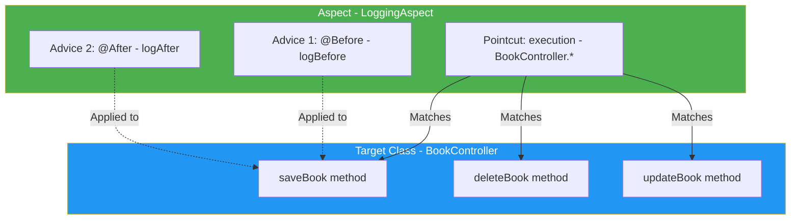
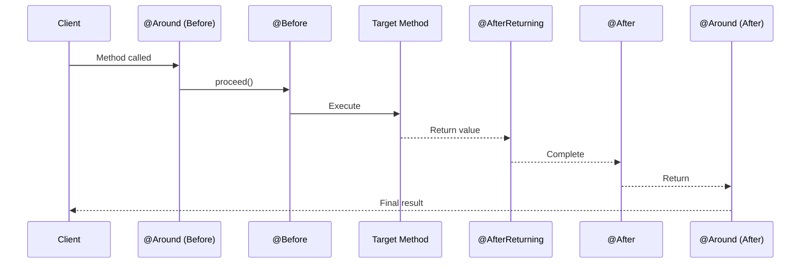

# Aspect-Oriented Programming (AOP) - Complete Guide

## Table of Contents
1. [Introduction to AOP](#introduction-to-aop)
2. [Why AOP? Cross-Cutting Concerns](#why-aop-cross-cutting-concerns)
3. [AOP Terminology](#aop-terminology)
4. [Setting Up AOP in Spring Boot](#setting-up-aop-in-spring-boot)
5. [Real Example from Source Code](#real-example-from-source-code)
6. [Pointcut Expressions Explained](#pointcut-expressions-explained)
7. [Advice Types](#advice-types)
8. [JoinPoint - Accessing Method Information](#joinpoint---accessing-method-information)
9. [Execution Flow](#execution-flow)
10. [Complete Examples](#complete-examples)
11. [Best Practices](#best-practices)
12. [Summary](#summary)

---

## Introduction to AOP

### What is AOP?

**Aspect-Oriented Programming (AOP)** is a programming paradigm that allows you to modularize cross-cutting concerns - functionality that affects multiple parts of your application.

> [!IMPORTANT]
> AOP separates **what** your code does (business logic) from **when/where** additional functionality should be applied (cross-cutting concerns).

### AOP vs OOP

| OOP | AOP |
|-----|-----|
| Organizes code into classes/objects | Organizes cross-cutting concerns into aspects |
| Inheritance for code reuse | Weaving for applying aspects |
| Encapsulation of data | Encapsulation of cross-cutting behavior |

---

## Why AOP? Cross-Cutting Concerns

### The Problem Without AOP

```java
public class BookController {
    
    public String saveBook(Book book) {
        // LOGGING - Cross-cutting concern
        System.out.println("Entering saveBook method");
        
        // SECURITY - Cross-cutting concern
        if (!isUserAuthorized()) {
            throw new UnauthorizedException();
        }
        
        // TRANSACTION - Cross-cutting concern
        beginTransaction();
        
        try {
            // ACTUAL BUSINESS LOGIC - Just one line!
            bookRepository.save(book);
            
            commitTransaction();
        } catch (Exception e) {
            rollbackTransaction();
            
            // LOGGING - Again!
            System.out.println("Error in saveBook: " + e.getMessage());
            
            throw e;
        }
        
        // LOGGING - Again!
        System.out.println("Exiting saveBook method");
        
        return "success";
    }
}
```

**Problems**:
- ❌ Actual business logic is ONE LINE but method is 30+ lines
- ❌ Same code repeated in every method
- ❌ Hard to maintain (change logging = change everywhere)
- ❌ Violates Single Responsibility Principle
- ❌ Code clutter reduces readability

### The Solution with AOP

```java
// Business logic ONLY - Clean and focused
@Controller
public class BookController {
    
    public String saveBook(Book book) {
        bookRepository.save(book);  // Just the business logic!
        return "success";
    }
}

// Cross-cutting concerns SEPARATED
@Aspect
@Component
public class LoggingAspect {
    
    @Before("execution(* BookController.*(..))")
    public void logBefore(JoinPoint jp) {
        System.out.println("Entering: " + jp.getSignature().getName());
    }
    
    @After("execution(* BookController.*(..))")
    public void logAfter(JoinPoint jp) {
        System.out.println("Exiting: " + jp.getSignature().getName());
    }
}
```

---

## AOP Terminology

### Key Concepts

| Term | Description | Example |
|------|-------------|---------|
| **Aspect** | Module containing cross-cutting concern | LoggingAspect class |
| **Advice** | Action taken at a joinpoint | @Before, @After methods |
| **Pointcut** | Expression matching joinpoints | `execution(* Controller.*(..))` |
| **JoinPoint** | Point in execution (method call) | When saveBook() is called |
| **Weaving** | Linking aspects with objects | Done by Spring AOP |

### Visual Representation



---

## Setting Up AOP in Spring Boot

### 1. Add Dependency

From source: `Additional dependencies to be put inside pom.xml.txt`:

```xml
<dependency>
    <groupId>org.springframework.boot</groupId>
    <artifactId>spring-boot-starter-aop</artifactId>
</dependency>
```

### 2. Enable AspectJ Auto-Proxy

From source: `Additional annotation on the Spring Boot Application class.txt`:

```java
@SpringBootApplication
@EnableAspectJAutoProxy  // Enable AOP
public class DemoApplication {
    public static void main(String[] args) {
        SpringApplication.run(DemoApplication.class, args);
    }
}
```

### 3. Create Aspect Location

From source: `Location of 'SampleAspect_java'.txt`:
> Aspect classes should be in the same package as your application or a sub-package so component scanning can find them.

---

## Real Example from Source Code

### SampleAspect.java (Actual Code from Course Materials)

```java
package com.example.demo;

import org.aspectj.lang.JoinPoint;
import org.aspectj.lang.annotation.After;
import org.aspectj.lang.annotation.Aspect;
import org.aspectj.lang.annotation.Before;
import org.aspectj.lang.annotation.Pointcut;
import org.springframework.stereotype.Component;

@Aspect      // Marks this class as an Aspect
@Component   // Makes it a Spring bean
public class SampleAspect 
{
    // Define a pointcut - WHERE to apply advice
    @Pointcut("execution(* BookNewController.*(..))")  
    public void beforepointcut() {}  // pointcut name 
    
    @Pointcut("execution(* BookNewController.*(..))")  
    public void afterpointcut() {}   // pointcut name
          
    // Before Advice - Runs BEFORE the matched methods
    @Before("beforepointcut()")  // applying pointcut on before advice  
    public void myadvice1(JoinPoint jp)  // it is advice (before advice)  
    {  
        System.out.println("Before the method");  
        System.out.println("Method Signature: " + jp.getSignature());  
    }  
    
    // After Advice - Runs AFTER the matched methods
    @After("afterpointcut()")
    public void myadvice2(JoinPoint jp)  // it is advice (after advice)  
    {  
        System.out.println("After the method");  
        System.out.println("Method Signature: " + jp.getSignature());  
    }  
}
```

### Line-by-Line Explanation

| Line | Code | Purpose |
|------|------|---------|
| 10 | `@Aspect` | Marks SampleAspect as an AOP aspect |
| 11 | `@Component` | Registers as Spring bean for component scanning |
| 14 | `@Pointcut("execution(* BookNewController.*(..))")` | Defines WHERE advice applies (all methods of BookNewController) |
| 15 | `public void beforepointcut() {}` | Pointcut method (just a name, no body) |
| 20 | `@Before("beforepointcut()")` | Advice runs BEFORE matched methods |
| 21 | `public void myadvice1(JoinPoint jp)` | The actual advice logic |
| 23 | `jp.getSignature()` | Gets method signature from JoinPoint |
| 27 | `@After("afterpointcut()")` | Advice runs AFTER matched methods |

---

## Pointcut Expressions Explained

### Expression Syntax

```
execution(modifiers? return-type declaring-type? method-name(params) throws?)
```

| Part | Description | Example |
|------|-------------|---------|
| `modifiers` | public, private, etc. (optional) | `public` |
| `return-type` | Return type (`*` = any) | `*` or `String` |
| `declaring-type` | Class name (optional) | `BookController` |
| `method-name` | Method name (`*` = any) | `*` or `save*` |
| `params` | Parameters (`..` = any) | `(..)` or `(String)` |

### Pointcut Examples

```java
// All methods in BookController
@Pointcut("execution(* BookNewController.*(..))")

// All methods in any Controller class
@Pointcut("execution(* *Controller.*(..))")

// All public methods
@Pointcut("execution(public * *.*(..))")

// Methods starting with 'save'
@Pointcut("execution(* *.save*(..))")

// Methods in specific package
@Pointcut("execution(* com.example.service.*.*(..))")

// Methods returning String
@Pointcut("execution(String *.*(..))")

// Methods with specific parameter
@Pointcut("execution(* *.*(Book))")
```

### Reusable Pointcuts

```java
@Aspect
@Component
public class LoggingAspect {
    
    // Define once, reuse many times
    @Pointcut("execution(* com.example.controller.*.*(..))")
    public void controllerMethods() {}
    
    @Pointcut("execution(* com.example.service.*.*(..))")
    public void serviceMethods() {}
    
    // Combine pointcuts
    @Pointcut("controllerMethods() || serviceMethods()")
    public void allBusinessMethods() {}
    
    @Before("controllerMethods()")
    public void logController(JoinPoint jp) {
        // Applied to all controller methods
    }
    
    @Before("allBusinessMethods()")
    public void logAll(JoinPoint jp) {
        // Applied to controller AND service methods
    }
}
```

---

## Advice Types

### Overview

| Advice | When It Runs | Use Case |
|--------|--------------|----------|
| `@Before` | Before method execution | Logging entry, validation |
| `@After` | After method (always) | Cleanup, logging exit |
| `@AfterReturning` | After successful return | Process result |
| `@AfterThrowing` | After exception thrown | Error handling |
| `@Around` | Before AND after | Performance monitoring |

### Execution Order



### @Before

```java
@Before("execution(* BookNewController.*(..))")
public void beforeAdvice(JoinPoint jp) {
    System.out.println("Before: " + jp.getSignature().getName());
}
```

### @After (Always runs)

```java
@After("execution(* BookNewController.*(..))")
public void afterAdvice(JoinPoint jp) {
    System.out.println("After: " + jp.getSignature().getName());
    // Runs whether method succeeds or throws exception
}
```

### @AfterReturning (On success)

```java
@AfterReturning(
    pointcut = "execution(* BookNewController.*(..))",
    returning = "result"
)
public void afterReturningAdvice(JoinPoint jp, Object result) {
    System.out.println("Method returned: " + result);
}
```

### @AfterThrowing (On exception)

```java
@AfterThrowing(
    pointcut = "execution(* BookNewController.*(..))",
    throwing = "exception"
)
public void afterThrowingAdvice(JoinPoint jp, Exception exception) {
    System.out.println("Exception: " + exception.getMessage());
}
```

### @Around (Most powerful)

```java
@Around("execution(* BookNewController.*(..))")
public Object aroundAdvice(ProceedingJoinPoint pjp) throws Throwable {
    System.out.println("Before method");
    
    long start = System.currentTimeMillis();
    
    Object result = pjp.proceed();  // Execute target method
    
    long end = System.currentTimeMillis();
    System.out.println("Execution time: " + (end - start) + "ms");
    
    System.out.println("After method");
    
    return result;
}
```

---

## JoinPoint - Accessing Method Information

### Available Information

```java
@Before("execution(* BookNewController.*(..))")
public void beforeAdvice(JoinPoint jp) {
    // Get method signature
    String methodName = jp.getSignature().getName();
    System.out.println("Method: " + methodName);
    
    // Get full signature
    String fullSignature = jp.getSignature().toString();
    System.out.println("Signature: " + fullSignature);
    
    // Get target class
    String className = jp.getTarget().getClass().getName();
    System.out.println("Class: " + className);
    
    // Get method arguments
    Object[] args = jp.getArgs();
    for (Object arg : args) {
        System.out.println("Arg: " + arg);
    }
}
```

### ProceedingJoinPoint (for @Around)

```java
@Around("execution(* BookNewController.*(..))")
public Object aroundAdvice(ProceedingJoinPoint pjp) throws Throwable {
    // Same methods as JoinPoint PLUS:
    
    // Execute target method with original args
    Object result = pjp.proceed();
    
    // Execute with modified args
    Object[] modifiedArgs = new Object[]{"Modified"};
    Object result2 = pjp.proceed(modifiedArgs);
    
    return result;
}
```

---

## Execution Flow

### When Method is Called

```mermaid
graph TD
    A[Client calls saveBook] --> B{AOP Proxy}
    B --> C[@Before advice runs]
    C --> D[Actual saveBook executes]
    D --> E{Method Success?}
    E -->|Yes| F[@AfterReturning runs]
    E -->|No| G[@AfterThrowing runs]
    F --> H[@After runs]
    G --> H
    H --> I[Return to client]
    
    style B fill:#4CAF50,color:#fff
    style C fill:#2196F3,color:#fff
    style F fill:#4CAF50,color:#fff
    style G fill:#f44336,color:#fff
    style H fill:#FF9800,color:#fff
```

---

## Complete Examples

### Logging Aspect

```java
@Aspect
@Component
@Slf4j
public class LoggingAspect {
    
    @Before("execution(* com.example.controller.*.*(..))")
    public void logMethodEntry(JoinPoint jp) {
        log.info("==> Entering: {}.{}() with args: {}",
            jp.getSignature().getDeclaringTypeName(),
            jp.getSignature().getName(),
            Arrays.toString(jp.getArgs()));
    }
    
    @AfterReturning(
        pointcut = "execution(* com.example.controller.*.*(..))",
        returning = "result"
    )
    public void logMethodExit(JoinPoint jp, Object result) {
        log.info("<== Exiting: {}.{}() with result: {}",
            jp.getSignature().getDeclaringTypeName(),
            jp.getSignature().getName(),
            result);
    }
}
```

### Performance Monitoring Aspect

```java
@Aspect
@Component
public class PerformanceAspect {
    
    @Around("execution(* com.example.service.*.*(..))")
    public Object measureTime(ProceedingJoinPoint pjp) throws Throwable {
        long start = System.currentTimeMillis();
        
        Object result = pjp.proceed();
        
        long duration = System.currentTimeMillis() - start;
        
        if (duration > 1000) {
            System.out.println("SLOW METHOD: " + 
                pjp.getSignature().getName() + " took " + duration + "ms");
        }
        
        return result;
    }
}
```

---

## Best Practices

### 1. Keep Aspects Focused

```java
// Good: Single responsibility
@Aspect
public class LoggingAspect { /* Logging only */ }

@Aspect
public class SecurityAspect { /* Security only */ }
```

### 2. Use Meaningful Pointcut Names

```java
@Pointcut("execution(* com.example.service.*.*(..))")
public void serviceLayerMethods() {}  // Descriptive name
```

### 3. Don't Overuse AOP

```java
// Don't use AOP for business logic
// Use AOP only for cross-cutting concerns:
// - Logging
// - Security
// - Transactions
// - Caching
// - Error handling
```

---

## Summary

### Key Takeaways

1. **AOP** separates cross-cutting concerns from business logic
2. **@Aspect + @Component** marks a class as an aspect
3. **@Pointcut** defines WHERE advice applies
4. **Advice types**: @Before, @After, @AfterReturning, @AfterThrowing, @Around
5. **JoinPoint** provides method information
6. **ProceedingJoinPoint** allows controlling method execution

### Quick Reference

| Annotation | Purpose |
|------------|---------|
| `@Aspect` | Mark class as aspect |
| `@Component` | Register as Spring bean |
| `@EnableAspectJAutoProxy` | Enable AOP |
| `@Pointcut` | Define where advice applies |
| `@Before` | Run before method |
| `@After` | Run after method (always) |
| `@AfterReturning` | Run after success |
| `@AfterThrowing` | Run after exception |
| `@Around` | Run before and after |

---

## Practice Questions

1. What is AOP and why is it needed?
2. Explain the difference between @Before and @After advice.
3. What is a pointcut expression and how do you write one?
4. What is the difference between JoinPoint and ProceedingJoinPoint?
5. Write an aspect that logs method execution time.
6. What annotations are needed to enable AOP in Spring Boot?
7. Give examples of cross-cutting concerns suitable for AOP.

---

**End of Note 10: AOP in Spring Boot**

*Previous: [09_Spring_Data_JPA.md](file:///c:/Users/2706p/Desktop/mcq/notes/09_Spring_Data_JPA.md)*  
*Next: [11_Web_Services_Introduction.md](file:///c:/Users/2706p/Desktop/mcq/notes/11_Web_Services_Introduction.md)*
