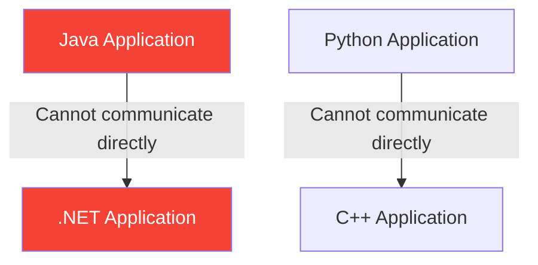
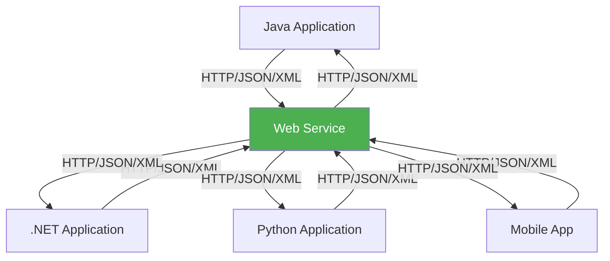
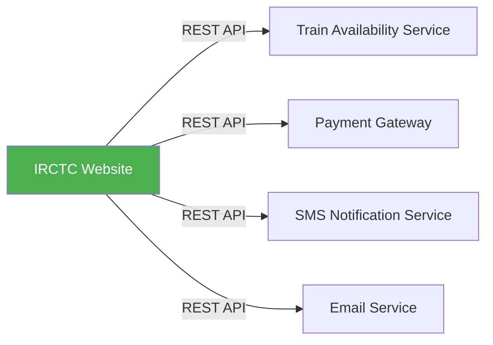
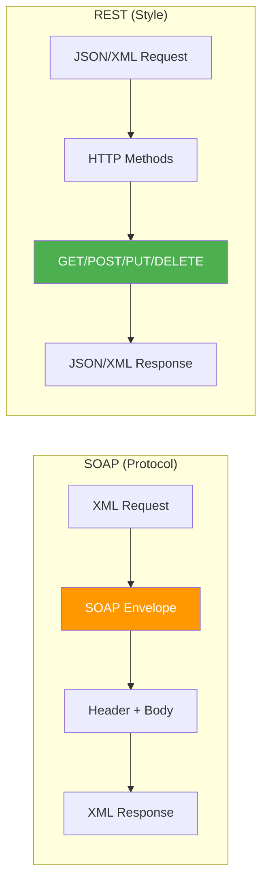

# Web Services Introduction - Complete Guide

## Table of Contents
1. [What are Web Services?](#what-are-web-services)
2. [Why Do We Need Web Services?](#why-do-we-need-web-services)
3. [Interoperability - The Core Benefit](#interoperability---the-core-benefit)
4. [Real-Life Scenarios](#real-life-scenarios)
5. [Types of Web Services](#types-of-web-services)
6. [SOAP Web Services](#soap-web-services)
7. [REST Web Services](#rest-web-services)
8. [SOAP vs REST - Detailed Comparison](#soap-vs-rest---detailed-comparison)
9. [When to Use SOAP vs REST](#when-to-use-soap-vs-rest)
10. [Summary](#summary)

---

## What are Web Services?

### Definition

From your course materials: **"What are Web Services.doc"**

A **Web Service** is a method of communication between two electronic devices over a network. It is a software system designed to support interoperable machine-to-machine interaction over a network.

> [!IMPORTANT]
> **Key Point**: Web Services allow different applications (built on different platforms, using different languages) to communicate with each other using standardized protocols like HTTP.

### Characteristics of Web Services

1. **Platform Independent**: Works on Windows, Linux, macOS
2. **Language Independent**: Java can talk to .NET, Python, etc.
3. **Self-Describing**: Describe themselves (WSDL for SOAP)
4. **Discoverable**: Can be published and discovered
5. **Loosely Coupled**: Client and server are independent

---

## Why Do We Need Web Services?

### The Problem Before Web Services



**Problems**:
- Different platforms use different data formats
- Direct communication requires same technology
- No standard way to exchange data

### The Solution with Web Services



**Solution**: Web Services provide:
- Standard communication protocol (HTTP)
- Standard data formats (JSON, XML)
- Platform-independent interaction

---

## Interoperability - The Core Benefit

### What is Interoperability?

**Interoperability** is the ability of different systems, regardless of their technology, to work together and exchange data.

### Example: E-Commerce Integration

```
Your Java E-Commerce Website
        ↓
    [Web Service API]
        ↓
┌───────┼───────┬───────┬───────┐
↓       ↓       ↓       ↓       ↓
Payment  Shipping  SMS    Email  Analytics
Gateway  Provider  API    API    Service
(.NET)   (Python)  (Ruby) (Go)   (Node.js)
```

All these different systems communicate seamlessly through Web Services!

---

## Real-Life Scenarios

From your course materials: **"Real_Life_Scenario_WebService flow.ppt"**

### Scenario 1: IRCTC Train Booking



### Scenario 2: Travel Aggregator

```
MakeMyTrip / Goibibo
        ↓
    [Web Service Calls]
        ↓
┌───────┼───────┬───────┐
↓       ↓       ↓       ↓
Flight   Hotels   Car     Bus
APIs     APIs    Rental   APIs
(100s)   (100s)  APIs     (50+)
```

### Scenario 3: Social Media Integration

```
Your Application
        ↓
┌───────┼───────┬───────┐
↓       ↓       ↓       ↓
Facebook Google  Twitter LinkedIn
  API    OAuth   API     API
```

### Scenario 4: Banking Application

```
Mobile Banking App
        ↓
    [REST APIs]
        ↓
┌───────┼───────┬───────┐
↓       ↓       ↓       ↓
Balance  Transfer  Bill   Loan
Inquiry  Service   Pay    Service
```

---

## Types of Web Services

### Two Main Types

| Type | Description | Data Format |
|------|-------------|-------------|
| **SOAP** | Protocol-based, formal | XML only |
| **REST** | Architectural style, flexible | JSON, XML, HTML, etc. |

---

## SOAP Web Services

### What is SOAP?

**SOAP (Simple Object Access Protocol)** is an XML-based protocol for exchanging structured information.

### SOAP Message Structure

```xml
<?xml version="1.0"?>
<soap:Envelope 
    xmlns:soap="http://www.w3.org/2003/05/soap-envelope">
    
    <soap:Header>
        <!-- Optional: Security, Transaction info -->
    </soap:Header>
    
    <soap:Body>
        <!-- Required: Actual request/response data -->
        <GetStockPrice>
            <StockName>GOOG</StockName>
        </GetStockPrice>
    </soap:Body>
    
</soap:Envelope>
```

### WSDL (Web Services Description Language)

WSDL is an XML document that describes the web service:
- What operations are available
- What data types are used
- Where the service is located

### SOAP Characteristics

| Feature | Description |
|---------|-------------|
| **Protocol** | Strict protocol, not just style |
| **Data Format** | XML only |
| **Transport** | HTTP, SMTP, TCP, etc. |
| **Security** | WS-Security (enterprise-grade) |
| **Transactions** | WS-AtomicTransaction support |
| **Description** | WSDL (formal contract) |

---

## REST Web Services

### What is REST?

**REST (Representational State Transfer)** is an architectural style for designing networked applications. It is NOT a protocol.

### REST Principles

1. **Stateless**: Each request is independent
2. **Client-Server**: Separation of concerns
3. **Cacheable**: Responses can be cached
4. **Uniform Interface**: Standard HTTP methods
5. **Layered System**: Client doesn't know intermediaries

### REST Uses HTTP Methods

| HTTP Method | CRUD Operation | Example |
|-------------|----------------|---------|
| **GET** | Read | GET /books/1 |
| **POST** | Create | POST /books |
| **PUT** | Update (full) | PUT /books/1 |
| **DELETE** | Delete | DELETE /books/1 |
| **PATCH** | Update (partial) | PATCH /books/1 |

### REST Characteristics

| Feature | Description |
|---------|-------------|
| **Style** | Architectural style, not protocol |
| **Data Format** | JSON (primary), XML, HTML, etc. |
| **Transport** | HTTP only |
| **Security** | HTTPS, OAuth, JWT |
| **Caching** | Built-in HTTP caching |
| **Description** | No formal contract (API docs) |

---

## SOAP vs REST - Detailed Comparison

From your course materials: **"SOAP vs REST.doc"**

### Comparison Table

| Aspect | SOAP | REST |
|--------|------|------|
| **Full Form** | Simple Object Access Protocol | Representational State Transfer |
| **Type** | Protocol | Architectural Style |
| **Data Format** | XML only | JSON, XML, HTML, Text |
| **Transport** | HTTP, SMTP, TCP, JMS | HTTP only |
| **Performance** | Slower (XML parsing overhead) | Faster (lightweight JSON) |
| **Bandwidth** | Higher (verbose XML) | Lower (compact JSON) |
| **Caching** | No built-in caching | HTTP caching supported |
| **Security** | WS-Security (enterprise) | HTTPS, OAuth, JWT |
| **Statefulness** | Can be stateful | Always stateless |
| **Contract** | WSDL (formal) | No formal contract |
| **Error Handling** | Built-in fault elements | HTTP status codes |
| **Learning Curve** | Steeper | Easier |

### Visual Comparison



---

## When to Use SOAP vs REST

### Use SOAP When:

1. **Enterprise Applications**: Banking, Insurance, Financial systems
2. **Formal Contracts Required**: Need WSDL definition
3. **ACID Transactions**: Need guaranteed delivery
4. **WS-* Standards**: Need WS-Security, WS-Addressing
5. **Stateful Operations**: Need session management
6. **Legacy System Integration**: Existing SOAP services

### Use REST When:

1. **Web Applications**: Modern web apps, SPAs
2. **Mobile Applications**: Bandwidth-conscious
3. **Public APIs**: Easy to use, well-documented
4. **Microservices**: Lightweight communication
5. **Performance Critical**: Need fast responses
6. **Scalability**: Stateless architecture helps scaling

---

## Summary

### Key Takeaways

1. **Web Services** enable communication between different systems
2. **Interoperability** is the main benefit
3. **SOAP**: Protocol-based, XML only, enterprise-focused
4. **REST**: Architectural style, JSON/XML, lightweight
5. **REST is preferred** for modern applications
6. **SOAP is used** for enterprise systems requiring formal contracts

### Quick Comparison

| If You Need... | Use |
|---------------|-----|
| Lightweight, fast | REST |
| Formal contract | SOAP |
| Mobile/Web apps | REST |
| Enterprise security | SOAP |
| Easy development | REST |
| Guaranteed delivery | SOAP |

---

## Practice Questions

1. What is a web service and why is it needed?
2. Explain interoperability with an example.
3. What are the two main types of web services?
4. Compare SOAP and REST web services.
5. When would you choose SOAP over REST?
6. Give 3 real-life examples of web services.
7. What is WSDL and what does it describe?

---

**End of Note 11: Web Services Introduction**

*Previous: [10_AOP_Spring_Boot.md](file:///c:/Users/2706p/Desktop/mcq/notes/10_AOP_Spring_Boot.md)*  
*Next: [12_REST_API_Fundamentals.md](file:///c:/Users/2706p/Desktop/mcq/notes/12_REST_API_Fundamentals.md)*
