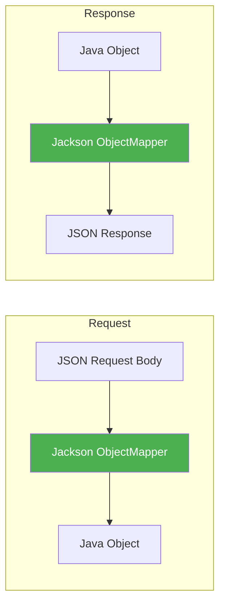
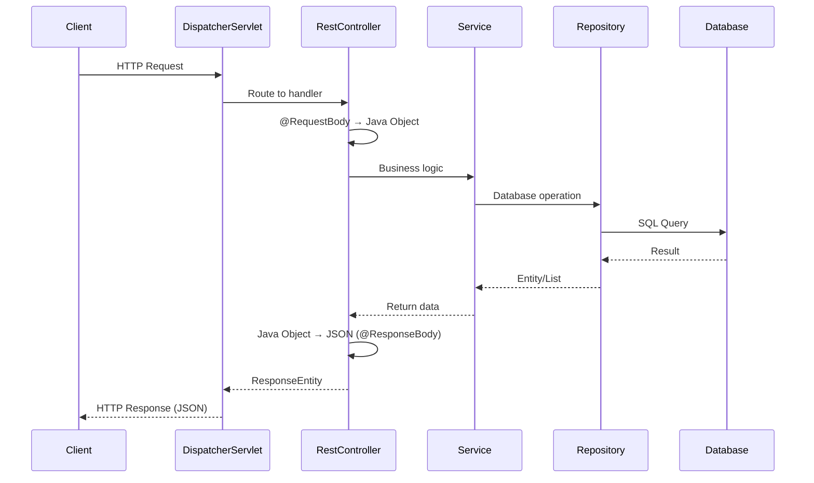

# Building REST APIs with Spring Boot - Complete Guide

## Table of Contents
1. [Introduction](#introduction)
2. [@Controller vs @RestController](#controller-vs-restcontroller)
3. [Real Example from Source Code](#real-example-from-source-code)
4. [@RequestBody and @ResponseBody](#requestbody-and-responsebody)
5. [Building a Complete CRUD REST API](#building-a-complete-crud-rest-api)
6. [ResponseEntity - Full Control](#responseentity---full-control)
7. [Exception Handling in REST](#exception-handling-in-rest)
8. [Execution Flow](#execution-flow)
9. [Testing REST APIs](#testing-rest-apis)
10. [Summary](#summary)

---

## Introduction

Spring Boot makes building REST APIs simple with annotations like `@RestController`, `@RequestBody`, and `ResponseEntity`.

---

## @Controller vs @RestController

From your course materials: **"Difference between Controller and RestController.txt"**

> **Controller** is the one which returns control to "View" i.e. JSP.
> That's why Controller's method can either return "ModelAndView" or "String". Both ModelAndView and String consist of JSP name.
>
> **RestController** is the one which returns the response directly to the client in the form of JSON, HTML, XML etc.

### Comparison

| @Controller | @RestController |
|-------------|-----------------|
| Returns **view name** (JSP, Thymeleaf) | Returns **data** (JSON, XML) |
| For web applications with views | For REST APIs |
| Needs `@ResponseBody` for data | `@ResponseBody` is implicit |
| `return "success"` → renders success.html | `return book` → sends JSON |

### Code Comparison

```java
// @Controller - Returns VIEW NAME
@Controller
public class BookController {
    @GetMapping("/book")
    public String getBook(Model model) {
        model.addAttribute("book", new Book());
        return "bookView";  // Returns view name → renders bookView.html
    }
}

// @RestController - Returns DATA
@RestController
public class BookRestController {
    @GetMapping("/api/book")
    public Book getBook() {
        return new Book("Java Guide", 500);  // Returns JSON automatically
    }
}
```

### Why @RestController?

`@RestController` = `@Controller` + `@ResponseBody`

```java
// These are EQUIVALENT:

@Controller
@ResponseBody
public class BookController { }

@RestController
public class BookController { }
```

---

## Real Example from Source Code

From your course materials: **"RestController vs Controller.txt"**

```java
// Controller returns JSP
@Controller
public String welcome() {
    return "welcome";  // → Looks for welcome.jsp or welcome.html
}

// RestController returns data
@RestController
public String welcome() {
    return "welcome";  // → Sends "welcome" as response text
}
```

---

## @RequestBody and @ResponseBody

From your course materials: **"RequestBody and ResponseBody annotations.doc"**

### @ResponseBody

Converts Java object to HTTP response body (JSON/XML).

```java
@GetMapping("/api/books")
@ResponseBody  // Optional in @RestController
public List<Book> getAllBooks() {
    return bookService.findAll();  // Java List → JSON Array
}
```

**Output**:
```json
[
    {"id": 1, "title": "Book 1", "price": 100},
    {"id": 2, "title": "Book 2", "price": 200}
]
```

### @RequestBody

Converts HTTP request body (JSON/XML) to Java object.

```java
@PostMapping("/api/books")
public Book createBook(@RequestBody Book book) {
    // JSON request body → Book object (automatic)
    return bookService.save(book);
}
```

**Input**:
```json
{
    "title": "Spring Boot Guide",
    "price": 500
}
```

### How Jackson Works



---

## Building a Complete CRUD REST API

### Entity

```java
@Entity
@Table(name = "books")
public class Book {
    @Id
    @GeneratedValue(strategy = GenerationType.IDENTITY)
    private Long id;
    
    @Column(nullable = false)
    private String title;
    
    private String author;
    private double price;
    
    // Constructors, getters, setters
}
```

### Repository

```java
@Repository
public interface BookRepository extends JpaRepository<Book, Long> {
    List<Book> findByAuthor(String author);
    List<Book> findByTitleContaining(String keyword);
}
```

### Complete REST Controller

```java
@RestController
@RequestMapping("/api/books")
public class BookRestController {
    
    @Autowired
    private BookRepository bookRepository;
    
    // GET all books
    @GetMapping
    public List<Book> getAllBooks() {
        return bookRepository.findAll();
    }
    
    // GET single book by ID
    @GetMapping("/{id}")
    public ResponseEntity<Book> getBookById(@PathVariable Long id) {
        return bookRepository.findById(id)
                .map(ResponseEntity::ok)
                .orElse(ResponseEntity.notFound().build());
    }
    
    // POST - Create new book
    @PostMapping
    public ResponseEntity<Book> createBook(@RequestBody Book book) {
        Book savedBook = bookRepository.save(book);
        return ResponseEntity.status(HttpStatus.CREATED).body(savedBook);
    }
    
    // PUT - Update entire book
    @PutMapping("/{id}")
    public ResponseEntity<Book> updateBook(@PathVariable Long id, 
                                           @RequestBody Book book) {
        if (!bookRepository.existsById(id)) {
            return ResponseEntity.notFound().build();
        }
        book.setId(id);
        Book updatedBook = bookRepository.save(book);
        return ResponseEntity.ok(updatedBook);
    }
    
    // DELETE - Remove book
    @DeleteMapping("/{id}")
    public ResponseEntity<Void> deleteBook(@PathVariable Long id) {
        if (!bookRepository.existsById(id)) {
            return ResponseEntity.notFound().build();
        }
        bookRepository.deleteById(id);
        return ResponseEntity.noContent().build();
    }
}
```

---

## ResponseEntity - Full Control

### What is ResponseEntity?

`ResponseEntity<T>` provides full control over the HTTP response:
- Status code
- Headers
- Body

### Common Patterns

```java
// 200 OK with body
ResponseEntity.ok(book)

// 201 Created with body
ResponseEntity.status(HttpStatus.CREATED).body(book)

// 204 No Content (DELETE success)
ResponseEntity.noContent().build()

// 400 Bad Request
ResponseEntity.badRequest().body("Error message")

// 404 Not Found
ResponseEntity.notFound().build()

// Custom headers
ResponseEntity.ok()
    .header("X-Custom-Header", "value")
    .body(book)
```

### Real Examples

```java
@GetMapping("/{id}")
public ResponseEntity<Book> getBook(@PathVariable Long id) {
    Optional<Book> book = bookRepository.findById(id);
    
    if (book.isPresent()) {
        return ResponseEntity.ok(book.get());  // 200 OK + body
    } else {
        return ResponseEntity.notFound().build();  // 404 Not Found
    }
}

// Using functional style
@GetMapping("/{id}")
public ResponseEntity<Book> getBook(@PathVariable Long id) {
    return bookRepository.findById(id)
            .map(book -> ResponseEntity.ok(book))
            .orElse(ResponseEntity.notFound().build());
}
```

---

## Exception Handling in REST

### Global Exception Handler

```java
@RestControllerAdvice
public class GlobalExceptionHandler {
    
    @ExceptionHandler(ResourceNotFoundException.class)
    public ResponseEntity<ErrorResponse> handleNotFound(ResourceNotFoundException ex) {
        ErrorResponse error = new ErrorResponse(
            HttpStatus.NOT_FOUND.value(),
            "Resource Not Found",
            ex.getMessage(),
            LocalDateTime.now()
        );
        return ResponseEntity.status(HttpStatus.NOT_FOUND).body(error);
    }
    
    @ExceptionHandler(MethodArgumentNotValidException.class)
    public ResponseEntity<ErrorResponse> handleValidation(MethodArgumentNotValidException ex) {
        String errors = ex.getBindingResult().getFieldErrors().stream()
                .map(err -> err.getField() + ": " + err.getDefaultMessage())
                .collect(Collectors.joining(", "));
        
        ErrorResponse error = new ErrorResponse(
            HttpStatus.BAD_REQUEST.value(),
            "Validation Failed",
            errors,
            LocalDateTime.now()
        );
        return ResponseEntity.badRequest().body(error);
    }
    
    @ExceptionHandler(Exception.class)
    public ResponseEntity<ErrorResponse> handleAll(Exception ex) {
        ErrorResponse error = new ErrorResponse(
            HttpStatus.INTERNAL_SERVER_ERROR.value(),
            "Internal Server Error",
            "An unexpected error occurred",
            LocalDateTime.now()
        );
        return ResponseEntity.status(HttpStatus.INTERNAL_SERVER_ERROR).body(error);
    }
}
```

### Error Response Class

```java
public class ErrorResponse {
    private int status;
    private String error;
    private String message;
    private LocalDateTime timestamp;
    
    // Constructor, getters, setters
}
```

### Custom Exception

```java
public class ResourceNotFoundException extends RuntimeException {
    public ResourceNotFoundException(String message) {
        super(message);
    }
}

// Usage in controller
@GetMapping("/{id}")
public Book getBook(@PathVariable Long id) {
    return bookRepository.findById(id)
            .orElseThrow(() -> new ResourceNotFoundException("Book not found with id: " + id));
}
```

---

## Execution Flow

### REST Request Processing



---

## Testing REST APIs

### Using cURL

```bash
# GET all books
curl http://localhost:8080/api/books

# GET single book
curl http://localhost:8080/api/books/1

# POST new book
curl -X POST http://localhost:8080/api/books \
  -H "Content-Type: application/json" \
  -d '{"title":"New Book","author":"John","price":500}'

# PUT update book
curl -X PUT http://localhost:8080/api/books/1 \
  -H "Content-Type: application/json" \
  -d '{"title":"Updated Book","author":"John","price":600}'

# DELETE book
curl -X DELETE http://localhost:8080/api/books/1
```

### Using Postman/ARC

From source: **"Imp about ARC output.txt"**
- Use Advanced REST Client (ARC) or Postman
- Set Content-Type header to `application/json`
- Send JSON in request body for POST/PUT

---

## Summary

### Key Takeaways

1. **@RestController** = @Controller + @ResponseBody
2. **@RequestBody** converts JSON to Java object
3. **@ResponseBody** converts Java object to JSON
4. **ResponseEntity** provides full response control
5. **@RestControllerAdvice** for global exception handling

### API Endpoints Summary

| Method | URL | Description | Response |
|--------|-----|-------------|----------|
| GET | /api/books | Get all books | 200 + Array |
| GET | /api/books/{id} | Get one book | 200 or 404 |
| POST | /api/books | Create book | 201 + Object |
| PUT | /api/books/{id} | Update book | 200 or 404 |
| DELETE | /api/books/{id} | Delete book | 204 or 404 |

---

## Practice Questions

1. What is the difference between @Controller and @RestController?
2. Explain how @RequestBody and @ResponseBody work.
3. What is ResponseEntity and when should you use it?
4. How do you implement global exception handling for REST APIs?
5. Write a complete CRUD REST controller for a Student entity.
6. What HTTP status code should you return for each CRUD operation?

---

**End of Note 13: Building REST APIs with Spring Boot**

*Previous: [12_REST_API_Fundamentals.md](file:///c:/Users/2706p/Desktop/mcq/notes/12_REST_API_Fundamentals.md)*  
*Next: [14_CORS_Configuration.md](file:///c:/Users/2706p/Desktop/mcq/notes/14_CORS_Configuration.md)*
