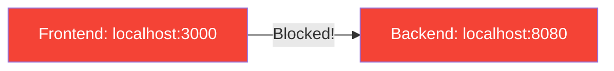
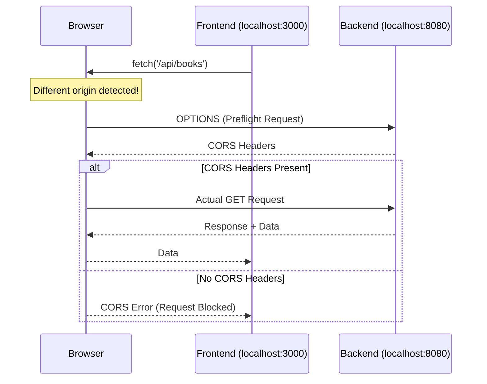

# CORS Configuration - Complete Guide

## Table of Contents
1. [What is CORS?](#what-is-cors)
2. [Understanding Origin](#understanding-origin)
3. [Why Does CORS Exist?](#why-does-cors-exist)
4. [Same-Origin Policy](#same-origin-policy)
5. [CORS in Action](#cors-in-action)
6. [Configuring CORS in Spring Boot](#configuring-cors-in-spring-boot)
7. [Global CORS Configuration](#global-cors-configuration)
8. [Summary](#summary)

---

## What is CORS?

From your course materials: **"CORS Info.txt"**

> **Cross-Origin Resource Sharing (CORS)** is an HTTP-header based mechanism that allows a server to indicate any origins (domain, scheme, or port) other than its own from which a browser should permit loading resources.

> [!IMPORTANT]
> CORS is a **security feature** implemented by browsers. It controls which websites can access your API.

---

## Understanding Origin

From your course materials:

> **Origin** consists of "protocol", "domain" and "port"
>
> e.g. http://myserver.com:8000
>
> Here:
> - "http" → protocol
> - "myserver.com" → domain name
> - 8000 → port

### Same Origin vs Different Origin

| URL 1 | URL 2 | Same Origin? | Reason |
|-------|-------|--------------|--------|
| http://example.com/a | http://example.com/b | ✅ Yes | Same all |
| http://example.com | https://example.com | ❌ No | Different protocol |
| http://example.com | http://api.example.com | ❌ No | Different domain |
| http://localhost:3000 | http://localhost:8080 | ❌ No | Different port |

---

## Why Does CORS Exist?

From your course materials:

> **By default browsers prevent Ajax (Asynchronous JavaScript and XML) requests from different origin.**

### The Security Problem

Without CORS, malicious websites could:
1. Make requests to your banking site using your credentials
2. Read your private data
3. Perform actions on your behalf

### CORS as the Solution

> **CORS is a standard to relax the same origin policy.**
>
> **It selectively allows cross origin requests while rejecting others.**

---

## Same-Origin Policy

### What Browsers Block



### Common Scenario

```
React App: http://localhost:3000
Spring Boot API: http://localhost:8080

↓ Different ports = Different origins = BLOCKED by browser ↓
```

### Error Message

```
Access to XMLHttpRequest at 'http://localhost:8080/api/books' 
from origin 'http://localhost:3000' has been blocked by CORS policy: 
No 'Access-Control-Allow-Origin' header is present on the requested resource.
```

---

## CORS in Action

### How CORS Works



### CORS Headers

| Header | Purpose | Example |
|--------|---------|---------|
| `Access-Control-Allow-Origin` | Allowed origins | `http://localhost:3000` or `*` |
| `Access-Control-Allow-Methods` | Allowed HTTP methods | `GET, POST, PUT, DELETE` |
| `Access-Control-Allow-Headers` | Allowed request headers | `Content-Type, Authorization` |
| `Access-Control-Allow-Credentials` | Allow cookies | `true` |
| `Access-Control-Max-Age` | Preflight cache time | `3600` |

---

## Configuring CORS in Spring Boot

From your course materials:

> **How can we enable CORS?**
>
> Apply following annotation on the RestController class:
>
> `@CrossOrigin("http://localhost:4200")`
>
> Here "http://localhost:4200" is assumed to be a different origin from where you would like to allow access to your Rest Service/s.

### Method 1: @CrossOrigin Annotation

#### On Controller Class

```java
@RestController
@RequestMapping("/api/books")
@CrossOrigin("http://localhost:4200")  // Allow Angular app
public class BookController {
    
    @GetMapping
    public List<Book> getAllBooks() {
        return bookService.findAll();
    }
}
```

#### On Specific Method

```java
@RestController
@RequestMapping("/api/books")
public class BookController {
    
    @GetMapping
    @CrossOrigin("http://localhost:3000")  // Only this method
    public List<Book> getAllBooks() {
        return bookService.findAll();
    }
}
```

#### With Multiple Options

```java
@RestController
@RequestMapping("/api/books")
@CrossOrigin(
    origins = {"http://localhost:3000", "http://localhost:4200"},
    methods = {RequestMethod.GET, RequestMethod.POST, RequestMethod.PUT, RequestMethod.DELETE},
    allowedHeaders = {"Content-Type", "Authorization"},
    allowCredentials = "true",
    maxAge = 3600
)
public class BookController {
    // All methods allow CORS from specified origins
}
```

---

## Global CORS Configuration

### Method 2: WebMvcConfigurer (Recommended)

```java
@Configuration
public class CorsConfig implements WebMvcConfigurer {
    
    @Override
    public void addCorsMappings(CorsRegistry registry) {
        registry.addMapping("/api/**")  // Apply to all /api endpoints
                .allowedOrigins("http://localhost:3000", "http://localhost:4200")
                .allowedMethods("GET", "POST", "PUT", "DELETE", "PATCH", "OPTIONS")
                .allowedHeaders("*")
                .allowCredentials(true)
                .maxAge(3600);
    }
}
```

### Method 3: CorsFilter Bean

```java
@Configuration
public class CorsConfig {
    
    @Bean
    public CorsFilter corsFilter() {
        CorsConfiguration config = new CorsConfiguration();
        config.setAllowedOrigins(Arrays.asList(
            "http://localhost:3000", 
            "http://localhost:4200"
        ));
        config.setAllowedMethods(Arrays.asList(
            "GET", "POST", "PUT", "DELETE", "PATCH", "OPTIONS"
        ));
        config.setAllowedHeaders(Arrays.asList("*"));
        config.setAllowCredentials(true);
        config.setMaxAge(3600L);
        
        UrlBasedCorsConfigurationSource source = new UrlBasedCorsConfigurationSource();
        source.registerCorsConfiguration("/api/**", config);
        
        return new CorsFilter(source);
    }
}
```

### Allow All Origins (Development Only!)

```java
@CrossOrigin(origins = "*")  // Allow any origin - DANGEROUS in production!
```

> [!CAUTION]
> Never use `origins = "*"` in production! Always specify exact allowed origins.

---

## Production Configuration

### Environment-Specific CORS

```java
@Configuration
public class CorsConfig implements WebMvcConfigurer {
    
    @Value("${cors.allowed-origins}")
    private String[] allowedOrigins;
    
    @Override
    public void addCorsMappings(CorsRegistry registry) {
        registry.addMapping("/api/**")
                .allowedOrigins(allowedOrigins)
                .allowedMethods("GET", "POST", "PUT", "DELETE")
                .allowedHeaders("*")
                .allowCredentials(true);
    }
}
```

**application-dev.properties**:
```properties
cors.allowed-origins=http://localhost:3000,http://localhost:4200
```

**application-prod.properties**:
```properties
cors.allowed-origins=https://www.myapp.com,https://admin.myapp.com
```

---

## Summary

### Key Takeaways

1. **CORS** prevents cross-origin requests by default
2. **Origin** = protocol + domain + port
3. **@CrossOrigin** for controller/method-level CORS
4. **WebMvcConfigurer** for global CORS configuration
5. **Never use "*"** for origins in production
6. **Always specify exact origins** for security

### Quick Reference

| Approach | Scope | Use Case |
|----------|-------|----------|
| `@CrossOrigin` | Controller/Method | Simple, quick setup |
| `WebMvcConfigurer` | Global | Centralized configuration |
| `CorsFilter` | Global | Maximum control |

### Common CORS Configuration

```java
@CrossOrigin(
    origins = "http://localhost:3000",
    methods = {GET, POST, PUT, DELETE},
    allowedHeaders = "*",
    allowCredentials = "true",
    maxAge = 3600
)
```

---

## Practice Questions

1. What is CORS and why is it needed?
2. What constitutes an "origin"?
3. Why does the browser block cross-origin requests by default?
4. How do you enable CORS in Spring Boot?
5. What is the difference between @CrossOrigin and WebMvcConfigurer?
6. Why should you never use "*" for origins in production?
7. What is a preflight request?

---

**End of Note 14: CORS Configuration**

*Previous: [13_Building_REST_APIs_Spring_Boot.md](file:///c:/Users/2706p/Desktop/mcq/notes/13_Building_REST_APIs_Spring_Boot.md)*  
*Next: [15_JPA_Relationships.md](file:///c:/Users/2706p/Desktop/mcq/notes/15_JPA_Relationships.md)*
