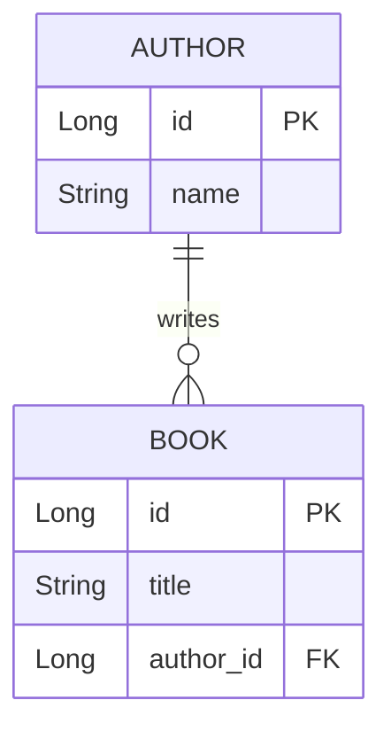

# JPA Relationships - Complete Guide

## Table of Contents
1. [Introduction](#introduction)
2. [Relationship Types](#relationship-types)
3. [One-to-One Relationship](#one-to-one-relationship)
4. [One-to-Many / Many-to-One](#one-to-many--many-to-one)
5. [Many-to-Many Relationship](#many-to-many-relationship)
6. [Cascade Types](#cascade-types)
7. [Fetch Types](#fetch-types)
8. [Bidirectional vs Unidirectional](#bidirectional-vs-unidirectional)
9. [Best Practices](#best-practices)
10. [Summary](#summary)

---

## Introduction

JPA provides annotations to map relationships between entities, corresponding to foreign keys in relational databases.

---

## Relationship Types

| Relationship | Description | Example |
|--------------|-------------|---------|
| **One-to-One** | One entity relates to one other | User ↔ Profile |
| **One-to-Many** | One entity relates to many | Author → Books |
| **Many-to-One** | Many entities relate to one | Books → Author |
| **Many-to-Many** | Many relate to many | Books ↔ Categories |

---

## One-to-One Relationship

### Unidirectional

```java
@Entity
public class User {
    @Id
    @GeneratedValue(strategy = GenerationType.IDENTITY)
    private Long id;
    private String username;
    
    @OneToOne(cascade = CascadeType.ALL)
    @JoinColumn(name = "profile_id", referencedColumnName = "id")
    private Profile profile;
}

@Entity
public class Profile {
    @Id
    @GeneratedValue(strategy = GenerationType.IDENTITY)
    private Long id;
    private String bio;
    private String avatarUrl;
}
```

### Bidirectional

```java
@Entity
public class User {
    @OneToOne(cascade = CascadeType.ALL)
    @JoinColumn(name = "profile_id")
    private Profile profile;
}

@Entity
public class Profile {
    @Id
    @GeneratedValue(strategy = GenerationType.IDENTITY)
    private Long id;
    
    @OneToOne(mappedBy = "profile")  // References user.profile
    private User user;
}
```

### Key Annotations

| Annotation | Purpose |
|------------|---------|
| `@OneToOne` | Marks one-to-one relationship |
| `@JoinColumn` | Specifies foreign key column |
| `mappedBy` | Indicates non-owning side |

---

## One-to-Many / Many-to-One

### Example: Author has Many Books

```java
@Entity
public class Author {
    @Id
    @GeneratedValue(strategy = GenerationType.IDENTITY)
    private Long id;
    private String name;
    
    @OneToMany(mappedBy = "author", cascade = CascadeType.ALL, fetch = FetchType.LAZY)
    private List<Book> books = new ArrayList<>();
    
    // Helper method for bidirectional consistency
    public void addBook(Book book) {
        books.add(book);
        book.setAuthor(this);
    }
    
    public void removeBook(Book book) {
        books.remove(book);
        book.setAuthor(null);
    }
}

@Entity
public class Book {
    @Id
    @GeneratedValue(strategy = GenerationType.IDENTITY)
    private Long id;
    private String title;
    
    @ManyToOne(fetch = FetchType.LAZY)
    @JoinColumn(name = "author_id")  // Foreign key column
    private Author author;
}
```

### Relationship Diagram



### Key Points

| Side | Annotation | Contains FK? |
|------|------------|--------------|
| "One" (Author) | `@OneToMany(mappedBy)` | No |
| "Many" (Book) | `@ManyToOne + @JoinColumn` | Yes |

---

## Many-to-Many Relationship

### Example: Books have Many Categories

```java
@Entity
public class Book {
    @Id
    @GeneratedValue(strategy = GenerationType.IDENTITY)
    private Long id;
    private String title;
    
    @ManyToMany(cascade = {CascadeType.PERSIST, CascadeType.MERGE})
    @JoinTable(
        name = "book_category",                           // Join table name
        joinColumns = @JoinColumn(name = "book_id"),      // FK to this entity
        inverseJoinColumns = @JoinColumn(name = "category_id")  // FK to other
    )
    private Set<Category> categories = new HashSet<>();
    
    public void addCategory(Category category) {
        categories.add(category);
        category.getBooks().add(this);
    }
}

@Entity
public class Category {
    @Id
    @GeneratedValue(strategy = GenerationType.IDENTITY)
    private Long id;
    private String name;
    
    @ManyToMany(mappedBy = "categories")  // Non-owning side
    private Set<Book> books = new HashSet<>();
}
```

### Database Tables Created

```sql
-- Entity tables
CREATE TABLE book (
    id BIGINT PRIMARY KEY AUTO_INCREMENT,
    title VARCHAR(255)
);

CREATE TABLE category (
    id BIGINT PRIMARY KEY AUTO_INCREMENT,
    name VARCHAR(255)
);

-- Join table (created by @JoinTable)
CREATE TABLE book_category (
    book_id BIGINT,
    category_id BIGINT,
    PRIMARY KEY (book_id, category_id),
    FOREIGN KEY (book_id) REFERENCES book(id),
    FOREIGN KEY (category_id) REFERENCES category(id)
);
```

---

## Cascade Types

### What is Cascading?

Cascading propagates operations from parent to related entities.

### Cascade Type Options

| Type | Description |
|------|-------------|
| `PERSIST` | Cascade save/insert |
| `MERGE` | Cascade update |
| `REMOVE` | Cascade delete |
| `REFRESH` | Cascade refresh from DB |
| `DETACH` | Cascade detach |
| `ALL` | All of the above |

### Usage Examples

```java
// Cascade all operations
@OneToMany(cascade = CascadeType.ALL)
private List<Book> books;

// Only cascade save and update
@OneToMany(cascade = {CascadeType.PERSIST, CascadeType.MERGE})
private List<Book> books;

// With orphan removal (delete children when removed from collection)
@OneToMany(cascade = CascadeType.ALL, orphanRemoval = true)
private List<Book> books;
```

### CascadeType.ALL Example

```java
// Save author automatically saves all books
Author author = new Author("John");
author.addBook(new Book("Book 1"));
author.addBook(new Book("Book 2"));
authorRepository.save(author);  // Books saved automatically!

// Delete author automatically deletes all books
authorRepository.delete(author);  // Books deleted automatically!
```

---

## Fetch Types

### Eager vs Lazy Loading

| Type | Description | When Data is Loaded |
|------|-------------|-------------------|
| `EAGER` | Load immediately | When parent is loaded |
| `LAZY` | Load on access | When collection is accessed |

### Default Fetch Types

| Relationship | Default |
|--------------|---------|
| `@OneToOne` | EAGER |
| `@ManyToOne` | EAGER |
| `@OneToMany` | LAZY |
| `@ManyToMany` | LAZY |

### Usage

```java
// Explicit LAZY loading (recommended for collections)
@OneToMany(fetch = FetchType.LAZY)
private List<Book> books;

// Explicit EAGER loading (use carefully)
@ManyToOne(fetch = FetchType.EAGER)
private Author author;
```

### N+1 Problem with LAZY

```java
// N+1 queries problem
List<Author> authors = authorRepository.findAll();  // 1 query
for (Author author : authors) {
    System.out.println(author.getBooks());  // N additional queries!
}

// Solution: Use JOIN FETCH in query
@Query("SELECT a FROM Author a JOIN FETCH a.books")
List<Author> findAllWithBooks();  // 1 query!
```

---

## Bidirectional vs Unidirectional

### Unidirectional (One-way)

```java
@Entity
public class Book {
    @ManyToOne
    @JoinColumn(name = "author_id")
    private Author author;  // Book knows about Author
}

@Entity
public class Author {
    // Author does NOT know about Books
}
```

### Bidirectional (Two-way)

```java
@Entity
public class Book {
    @ManyToOne
    @JoinColumn(name = "author_id")
    private Author author;  // Book → Author
}

@Entity
public class Author {
    @OneToMany(mappedBy = "author")
    private List<Book> books;  // Author → Books
}
```

### When to Use Which?

| Use Unidirectional When | Use Bidirectional When |
|------------------------|----------------------|
| Simple relationships | Need to navigate both directions |
| Performance concerns | Business logic requires both sides |
| Avoid complexity | Need cascading from parent |

---

## Best Practices

### 1. Use LAZY Fetch for Collections

```java
@OneToMany(fetch = FetchType.LAZY)  // Always for collections
private List<Book> books;
```

### 2. Use Helper Methods for Bidirectional

```java
public void addBook(Book book) {
    books.add(book);
    book.setAuthor(this);  // Keep both sides in sync
}
```

### 3. Be Careful with CascadeType.REMOVE

```java
// Dangerous: Deleting author deletes all books
@OneToMany(cascade = CascadeType.ALL)

// Safer: Only cascade save/update
@OneToMany(cascade = {CascadeType.PERSIST, CascadeType.MERGE})
```

### 4. Use Set for Many-to-Many

```java
// Use Set (not List) to avoid duplicate issues
@ManyToMany
private Set<Category> categories = new HashSet<>();
```

---

## Summary

### Quick Reference

| Relationship | Owner Side | Non-Owner Side |
|--------------|------------|----------------|
| @OneToOne | @JoinColumn | mappedBy |
| @OneToMany / @ManyToOne | @ManyToOne + @JoinColumn | @OneToMany(mappedBy) |
| @ManyToMany | @JoinTable | mappedBy |

### Key Points

1. **@JoinColumn** is on the owning side (has FK)
2. **mappedBy** is on the non-owning side
3. Use **LAZY** fetch for collections
4. Use **helper methods** for bidirectional relationships
5. Be careful with **cascade** operations

---

## Practice Questions

1. Explain the difference between @OneToMany and @ManyToOne.
2. What is the purpose of mappedBy?
3. What are cascade types and when to use them?
4. What is the difference between EAGER and LAZY fetch?
5. How do you create a Many-to-Many relationship?
6. What is the N+1 problem and how do you solve it?

---

**End of Note 15: JPA Relationships**

*Previous: [14_CORS_Configuration.md](file:///c:/Users/2706p/Desktop/mcq/notes/14_CORS_Configuration.md)*  
*Next: [16_JPQL_Custom_Queries.md](file:///c:/Users/2706p/Desktop/mcq/notes/16_JPQL_Custom_Queries.md)*
